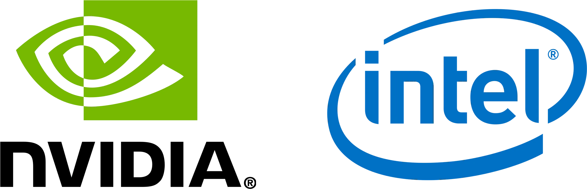
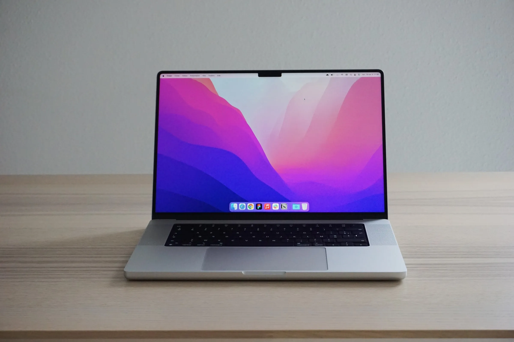
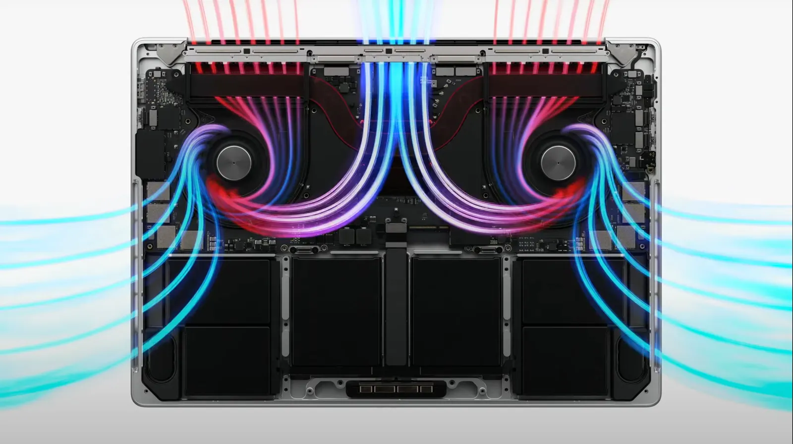
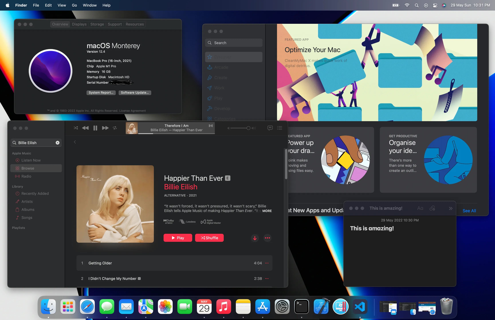
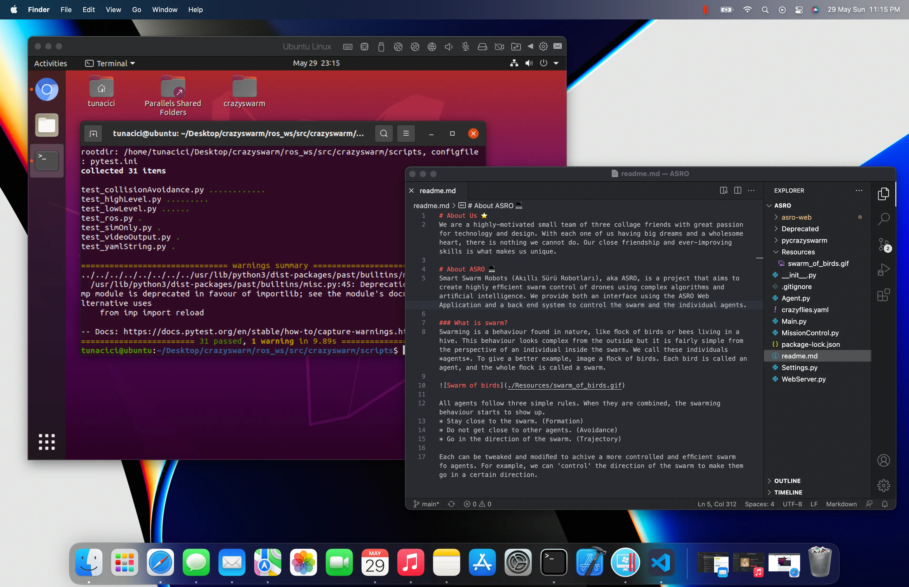
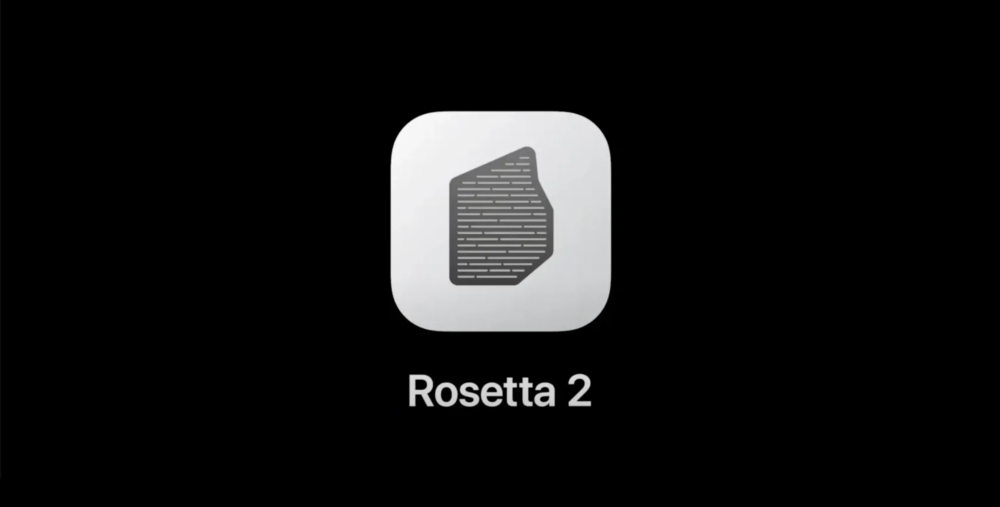

As far as I remember, I have been using Windows machines both for entertainment and programming. That was until the Apple’s WWDC 2021 event where they announced the new Macbook Pros with M1 Pro and M1 Max SoCs. Looking at their presentation I was simply amazed. Everything they showed about the performance and efficiency of these new SoCs, sounded too good to be true. Imagine running an Ubuntu Virtual Machine, many Docker containers, compiling large codebases and watching 4K content on YouTube at the same time. Yeah, it might not sound **_that_** impressive but the M1 chip does all of it without breaking a sweat! It’s efficiency is so good that you rarely find yourself looking for an outlet to plug your charger.

After a year later, I decided to get the 16" Macbook Pro with M1 Pro. I was about to change my whole work, and presumably my life, style. As you know I am a software engineer. So, I spend most of my time on computers. This idea of switching from Windows to macOS was scary because I needed to move everything I had from one platform to another. All of my projects, tools and work-environment had to be either moved or replaced with it’s macOS equivalent.

> Think of it like moving from one country to another. You need to move your entire house and maybe your car across the sea! Maybe you are thinking that I am exaggerating but trust me it feels exactly like that.

NVIDIA and Intel / Source: cgchannel.com

I used to have a 27" monitor connected to my Acer laptop. It had the Intel’s 7th gen CPU and NVDIA’s GTX 1060 GPU. They served me well and did their job pretty good. But now it was time to ditch all that and move to the new relatively small, yet **powerful**, Macbook Pro.

As of now it’s been exactly one week since I switched to Macbook and boy oh boy! I have so many things to write about this beast of a machine. Let’s start by talking about it’s design. Then I will talk about it’s hardware and software.

Design
==========

Macbook Pro 2021 / Source: unsplash.com/@tony_cm__

I am relatively new to the Apple’s products. So, I do not have the most experience when it comes to Apple’s ecosystem and all that. But I can say, with great confidence, that their designs are just exceptional!

The **all-aluminium chassis** feels cold and very durable. I bought the silver version and it looks amazing. The whole body looks very simple yet expensive and chic!

The near-4K Pro Display XDR is, IMO, is the best screen on a laptop. It might even be amongst the best ones in the monitor industry. **It is that good**! The colors are very accurate and **eye-catching**. It can get super bright and stay visible under direct sunlight. When I first opened the lid and saw the screen, I was screaming inside! My previous monitor looked like something from 80s compared to the Macbook’s screen.

The sound quality is what surprised me the most. I am not an audiophile but I always appreciate the high quality listening. The speakers sounded way better than I expected. The lows are really low and you can hear/feel the bass. The mids are **simply amazing**. The highs have the same quality and don’t get distorted on high volumes. I have a JBL Xtreme 2 and it does not sound like this! Yeah the JBL gets louder and have better lows but, to me, Macbook’s speakers are more **enjoyable**.

Hardware
========

Macbook’s Internals / Source: macrumors.com

There is only one thing I want to talk about here and it’s the M1 Pro. I still cannot comprehend how Apple created something **so powerful and yet very efficient**. How much powerful you ask? Well, to put it simply, I was able to compile a relatively large C++ codebase in 7 minutes! The same operation usually takes 50–60 minutes on my Windows machine. And I did not tell you the best part yet; **It did not break a sweat!** During the compilation, my old machine spins up the fans so much so that it starts to sound like a jet engine taking off. Meanwhile the Macbook Pro only got a little bit hot on the screen sides. I do not know if Apple does this intentionally but, even under full-load the fans **rarely** kick off. And even when they do, you cannot hear them at all.

There is one more thing that I also want to talk about. The battery life on this machine is, again, **exceptional**. It has the **best battery life on any laptop**. I was able to use it 2 days in a row without even charging. During that 2 days, I browsed the internet, watched some Netflix, did some 3–4 hours code sessions, listened to lossless music and downloaded/installed many programs. I can safely say that, you can just pick up this machine and leave home without worrying about it’s battery. It is that good!

Software
========

macOS Monterey

Now we come to the part that matters the most: macOS. Compared to Windows, it has a much better UI and UX in my opinion. The operating system feels **complete** and it is **consistent** throughout the whole system. Everything from the animations to design of the applications are very well made and **polished**. For a new user like me this consistency and eye-candy elements are very impressive. Do not get me wrong, Windows is still a good OS but it is filled with bloatware that drags the system down. Apple did an amazing job with macOS and I am **very happy with it**. Switching to it was very easy and it only took me about 2–3 days to get used to it.

Apple uses the **ARM64** architecture on their M1 chips. People were telling me that this will be a bad thing because most apps would either be not supported or work very poorly. But they were wrong! The transition from x86–64 architecture to ARM64 is still going but most apps have completed their transition. Like Parallels, IntelliJ, NodeJS and Adobe apps. Even if an app is not ARM64 compatible, macOS uses Rosetta 2 to emulate it. With the power of M1 Pro even the emulated apps run good.

Parallels 17 Running Ubuntu 20.04

For a project I am working on, I need to use a toolchain called ROS (Robots Operating System). Currently it only works on Ubuntu. On my previous machine, I needed to install Ubuntu alongside my Windows and dual-boot. This was not that hard but after some time, switching from one OS to another was tedious and time-consuming. I could not use a Virtual Machine simply because it was too slow (I tried VMWare and VirtualBox, both were unusable). But thing were different on the macOS realm. Using **Parallels 17**, I was able to install Ubuntu 20.04 ARM64 very easily. M1 Pro and macOS is so good that I can run Ubuntu on a virtual machine and still do other stuff. Yes you can do that on Windows too but here everything is so **easy, fast** and  just **convenient**.

JetBrains’s already transitioned the IntelliJ to Apple chips. The performance difference was very visible. On my Windows machine running the IntelliJ project at the same time was very slow and laggy. Here in macOS, well… let’s just say it is **very** **fast**.

Rosetta 2 / Source: apple.com

Although the M1 Pro and macOS is a very **powerful combo**, they have one thing that just cannot compete with Windows (yet). The ARM64 architecture is still new to the laptop/desktop market. So, there are a lot of incompatible apps. There are workarounds to making them work but, it’s just not worth it. For example, PyQt5 is an important library that I work with a lot. I was not able to install it for 2 days straight. The solution was to use Rosetta 2 because PyQt5 was not compatible with ARM64 yet. Such a simple thing on Windows can be very complex on macOS because of this architecture. Hopefully more and more apps will start to use ARM64 in the future.

Final Thoughts
==============

I had only a week of a time with the Macbook Pro, M1 and the macOS. But my overall impressions are **very very very positive** and  I am **very happy** with the results. I have successfully migrated from Windows to macOS. The transition was easier than I thought. There are still tons of things to learn but as of now, I am very comfortable with my Macbook Pro. It was %100 worth it. I encourage anyone, _who wants to do the same thing_, to leave their Windows machines and just switch to macOS/Macbook. You will be very happy by this beast’s **raw power** and **high efficiency**.

Apple really outdone themselves with the M1 family. Ditching the Intel and making their own SoC was a **good call** and I am very **excited** for the future of M1 and possibly M2. One thing I want to add here is the Apple’s marketing video for the 2021 Macbook Pro. There is a line that caught my attention the most. I think it describes everything with the Macbook Pro perfectly.

> What have we done? And more importantly, what will you do?

If you made it to this part, thank you for reading my article. If you have any suggestions or criticisms, feel free to contact me in any way you like.
