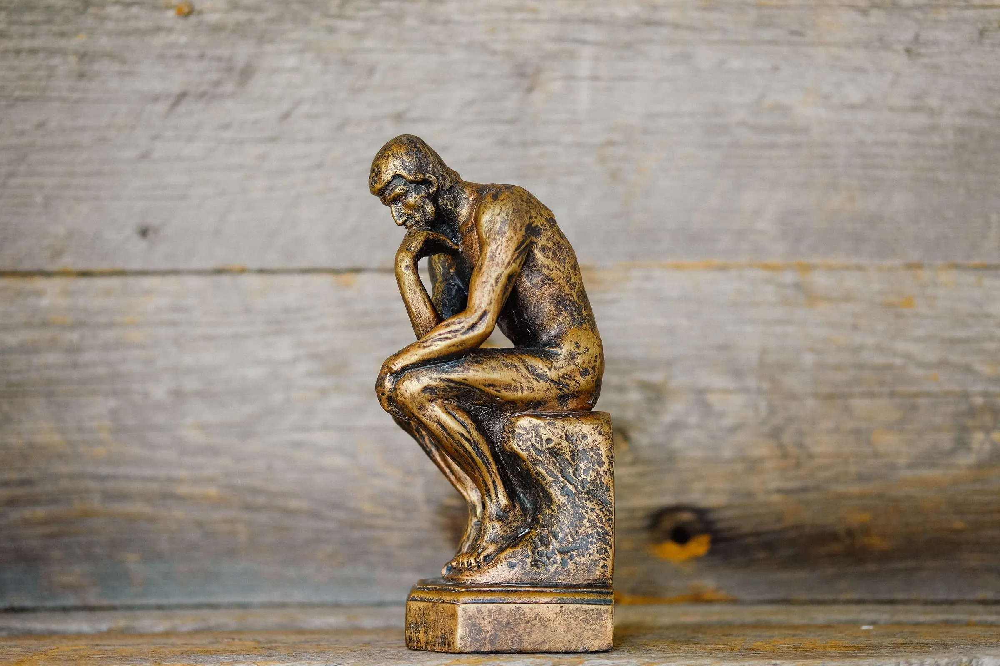
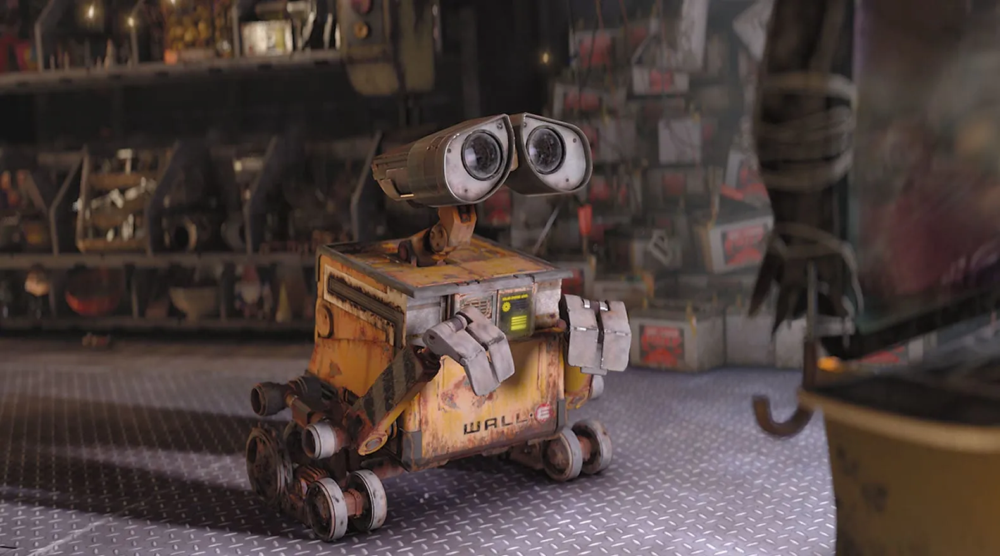

Look at the above painting. I mean really look at it. What do you see? Well, we see a human on the left (Adam) and the God on the right (with his/her angels) _touching their fingers_. But there is more to it. See the right side of the picture where the God stays. Doesn’t it look like a human brain? A doctor realized this similarity 500 years after the picture was drawn.

The general idea he come up with is that divine power does not come from outside world. It comes from within our mind. Adam represent us humans, and the God represents our mind. And this _touching of fingers_ is us, reaching out to ourselves.

> When we talk about the God, we are actually talking with our own mind. It is not a God, but us alone.

The Bicameral Mind
==================

Duality — Source: unplash.com by Jake Pierrelee

Julian Jaynes first introduced the term ‘_Bicameral Mind_’ in his writing ‘_The Origin of Consciousness_’ in 1976. He talks about the human brain having two states/parts. One is appearing to be “speaking” and the other one is just “listening and obeying”. This speaking happens in an auditory form. It is basically _talking to ourselves_. We use verbal language to talk, like speaking English or Spanish.

> Try to speak to yourself but without using a language. It’s impossible.

The consciousness comes from this exact topic. It is not some divine power or a mysterious soul that exists inside us. No, it is just us. The consciousness is us talking to ourselves. We think, ask, wonder and become curious about almost anything. All of this happens all the time inside our mind. We argue with ourselves. We decide whether to go outside with our friends or just watch the new episode of The Boys. We get angry with ourselves because of a mistake we did years ago. It’s all us.

Early humans brain was different than ours. The biological difference mgiht not be too much. But the way it works is sure to be different. When they first heard their own voices, they were probably surprised and scared. I mean, who is in their mind that just constantly speaks and wonders? They thought this voice as a God or some divine power. Their own desires and needs are spoken to them by this ‘God’. The God said “drinking wine is not good because it makes you do bad things” so they just stopped drinking.

> But in fact it was not the God that made them stop, it was their own mind.

The Consciousness
=================

Thinking — Source: unplash.com by Kenny Eliason

In order to ‘_gain’_ consciousness we must realize that the voice inside us is no one’s but our own. And that we must speak with ourselves. Without these two there is no consciousness. Speaking only happens with usage of a language. The more advanced the language, the more we can speak and the more conscious we become. Let me give you an example to help you better understand what I’m talking about.

Try to answer this: when did you become self-consciousness? Was it the time you were born? Was it when you hit puberty? Of course we can’t answer this question. Growing self-consciousness is not one-time thing. It is a never-ending process.

When you are just a kid you don’t know not many words. As you get older, your vocabulary grows. You know what _space, ocean, divine, god_ and _devil means_. Where before you only knew _mama, dad_ and _food_. When your language grows your consciousness grows with it.

> Did you ever realized that as you get older you become more self-aware and consciousness?It is not because you have aged, it’s because you have started experiencing new stuff and learning new meanings to the words.

Although the language you know helps a lot with your consciousness, it is not enough. The words must have a meaning too. The meaning of the word ‘death’ changes a lot from person to person. Some see it as an ending some see it as a salvation. This is why your friends consciousness is different than yours, even though he/she is the same age as you. In the end:

To ‘gain’ consciousness

*   We need to **understand** that the voice in our mind is **no one but us**.

To ‘grow’ consciousness

*   We need to know a **language** and learn the **meaning of its words**.

The Artificial Intelligence
===========================

Wall-E — Source: Disney

We tried to ‘define’ what consciousness is in the previous parts. It is a way of talking to ourselves and knowing that it is us. But what does knowing all this do? How does it help us? Well, firstly it makes us more aware. Our goals and reason of existence become clearer. We can find our own meanings to our lives easier. Overall, we gain more control over our lives. Secondly, we can use that knowledge to create a more realistic machine that feels ‘alive’.

Every Artificial Intelligence right now has some sort of learning feature like us. But they neither have conscious or control over their actions. They talk to us using words and somewhat knows their meanings. So, they do have a language and placed some meanings to it’s words.

> What they lack is a voice. A voice that speaks to them. This voice must come from their inner-self for them to ‘gain’ consciousness.

Imagine a machine that speaks to itself. What would that look like? What would he/she says the first? Would it just explode? What kind of motivations will he/she have? Well we can make some good guesses.

Let’s say we gave an AI the ability to speak to itself. First it needs to realize that this voice is **not a stranger** and is coming from within **itself**. After the realization that the voice is coming from no one but itself, it needs to ‘grow’ it’s consciousness. This the part where the Artificial Intelligence will really shine. The language, the words and the their meanings will define what kind of a ‘**person**’ it will become. The meanings can only be archived with experience. So, if we give this AI a chaotic an tragic ‘childhood’ it might become more a ‘bad’ person. Or if we can just make it a ‘good person’ by giving it more meaningful and peaceful childhood. It’s all about what kind of meanings he/she gives to the words.

My closing words are this. The consciousness is a thing that **can be gained and grown**. The realization of our own voice and the language we know are the most important things to the path of self-consciousness.

> By diving into this world of self realization and awareness we come up as a wiser and better person. And the information we gained during that process can be used to create sentient life.

Thanks for reading my article. This one is a little bit different from my usual writings. Most of the ideas I learned came from the podcast ‘Philosophise This!” and the TV show “Westworld”. If you have any suggestions please feel free to share them with me.
