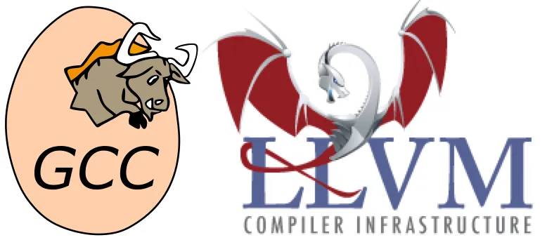
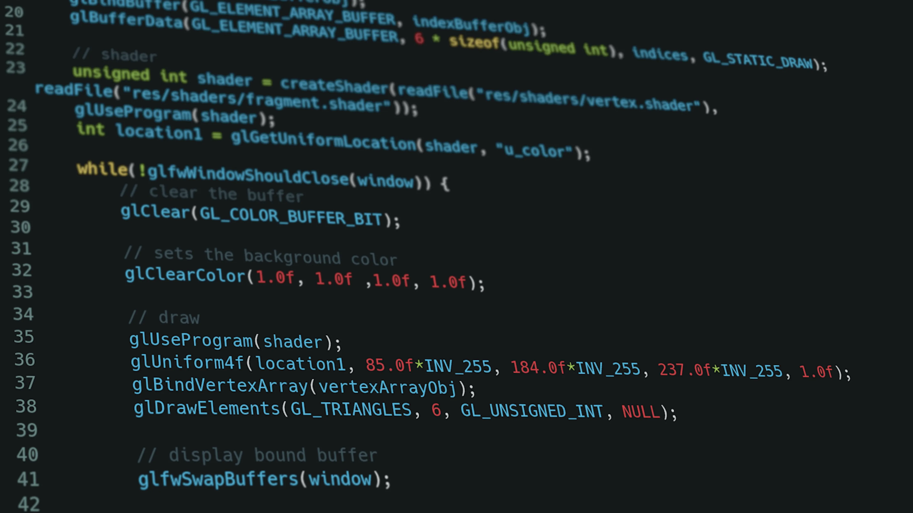
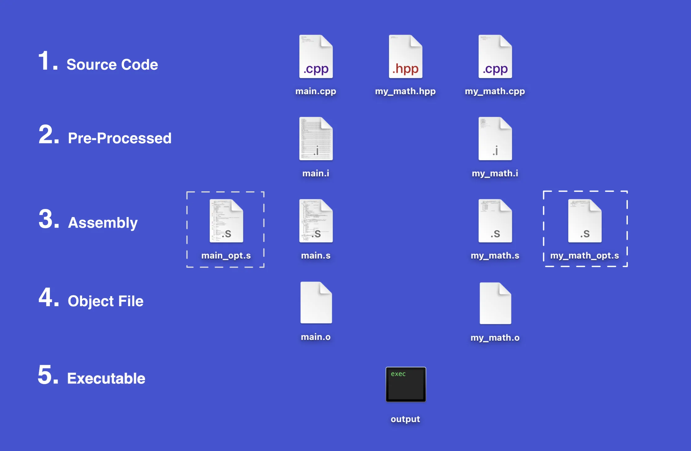
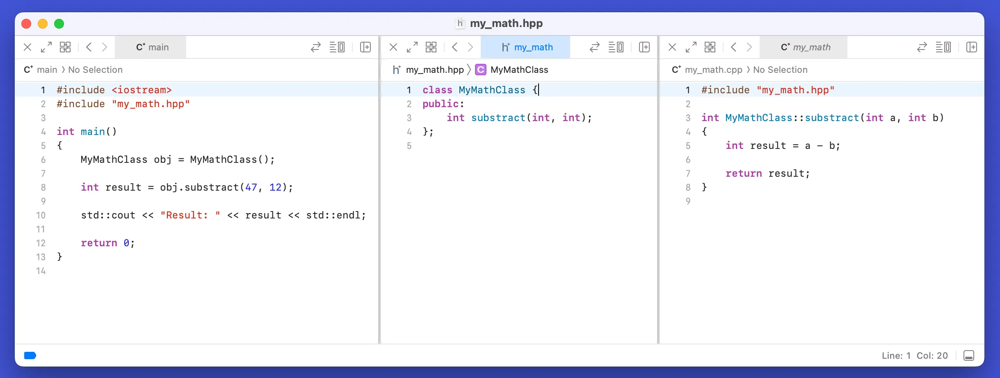
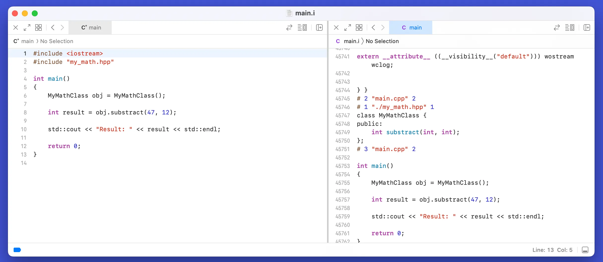
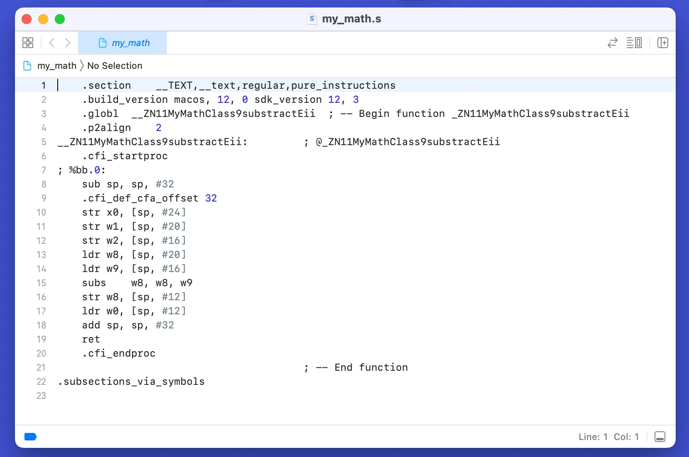
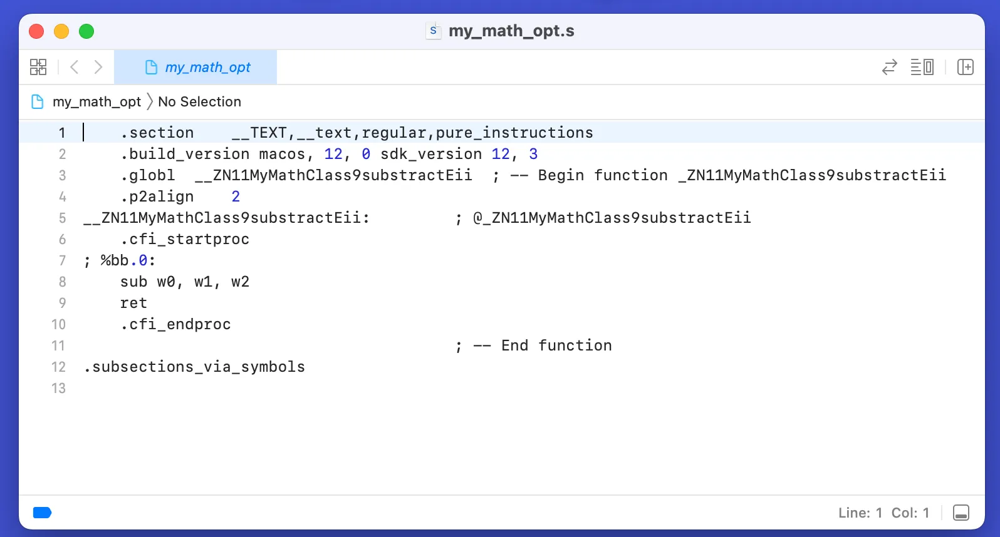
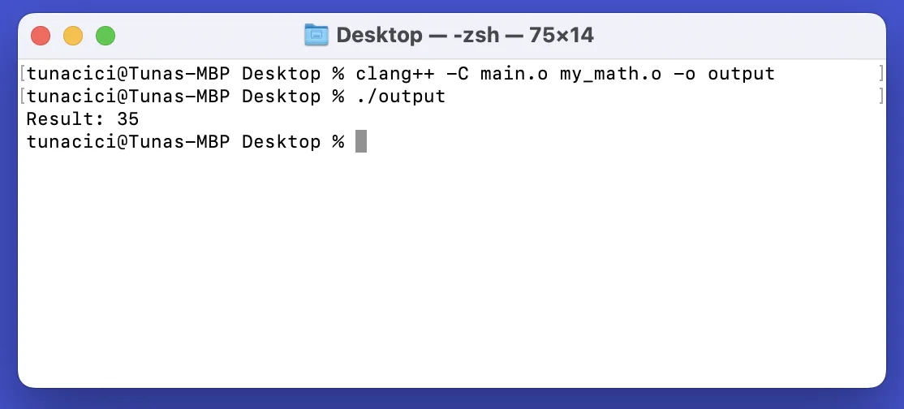

If you ever meddled with programming or coding, it is very likely that you have heard about compilers. Espacially them ugly link and compiler errors you get when you try to build a C/C++ project you got from GitHub. I know they are annoying to see but, they all mean something. Today I will tell you the most basic things about the compilers so that you can better understand the reason of them errors. I will try some questions like: Why do they exist? What problems do they solve? How do they work? etc.

This article meant to be an introduction only. There are way smarter champs than me. If you are looking for a more advanced article please check them out. The YouTuber ‘**Cherno**’ is a good example. I learned most of my skills and knowledge from him.

Also, I will not be talking about the compiler phases like syntax or lexical analysis. Instead, I will focus on the things that may help you in your projects. I hope that it will give you a better understanding on what a compiler is.

What Are Compilers?
===================

If I were to explain compilers in ELI5 form it would be this:

> A compiler converts your code into a language that a machine can understand.

A compiler is basically a ‘small’ program that converts a human-readable source code into instruction sets that the CPU can understand and execute. The source code can be C, C++, Fortran, Rust, Swift etc. The machine code is actually an assembly code. So we can say that, compilers create/produce assembly codes.



Two Most Popular Compilers — Gcc and Clang (LLVM)

Some of the popular compilers/toolcahins are: GCC, Clang, MSVC, Intel C/C++ Compiler. They all have pros and cons. For example; Intel’s compilers are very good at arithmetic operations compared to others, Clang provides a better error output than GCC and etc.

Why Do They Exist?
==================

We, _as humans_, communicate with each other using words. The computers on the other hand uses 1s and 0s. If we want to talk to them (by giving instructions) we would need a ‘translator’. This translator needs to convert our words using the Latin alphabet into a bunch of 1s and 0s.

Here we are introduced to compilers. They are the translators we need. Of course, we cannot just tell the compiler: “Hey, draw a triangle to the screen!” We need to talk in a more formal language. We call these language ‘programming languages’ like C++ or Rust.

Long story short, the reason compilers exists is the language difference between us, _humans_, and the machines.



An Example C/C++ Code — Source: unplash.com Authort: Krishna Pandey

How Do They Work?
=================

Compilers cannott just translate the source code by reading line by line. It needs some abstraction and to work in stages. There are two main stages: compiling and linking. They are the most basic task a compiler needs to do.



Simplified Stages and Corresponding Files

To explain what each ‘stage’ does, I wrote a simple C++ code that just subtracts two numbers and prints the result to the screen. There are three source files: `main.cpp`, `my_math.hpp` and `my_math.cpp`. Basically, `my_math` files are where my class and definitions written and `main` is the entry point of the program. The files surrounded with _dotted square_ are optimized assembly files. Don’t worry, I’ll explain them later.



Source Code

Compiling
=========

In the compiler stage, the whole source code is being analyzed, pre-processed, optimized and converted into an object code (s_tages 1 to 4 in the picture_). This is the stage where all the ‘translation’ happens. When you get a compile error, it happens in the stage. You can compile a C++ by simply calling `g++`, `clang++` or a similiar compiler. Here’s an example:

```bash
clang++ main.cpp
```

By default compiler ‘removes’ intermediate files and gives you an executable straight away. If you want to see these intermediate files you need specify some arguments.

Pre-Processing
--------------

The first thing the compiler does is to ‘process’ all the code that you specified with the ‘pre-processor’ tag. For example, `#include,` `#define,` and `#ifndef.` Compiler basically just looks for all the symbol `#` and process them. At the you obtain a `.i` file. This file is still a human-readable source code.



Pre-Processed main.cpp

When we `#include` the iostream, all its functions and definitions will included in our source code, hence the name _include_. Although my source code was small, the pre-processed file came out WAY bigger. From just 14 to 45762 lines of code! It basically did a copy-paste.

You can get the pre-processed file with the -E tag:

```bash
clang++ -E main.cpp > main.i
```

Assembly
--------

Now that we have our final pre-processed source code, the compiler can begin the translation. In our case, C++ source code is first translated to the assembly language. Assembly is still a human-readable code. It has operations like `mov`, `add` and `sub`. These operations corresponds to the different CPU instructions. They literally specify what the CPU should to do!



Assembly Code of my_math.cpp

You can get the assembly code with the -S tag:

```bash
clang++ -S my_math.cpp -o my_math.s
```

The interesting part here is that our source code only does subtracting but, the assembly code appears to be doing more than that. Calling many operations like `str`, `ldr` and `ret`. What are those?

The compilers does these extra operation for better debugging and such. Luckily, the smart people who created the compilers also created something called _compiler optimizations_. They analyze your source and try to ‘optimize’ it by reducing the assembly operations. Thus, making your code faster.



Compiler Optimizations Turned On

You can see how well it ‘optimized’ my code. It is crazy! Compiler optimizations have different levels like `o1`, `o2` and `o3`. O3 is the most aggressive one that produces the fastest and most optimized code. You can enable the optimization and specify the level with the -O tag:

```bash
clang++ -S -O2 my_math.cpp -o my_math_opt.s
```

Object File
-----------

What is an object file you ask? They are the CPU instructions we mentioned before. They are created using the assembly code before. You can open and try read them but it is filled with 1s and 0s. Object files are NOT meant to be readen by us, they are for the computers.

**FYI: Windows uses** `.obj` **as the file extension rather than** `.o`.

Each object file corresponds to a single source code. So my `main.cpp` file produces a `main.o` file and `my_math.cpp` produces `my_math.o`. You can get the object file with the -C tag:

```bash
clang++ -C main.cpp
```

Finally, we have two object files that can be readen by the computer. But, we have two different files. Which one will be used to start our program? How will the function defined in `my_math.o` can be used in `main.o` ? The answers lies within the linking stage.

Linking
=======

In the linking stage, all of your object files are linked together. When you compile you source code, you might have multiple include statments and outside function calls. For example, in our `main.cpp`  file we called a function ‘substract()’ that is implemented in the `my_math.cpp` file.



Linking Two Object Files

Now, in the compilation stage we obtained two object files. `main.o` and `my_math.o`. Linkers job is to link those two files so that they can ‘communicate‘ with each other. You can think of it the linker as a ‘merger’. It basically takes all the object files and ‘merges’ them into a single file. You can link one or more files and create and executable by calling:

```bash
clang++ -C main.o my_math.o -o output
```

After the linking stage, we finally obtained our executable called `output`. This is the file which can be just executed by the computer. In Windows it has the extension `.exe` and in Linux `.out`. The executable includes all of our codes from `main.cpp` and `my_math.cp` thanks to the compiler and the linker.

Final Words
===========

When we take a look back, we learned how a compiler works, what purpose does it server and the reason of their existence. Compilers are basically the translators between us humans and computers. They help us communicate using the programming languages. Using the assembly language and many different conversions/translation it produces machine-readable object files. And finally, it links these object files to create a single executable. After then, we use it to run our beautiful code.

Thanks for reading my article on compilers. I know that this is not a technical explanation at all. This is more of a high-level and a little bit practical take on the compilers. If you spot any errors or mistakes please let me know.

Take care ❤
