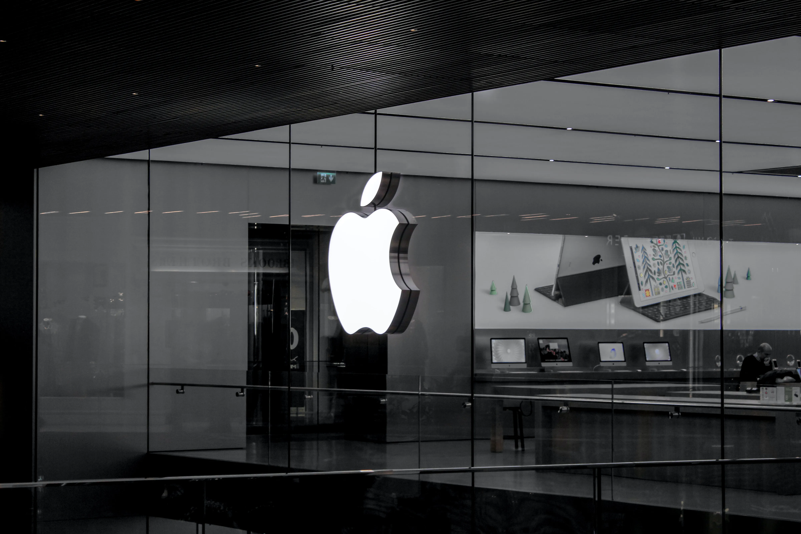
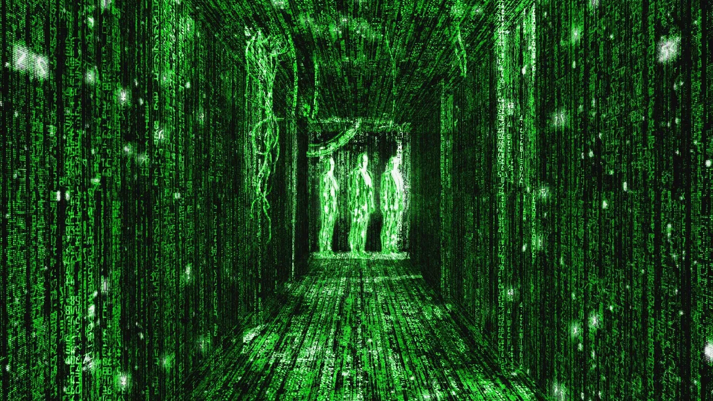
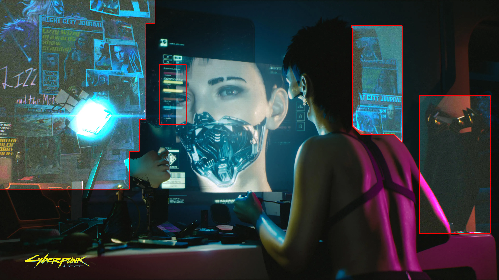

Lately I’ve been thinking about personal computers and how it affected all of us. Yeah, it’s a bit cliché and cringy to talk about these type of topics. Everyone writes and talks about how computer are either the greatest or the most evil thing that ever existed. I’m not going to talk about either of them today. Today, I will talk about the future and do a little bit philosophy. It’s a gonna be a wild ride!

‘Innovation’
============

When Apple, Google, Sony and etc. introduces something new what is the common thing we all can expect? Better, Faster, Stronger products of course! Every iteration of a product (and computers too) is better and faster than the previous one. Yes, some iterations are WAY better than we except (E.g. Apple M1 Silicon) but they are basically the same. They introduce us a phone or computer. It has more pixels, cores, transistors, memory and etc. But the way we interact with them stays the same.

Apple / Source: unplash.com / Autoher: Hussam Abd

The Way We Live
===============

Imagine a week without your phone, computer or tablet. Yeah.. I can’t either. The personal computers we have are so entangled with our lives that we don’t even notice them. Like, checking your phone every 5 minutes or just cruising casually on the Reddit/Instagram is something we do everyday.

And when you think about it, all we do is look at some screens and press some buttons. Isn’t it crazy? I think that, if a person born before 1800s saw us, he/she would think that we are aliens or wizards or something. How are we able just press a button and all of a sudden we sent a message to our friend 10,000 kilometers away?!

Yes, buttons and touchscreens are cool and all but what if we can use something else. Something else to sent that 10,000 kilometer worth of message. What if we could use just our thoughts and intentions? No, I am not talking about magic or psychokinesis.

Lots of computers / Source: unplash.com / Author: Marvin Meyer

Interaction
===========

The whole universe is about interaction. When atoms ‘combine’, they interact. When water is poured over fire, they interact. When we touch something, we interact. Everything we do, we do with interaction.

Our ancestors used sticks and stones. But now things have changed. We use flat screens and shiny-looking buttons. Switches, sliders, wheels and etc. These are the current things we use. Yes, we still hold/touch things with our hands but, you know what I’m talking about.

People collaborating / Source: unplash.com / Author: John Schnobrich

Something ‘New’
===============

We need something new. Something less physical and less ‘old’. You might be thinking,

> “We use our hands/legs for thousands of years, what else can we use?”

And I say

> “Your mind, my friend”.

Sorry for the serious and somewhat cringe answer but that’s the truth. We have something way more powerful than our physical being. We have our mind and brain. They are at the center of everything. Even when we want to simply move our hands, our mind is the one that give this command. And what if we can use it more efficiently?

Let’s say I want to sent a message to my ex at 3:00 AM. I don’t want to grab my phone and unlock it and press some keyboard buttons. I want to sent the message as soon as my drunk brain gives the command.

How is that possible you ask? Well let me introduce you to the Brain Computer Interface.

Matrix / Source: wired.com

Brain Computer Interface
========================

It’s something that sound too scientific. Maybe even a bit Hollywood-ish? Both are valid responses to the Brain Computer Interface (BCI for short). It is basically the bridge between our brains and computers. Anything that has a computer can use this technology. (well… only in theory that is)

What it does is to ‘read’ our intentions and translates them into a language that the computer/machine can understand. This translation means that we can ‘talk’ with any computer just with our mind. No hands and no screens. Just our thoughts and the computer.

Currently there are some extremely talented people working on this Brain Computer Interface. (NeuraLink, Kernel, NextMind and etc.) I don’t want to talk about the technical part in this article. I will mostly talk about it’s possibilities. Though, if you want a more technical article, I can surely do so!

The Possibilities
=================

Now comes the fun part. Think about something simple you do everyday with your computer or phone.

*   Starting a navigation to your work using Google Maps? Just ‘tell’ your phone to do that using your brain. Done!
*   Calling your friend on the phone? Just say the words in your mind!
*   Want to skip to the next song on Spotify and increase volume? Done and done!

These everyday activities can be way simpler and faster using nothing but your brain. But what about the other stuff? Like, turning on your car headlights. Locking/Unlocking your house door. Driving a plane. Painting using a robot arm. Firing a weapon system. Hacking into a network. All these things are can be controlled by a computer. And therefore your brain. When I say your brain, I mean just the brain. No physical contact or anything.

Girl replacing her jaw / Source: cyberpunk.net

Cyberpunk
=========

I know that I should not stray from this article’s topic. But, there is something else I want to talk about. Let’s assume that the humanity managed to get BCI technology out and made it mainstream.

Brain Computer Interface allowed us to use any computer with just our brains. This means that we can make prosthetic arms and body parts. After all, they are just tools controlled by computers. Therefore we can use them effortlessly with our mind.

The interesting part is that we can replace our biological arms and use prosthetic arms. They are better in every way. Better coordination, faster movement, stronger punches. Imagine that the BCI and prosthetic technologies are advanced so much so that everyone just uses them. Every person on the street has a prosthetic arm and leg. They all can punch through concrete wall and come out unscratched.

It sound amazing isn’t it? You run faster. You be stronger and carry more stuff. You might even see better, thanks to prosthetic eyes. Yes, I agree it is amazing. But there is a catch.

If everyone could replace their body parts, what would that mean? Your arm broke? No problem mate let me get another one real quick. You want to have longer legs? You got it! Every part of your body is now easy to repair and replace.

This might not seem like a issue but it is a big one. What is stopping you from harming yourself right now? It is the knowledge that you have only one life. One heart, two eyes, two arms, two legs. There is no replacement. No do-over. This mentality is the one that keeps your from doing dangerous things. You can’t just jump from high buildings. You will lose your legs and maybe more.

The BCI and prothetic technology creates this problem. You can do dangerous things more easily now. Lost your arm in a fight? No biggies, you can just buy another one. If this type of mentality becomes more and more widespread, then the whole society and human-race will become more chaotic. There will be more crime, depression and war.

All this is because Brain Computer Interface. If it didn’t existed we would not have prosthetic arms. No way to talk to computers other than pressing buttons and touching screens. Maybe it is not a good technology after all? Maybe we should stick to the good-old chops and sticks?

Thanks for reading my article. If you have any suggestions, feel free to contact me. I’m always looking for ways to improve myself.
