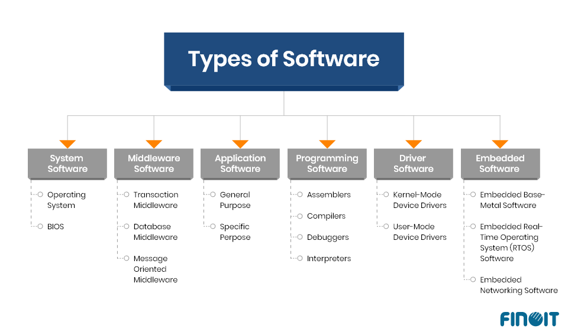

Between “pressing the power button” on your device to actually start using it, there exists many pieces of software from different vendors that must execute & work together for a system to Gracefully Boot™.

Most modern devices are capable of [booting in a few seconds](https://forums.macrumors.com/threads/how-long-does-it-take-to-boot-your-macbook-pro.2198565/) & being fully ready to be used. There are even areas (safety-critical) where [sub 1 second boot time](https://elisa.tech/blog/2022/12/07/linux-in-aerospace/#:~:text=the%20system%20must%20be%20operational%20in%20only%20a%20few%20seconds%20or%20even%20less.) is not only possible but required! These timings are fascinating when you learn how much “software switching” happens & the important role they each play.

The overall process I just described above is called a **boot process**. It’s a rather “big” topic that covers things like: Firmware, BIOS, \[U\]EFI, First-Stage & Second-Stage Bootloaders, ACPI, Device Trees and a little bit of X86, ARM & Hardware. But worry not! I’m here to explain all of these (and more) in a nicely formatted & easily digestible way.

Bootloader-Related Terms & Logos

If you are ready, grab something to drink for yourself because this is going to be a “long” one >.<

**Quick Note:** Initially I intended this to be a one giant writing. However, it turned out to be a REALLy long one, so I divided it into 3 parts.

1.  [Bootloaders & The Wilderness of The Firmware\*](https://medium.com/@tunacici7/bootloaders-the-wilderness-of-the-firmware-5a9b13c1bffd) (this one)
2.  First-Stage Loaders: BIOS, \[U\]EFI & ARM Counterparts (coming soon)
3.  Second-Stage Loaders: GRUB2, iBoot, BOOTMGR & More (W.I.P.)

> **WARNING:** This is a beginner — intermediate level writing with relatively limited info on technical stuff like; how-to build or implement-in-C and is written with the sole purpose of education and bringing more people into the topic of bootloaders in the hopes of ‘nurturing’ their curiosity.

Problem
=======

There are basically two types of memory/storage types: [volatile](https://en.wikipedia.org/wiki/Volatile_memory) and [non-volatile](https://en.wikipedia.org/wiki/Non-volatile_memory). When a device is not running all the data & software are stored in a non-volatile storage like eMMC, HDD, SSD, USB Flash Drive, CD-ROM and so on. In contrast, when a device is running \[some of\] that data & software are now stored in a volatile storage like [SRAM](https://en.wikipedia.org/wiki/Static_random-access_memory) and [DRAM](https://en.wikipedia.org/wiki/Dynamic_random-access_memory).

Volatile vs. Non-Volatile Memory — Table Source: diyanaha.wordpress.com

See the [Von Neumann architecture](https://en.wikipedia.org/wiki/Von_Neumann_architecture) for more information on the question “why?”.

As with anything in life, your device/CPU has no idea what to do when it’s first started. It can’t just load your operating system and applications because it doesn’t even know what/where your storage device is, let alone your specific “operating system”.

Your device is \[almost\] completely blind at this point. It somehow must recover itself from this situation and become fully-functional. This process is called [bootstrapping](https://en.wikipedia.org/wiki/Bootstrapping#Software_loading_and_execution): _for a computer to pulls itself up by it’s own bootstraps._

I assume you got the problem defined in your mind. Just in case you didn’t here’s the problem “we” are trying to solve & explain:

**How does a computer starts itself when it doesn’t know what is what and where is where?**

> Btw, the question above is a little bit naive. There are way more questions that needs to be asked. Of course, I will answer most of them here, but I didn’t explicitly specified them for simplicity sakes >.<

Warming Up
==========

Every software program out there has some form of requirements from its working environment. Let’s give some examples.

*   **Python Script:** Requires `python`
*   **Java Program:** Requires `jre`
*   **Most C / C++ Programs:** Requires `libc` or `libc++`
*   **Most PC Games:** Requires `DirectX`

> Of course there are WAY more things that a program can require, but it’s just a simplification.

An AR/VR Game Made /w Unity Has Many Layers of “Requirements” — Source: unity.com

Now, the above examples are just some _high-level requirements_. What about things like `stdin`, `stdout`, `TCP/IP Stack`, `Software Exceptions`, `Stack Area` and `Heap Area`? Most program expect you to have these types of thing because they are so “base/trivial”. Luckily we have this amazing thing called _operating systems_ that does these types of stuff for us;) But how do they come to existence anyway?

When you launch a software program, your operating system handles most of the “boring” stuff for you like (not in-order):

*   Loading dynamic libraries (e.g. `libc`)
*   Loading it into memory
*   Parsing the executable (e.g. `ELF`, `PE`)
*   Setting up the Stack
*   So on…

Low-level programs like _kernels_ or _generic firmwares_ are not so different in this area. They, too, need to be loaded into memory and have some sort of _stack_ set-up for them. Unlike “normal” programs however, they have additional requirements like “I want to run on CPU Core #1” or “Interrupts must be disabled on all cores”.

A \[presumably incorrect\] Comparison Between High Level Software & Low Level Software — Source: developer.qualcomm.com

As you can see these are not your “normal” requirements. These are more “hardware-related & environmental” requirements. Now comes the big question:

**Who can satisfy these environmental requirements for low-level programs like _kernel_ and _firmware_?**

Introducing.. Bootloaders!
==========================

Software program(s) that the CPU executes to boot itself is called are **bootloaders**. Now the term “bootloader” is very broad and generic. It could be a small [assembly stub](https://github.com/mit-pdos/xv6-public/blob/master/bootasm.S), a [firmware](https://en.wikipedia.org/wiki/BIOS) or a multi-purpose [project](https://www.gnu.org/software/grub/) like GNU GRUB.

> You might know **bootloaders** as the program that you see on the screen before launching your favorite operating system.

According to [Wikipedia](https://en.wikipedia.org/wiki/Bootloader#:~:text=a%20computer%20program%20that%20is%20responsible%20for%20booting%20a%20computer), a bootloader is: “_… a computer program that is responsible for booting a computer._” And throughout this writing I’ll use this as the base definition.

Two Different Bootloaders & Their Interface (Left: GRUB - Right: BOOTMGR)

As seen from the above examples, there are many forms that a bootloader can take and be written. For a better understanding, let’s list some of the core responsibilities of a bootloader:

*   **Detect & Initialize Hardware**
*   **Load a Program Into Memory**
*   **Pass Control to The Loaded Program**

> When I say “program” I mean stuff like, kernels, operating systems or other-bootloaders. However, since they are technically also programs, I’m going to call ANYTHING that a bootloaders loads a program.
> 
> In other words: **program === kernel/OS/bootloader** throughout this writing.

Most modern bootloaders, of course, do more than what listed about (e.g. [Diagnostics](https://www.memtest86.com), [Basic CLI](https://www.gnu.org/software/grub/manual/grub/html_node/Command_002dline-and-menu-entry-commands.html), [Cool GUI](https://limine-bootloader.org/)). However, for a program to be properly called “a bootloader” it MUST handle the above 3 tasks.

Detect & Initialize Hardware
----------------------------

First thing first; _CPU,_ _memory_ and _storage_. These are the hardware devices that a bootloader program MUST detect and properly initialize before trying to “load” a program into memory.

Raspberry Pi 4 Board Hardware Overview — Source: seeedstudio.com

Naturally, this part is hardware-dependent. Meaning the bootloader must be designed, implemented and built for the target [CPU ISA](https://medium.com/@tunacici7/what-are-cpu-architectures-and-instruction-sets-384e0365b4b9) (e.g. x86, ARM64, RISC-V). This requires different booting methods & standards to be used, but more on this later.

After that, the memory must be set-up. Here we are faced with a new problem. Since a bootloader is still a “program”, it itself needs to be loaded into memory. But how? Isn’t the bootloader responsible for that? Hmm… this seems similar to the [well-known chicken or the egg problem](https://en.wikipedia.org/wiki/Chicken_or_the_egg).

Obviously we need some another program for this. And guess what! It is also a type of “bootloader”. More specifically a “**First-Stage Bootloader**”. Again, more on this later;)

Different Kind of Non-Volatile Storage Devices

But now, what about storage devices? The target program is, as we know, is stored inside a non-volatile memory. In this case, a bootloader MUST implement the proper device drivers & use them to detect & read from storage devices like eMMC, HDD, SSD and USB Flash. For example, an [AHCI](https://en.wikipedia.org/wiki/Advanced_Host_Controller_Interface) driver is [implemented](https://github.com/search?q=repo%3Arhboot%2Fgrub2+ahci&type=code) in a bootloader so that it can operate on [SATA drives](https://en.wikipedia.org/wiki/SATA).

> Additionally, a bootloader can also initialize stuff like a serial port, keyboard, RAM buffer, display etc. Although not necessary, but most [modern bootloaders](https://limine-bootloader.org) do include them for a better UX & accessibility.

Load a Program Into Memory
--------------------------

A bootloader should be able to detect different programs from different storage devices & then launch them. And, optionally, provide some arguments to the target program. Now, the question is “How”?

Different Programs Detected by GRUB — Source: ubuntubuzz.com

**First**, a bootloader must identify the program it wants to load. This is generally done by scanning a storage device (or a [drive](https://support.microsoft.com/en-us/windows/all-about-ssd-hdd-and-storage-types-9c6c7c59-7d1c-4611-9ba9-676d53cc0ff1)) for files that have a specific [Magic™ header](https://en.wikipedia.org/wiki/List_of_file_signatures). A magic header is a sequence-of-bytes that is unique to a particular type of program.

A bootloader can’t (and shouldn’t) just launch any type of program. It needs to know that “Okay, this program ‘can’ and ‘wants to’ be loaded by me.” This idea is implemented using Magic™ headers as previously said.

> You can think of Magic™ headers as signatures for files. I don’t know why they are called ‘Magic’ :/ Personally tho, I find them really interesting and you should look them too when you have a chance.

Magic Header Are Used For Almost Any File Out There, Above is The ELF \[Magic\] Header — Source: nathanotterness.com

These Magic™ headers have other important meanings apart from being useful for bootloaders when detecting programs. They tell others:

*   I am a/n <TYPE> of file.
*   I acknowledge what my <TYPE> represents
*   I comply with the specifications of my <TYPE>

> It’s like an agreement between programs! (we’ve just discovered [software standards & specifications](https://en.wikipedia.org/wiki/Software_standard))

Here we are faced with a new topic: **boot specifications**. They are not real programs but rather “specifications” that defines what a/n <TYPE> of software program can expect and how it should behave. And we use Magic™ headers to tell that “I am <TYPE> of file and acknowledge everything in it.”

> Boot specifications can also be known as **boot protocols**.

We have different boot specifications out there. Some are open-source and popular and some or custom-made & proprietary. Here’s some of the most common ones:

*   [**Multiboot 1/2**](https://www.gnu.org/software/grub/manual/multiboot2/multiboot.html): GNU’s boot protocol. Mainly used by GRUB for Linux.
*   [**Limine**](https://github.com/limine-bootloader/limine/blob/v5.x-branch/PROTOCOL.md): Modern boot protocol. Mainly used by hobbyist OS devs.
*   [**Linux**](https://www.kernel.org/doc/html/v5.6/x86/boot.html): Linux’s own boot protocol. Used by SysLinux on x86 platform.
*   [**BIOS**](https://www.scs.stanford.edu/nyu/04fa/lab/specsbbs101.pdf): Basic Input and Output System for PCs. More on this later.
*   [**\[U\]EFI**](https://uefi.org/specifications): Unified Extensible Firmware Interface. More on this later.
*   [**MachO**:](https://github.com/AsahiLinux/docs/wiki/SW%3AMachO-Boot-Protocol) Apple’s own \[boot\] protocol. Used by iBoot on Apple devices.

Windows BOOTMGR Asking Which OS to Load — Source: technewsinc.com

**Second**, a bootloader selects which one of the discovered programs to be loaded & launched. This step is either pre-configured via a config file so that the bootloader “knows” which one to boot from OR it “asks” the user via a CLI or even a GUI. Most of the time the former method is used.

Different bootloaders have different config files, syntaxes and interfaces. This is purely implementation defined and the design is up to the bootloader developer. However, you can be \[as an user\] sure to know that some form of **boot configuration** is possible (e.g. config file).

GRUB Config File Found Under /boot/grub/grub. cfg — Source: linuxbabe.com

**Third**, depending on the boot specification/protocol, a bootloader sets up the environment the program expects itself to be in when launched. This step is further explained in the <TODO: FIRMWARE\_HISTORY> section.

**Fourth**, the program finally gets “parsed” & loaded into the memory. This process depends entirely on the program format (type). It could just be as “simple” as parsing an `[ELF](https://en.wikipedia.org/wiki/Executable_and_Linkable_Format)` file and then loading its sections into the memory. Or it could be a Linux `[bzImage](https://en.wikipedia.org/wiki/Vmlinux#bzImage)` with `[initrd](https://en.wikipedia.org/wiki/Initial_ramdisk)` that needs additional things like decompressing.

Loading ELF File Into Memory (Both Physical & Virtual Memory is Given) — Source: ourembeddeds.github.io

After the parsing, a bootloader basically copies the program from the storage drive (non-volatile) to the memory (volatile). Generally this is as simple as just mirroring the executable format into memory byte-by-byte. However, there are some edge-cases that needs handling. For example;

*   **Memory conflicts**: If the program’s desired load address conflicts with the bootloader’s memory or other occupied areas, the bootloader may need to perform [relocation](https://stackoverflow.com/questions/1203108/why-do-boot-loaders-relocate-in-memory) to get out of the way.
*   **Platform constraints:** Some platforms (especially x86) have additional constrains like the infamous [A20 Line](https://www.win.tue.nl/~aeb/linux/kbd/A20.html) or a [Memorry-Mapped IO.](https://en.wikipedia.org/wiki/Memory-mapped_I/O_and_port-mapped_I/O)

> Generally, a \[well-written\] program is aware of these edge-cases and is designed to handle them by itself.

Pass Control to The Loaded Program
----------------------------------

A bootloader job ends just before the loaded program gets executed. At this point of time, the program is loaded into the memory and is now ready to be executed.

Bootloader And The Program In the Memory (Visualized) — Source: embetronicx.com

You might be asking, “What happens to the bootloader in the memory after it’s done? Does it get deleted?” The answer depends on the bootloader and its configuration. It might:

*   **Stay in the memory:** Sometimes speed is key. So, no purging occurs.
*   **Relocate to another place**: Might want to keep it for later(?)
*   **“Deletes” itself from the memory**: Purge everything!

Again, this behavior is implementation defined and there is no “right” answer.

> If you are working on low-level stuff, I advise you to assume the “worst” which the bootloader “Stays in the memory” and handle that accordingly.

Finally, the bootloader calls the _ENTRY_ function defined by the program’s linker in build-time. From now on the flow of execution continues from the program and it is assumed to be in “total control” of everything! Sounds cool & dangerous…

An Example Assembly Entry Stub — (The Entry Label is Defines as \_start)

> Take a pause here if you’d like to. The upcoming sections are going to be relatively more technical & practical stuff >.<

Firmware (Between Hard and Soft)
================================

So far we have defined _what_ a bootloader is and seen some of its main objectives (and how it achieves them). It is now time to get a bit more technical and talk about stuff like x86/ARM boot process, BIOS, \[U\]EFI and firmwares in general.

In the world of “computing” we have:

*   the **hardware:** physical IRL component that handles the actual computing (e.g. CPU, RAM) and
*   the **software:** tells what the hardware should do & how to behave (e.g. OS, Drivers, Applications)

The thing with software is that.. it’s just a too broad of a term. I mean look at the image below and compare each software to other. They’re all technically software, but is it “smart” to identify them as “a software” and call it a day?

Some \[Unofficial\] Types of Software, There Are ofc More ‘Than What’s Above — Source: finoit.com

Can we really compare a low-level device driver to a Web application? Sure, they are both software, but the “level-of-abstraction” they work on is VASTLY different. Also, the stakes are VERY different. If a low-level software fails, it can literally “**cook**” the hardware (imagine if your CPU cooler failed to work \*R.I.P.\*). On the other hand we have high-level software like Stardew Valley that we can “always” restart to without much risk. The worst we can lose here is the game progress we made. (it still sucks tho)

Clearly we need some sort of way to distinguish between different types of softwares… Oh, wait. I found it! What’s the state between **hard** and **soft**? I know: it’s [**firm**](https://dictionary.cambridge.org/us/dictionary/english/firm). Then let’s call this new type of software a **firm**ware. _I’m such a genius and creative person(!)_

Simplified View Showing The Relationship a Firmware Has With HW & SW — Source: inspirezone.tech

We are going to classify all really-low-level programs as “**firmware**” instead of “**software**”. Since they are not really a software like video games or web browsers. They deal directly with the hardware and provide some sort of functionalities for the higher level softwares like kernels or a drivers. And, unlike software, they are designed/targeted for very-specific purposes like dealing with the XHCI controller or an optical mouse.

According to [Wikipedia](https://en.wikipedia.org/wiki/Firmware#:~:text=class%20of%20computer%20software%20that%20provides%20the%20low%2Dlevel%20control%20for%20a%20device%27s%20specific%20hardware.), a firmware is: “_… class of_ [_computer software_](https://en.wikipedia.org/wiki/Computer_software) _that provides the_ [_low-level control_](https://en.wikipedia.org/wiki/High-_and_low-level) _for a device’s specific_ [_hardware_](https://en.wikipedia.org/wiki/Computer_hardware)”.

In Laymen’s terms: a firmware is simply a software program that directly talks with the hardware for very specify purposes.

There are of course more differences between a software and a firmware. Instead of just typing them out, let’s see them in a picture (most important ones).

Some Comparisons Between SW & FW — Source: hardwarebee.com

Connection With Bootloaders
---------------------------

Now, the above section begs the questions “_Should the bootloaders be considered as a firmware or a software?_” The answer is **both**. Let me explain.

We know that a bootloader can be in any form (e.g. assembly stub, full-on project). This means that it can be considered as a **firmware** if it deals with low-level control of any kind-of device. It can also be considered as a typical **software** by providing services like a GUI and a CLI.

This distinction between a “firmware-level bootloader” and “software-level bootloader” is kinda confusing. To clarify it, the people-of-software world created two categories for bootloaders.

*   **First-Stage Bootloaders:** Like BIOS on x86 platforms
*   **Second-Stage Bootloader:** Like GRUB2 or iBoot.

The Overly-Simplified Transitions Between Different Boot Stages

You can already have some idea as to what they are. But, you will have to hold on to that thought just a little bit more. I’ll explain them in the coming sections;)

> Bootloaders \[obviously\] needs to handle each platform differently. Espacially the First-Stage bootloaders. Below sections give information on x86 & ARM on their boot process & characteristics.

x86 — Boot Characteristics
==========================

X86 \[Simplified\] Boot Overview

NOTE: This section is mainly referenced from [intermezzOS’s wiki page](http://intermezzos.github.io/book/first-edition/multiboot-headers.html).

One of the main “philosophies” behind x86 is for it to be as **general** **purpose** as possible. It maintained backwards compatibility throughout years. But this made the overall boot process on x86 platforms a [mess](https://news.ycombinator.com/item?id=30666914).

The x86 boot process is a whole pile of hacks held together with duck tape & glue. Each x86 generation added a feature that meant new steps for the process; further complicating it. The [A20 Line](https://www.win.tue.nl/~aeb/linux/kbd/A20.html) is a good example to this:(

> [Here’s a fun fact](http://intermezzos.github.io/book/first-edition/multiboot-headers.html#:~:text=when%20your%20fancy%20new%20computer%20starts%20up%2C%20it%20thinks%20it%E2%80%99s%20an%208086%20from%201976.): “when your fancy new computer starts up, it thinks it’s an [8086](https://en.wikipedia.org/wiki/Intel_8086) from 1978. And then, through a succession of steps, we transition through more and more modern architectures until we end at the latest and greatest”

CPU
---

At **first**, the CPU is on a state called “real mode”. This is the 16-bit mode that the original x86 chips used.

The **second** one is the 32-bit “protected mode”. This mode add new things on top of the 16-bit “real mode”. It is called protected because the real mode sort of lets you do whatever you want (e.g. including bad ideas). Protected mode enables certain kinds of protections such as when accessing the RAM.

The **third & final** mode is the 64-bit “long mode”. Naturally we want programs (like the Kernel) to be running in this state.

More information on this topic can be found [tortall.net — Execution Modes and Extensions](https://www.tortall.net/projects/yasm/manual/html/arch-x86-modes.html).

Most Important X86 CPU Modes — Author: Faheem Syed

> The above states are important to us as the bootloader needs to handle transitions between them before it can pass control to the program.

Memory & Device Discovery
-------------------------

The overall system on an x86 platform is described using a [memory map](https://en.wikipedia.org/wiki/Memory_map). It is basically an array of information that specifies which areas of memory is used, reserved or free. The below picture is a good example showing a memory map.

Physical Memory Map As Seen & Reported by BIOS — Source: rekall-forensic.com

Unlike ARM, x86 platforms are more “dynamic”. Meaning the devices (e.g. PCIe, USB, Ethernet) are not necessarily known to “exist” before the system boots up. This is where **First-Stage** bootloaders, like BIOS, comes in to play. They “detect/discover” the devices available on the system and then create a memory map.

> Keep this “memory map” in mind. They will be important when we talk about Device Trees in ARM.

ARM — Boot Characteristics
==========================

ARM \[Simplified\] Boot Overview (\*most\*)

Unlike x86, ARM platforms are generally targeted for more “mobile” devices and therefore follow a **specialist** philosophy. Although, [Apple’s M SoCs](https://en.wikipedia.org/wiki/Apple_M1) proving this to be false.

For this reason ARM platforms are more **static** in nature. Meaning all of the hardware is designed to be closely working together and once it’s manufactured, it can’t be easily upgraded. For example, on x86 systems you can switch out your RAM modules and/or add more SATA ports.

> Again, [Apple’s new Mac Pro](https://www.apple.com/mac-pro/) is proving this to be false /w expendable PCIe ports.

Due to being “**static**” in terms of hardware peripherals, ARM platforms doesn’t “care” about backwards compatibility as much as x86. And by this, the boot process becomes more clear & straight-forward.

Hardware Parts Are (closely) Tied on This Raspberry Pi 5 (Popular ARM Board)

Unfortunately for ARM, having a “**specialist** philosopshy” resulted in it being full of proprietary & vendor-dependent software/firmware solutions. Yes, the overall boot process is simpler and more clear. But, the actual implementation of it is \[most of the time\] [NOT STANDARD!](https://www.reddit.com/r/hardware/comments/ymh8uu/eli5_is_there_any_good_reason_why_arm_systems/) This is a rather big problem as we will see in **First-Stage Loader** section.

> Luckily, with recent [\[U\]EFI](https://developer.arm.com/Architectures/Unified%20Extensible%20Firmware%20Interface) and [Arm® Base Boot Requirements](https://developer.arm.com/documentation/den0044/g/?lang=en) we might see more standardization in the ARM world. Here’s hoping!

CPU
---

ARM does not suffer from the same mess of 16-bit real mode and 32-bit protected mode state transitions. Instead we have [Exception Levels](https://developer.arm.com/documentation/102412/0103/Privilege-and-Exception-levels/Exception-levels). Depending on your ARM core, every instruction is run on the same X-bit mode. For _AArch32_, it’s 32-bit and for _AArch64_ it’s 64-bit.

ARM Exception Levels — Source: developer.arm.com

The bootloader’s main job here is less cluttered here (but vendor-specific solutions can interfene). Its main focus here is mostly working closely with exceptions levels. More info on them can be found on [developer.arm.com — Privilege and Exception levels](https://developer.arm.com/documentation/102412/0103/Privilege-and-Exception-levels/Exception-levels).

Memory
------

The overall system on ARM platforms are generally represented using [Device Trees](https://en.wikipedia.org/wiki/Devicetree). They can be compared to memory maps on x86, as they are both used to describe the system hardware. Below is an example Device Tree Structure.

An Example \[Part of An\] ARM Device Tree Structure (Represents a QEMU ARM Virt Machine)

On the implementation level, device trees look “similar” to JSON files. They represent the system in an hierarchical view. For example, there can be a parent CPU cluster ([NUMA Node](https://en.wikipedia.org/wiki/Non-uniform_memory_access)) that has many core’s defined as its children.

Device Trees can be in two different file formats.

*   **Device Tree Structure** `(.dts)`**:** Human-readable (similar to JSON)
*   **Device Tree Blob**`(.dtb)`**:** Machine-readable (simple Binary Blob)

A `.dts` file can be compiled into `.dtb` & vice-versa. Check out my simple [GitHub Gist](https://gist.github.com/TunaCici/03aaa31cab18d9c7720dfe1ae52d6db8) to see how it is done. Shameless plug… ;)

The bootloader’s main job here is to “read & parse” the `.dtb` file and initalize the hardware accordingly. And pass it _as-is_ to the loaded program.

Physically, the `.dtb` files are generally stored inside “ROM/Flash” on the board and/or, optionally, embedded inside the **First-Stage loader**.

Closing Words
=============

Before we jump to First-Stage loaders, let’s take a break. We just saw & learned A LOT of new things. Just let your mind rest a bit and let it digest the information.

Bootloaders are not so simple programs as you can already see & feel. They cover wide range of fields: hardware, firmware and software). You need to at least understand some parts of them to get a good idea on what bootloaders are AND what they do. Try to take a few days of break and come back to this writing later again. I’m sure you’ll understand everything a bit better!

Very soon I’ll publish the next part of this bootloader series, which is going to be called **First-Stage Loaders: BIOS, \[U\]EFI & ARM Counterparts**. I’m doing some final editing & preparations for the images & diagrams.

If you have spotted some errors and/or think that what I said was wrong, please DO tell me! It would mean a lot to me. And lastly, thanks for the reading.

Enjoy Life ❤
