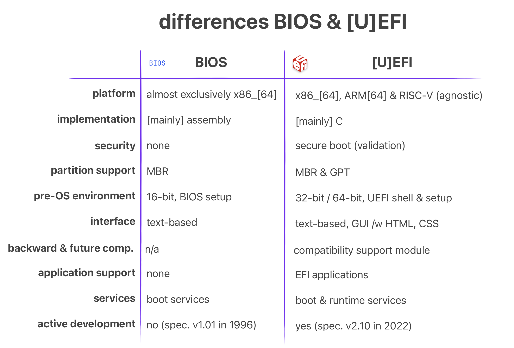

First-Stage Loaders: BIOS, \[U\]EFI, iBoot1 & U-Boot (SPL)

Bootloaders, due to their low-level nature, sometimes have to work closely with the hardware. This can lead to some serious constrains, such as having [size smaller than 64 KiB](https://www.scs.stanford.edu/nyu/04fa/lab/specsbbs101.pdf) or being written in pure [machine-code](https://github.com/ARM-software/u-boot/blob/master/arch/x86/cpu/start.S) because the stack isn’t properly initialized yet.


This is One Way to Initialize Stack Without A Help From First-Stage Loaders

Naturally, bootloaders are critical as they are _literally_ one of the first programs to run when you press the “Power On” button. Without them, the system wouldn’t be able to boot up; and obviously we don’t want that >.<

For this reason, some bootloaders are placed inside “special” chips such as [ROM or Flash Memories](https://en.wikipedia.org/wiki/Bootloader#:~:text=The%20computer%20first%20executes%20a%20relatively%20small%20program%20stored%20in%20read%2Donly%20memory%20(ROM%2C%20and%20later%20EEPROM%2C%20NOR%20flash)), and as a result further increasing the already strict constraints.

Bootloaders that match the above criteria are categorized as **First-Stage Loaders**. As the name suggest, they are \[one of\] the first programs to be executed when the system turns on. Initially their objective was to “_initialize just enough hardware to load the_ **_Second-Stage Loader_**”. But, with time they got bigger & gained ability to do stuff like run-time configuration /w fancy GUI, secure boot, automatic updates and whatnot.


Modern First-Stage Loaders Which We Are Going To Discuss Soon Enough

Here’s some common characteristics of a **First-Stage Loader**:

*   They are a f**irmware**.
*   Stored inside **ROM** or **flash memory**
*   Small in size (**a few KiBs**)
*   Machine & platform dependent
*   **Limited** features (relative to Second-Stage Loaders)

The best example for a First-Stage Loader is **BIOS** on x86 and **U-Boot (SPL)** on ARM.

BIOS
====


BIOS Implementation (Left) & Specification (Right)

Special to x86 platforms (e.g. Intel, AMD, IBM PC) **B**asic **I**nput/**O**utput **S**ystem (**BIOS**) is a special firmware that is automatically run the we press the “Power On” button or if the CPU “reset” signal is present. It is a First-Stage bootloader that resides \[generally\] inside a ROM chip on a motherboard.

Well, I just lied: It’s technically NOT a piece of firmware but rather a **specification**.


We Can Compare Specifications to Blueprints

Initially, it was just a proprietary First-Stage Loader firmware used by [IBM PCs](https://en.wikipedia.org/wiki/IBM_PC_compatible) during 1970–80s. However, it was reverse-engineered by [Phoenix](https://en.wikipedia.org/wiki/Phoenix_Technologies), and then later was turned into a specification called [_BIOS Boot Specification_](https://www.scs.stanford.edu/nyu/04fa/lab/specsbbs101.pdf) written by [Compaq](https://en.wikipedia.org/wiki/Compaq), [Phonix](https://en.wikipedia.org/wiki/Phoenix_Technologies) and [Intel](https://en.wikipedia.org/wiki/Intel) in 1991.

The fact that BIOS is a specification and not a firmware basically means that there can be many BIOS out there and your PC’s BIOS might look different then mine & have more features as well!


Different “Popular” BIOS Implementations

In fact here’s some implementations of the BIOS Boot Specification:

*   **AMIBIOS** by [American Megatrends](https://www.ami.com)
*   **SeaBIOS** by [Open Source Community](https://www.seabios.org/SeaBIOS)
*   **InsydeH20** by [Inside Software](https://www.insyde.com)

> The full comparison between them can be found on [Wikipedia’s BIOS page](https://en.wikipedia.org/wiki/BIOS#Vendors_and_products).

Power-On Self-Test (POST)
-------------------------

One of the main tasks of a BIOS is to run “self-diagnostics” on the system & hardware. It is also known as the **P**ower-**O**n **S**elf-**T**est (**POST**). Remember that a critical tasks of a bootloader was to initialize the hardware. Well, POST is the how BIOS achieves this.


Example POST Logs — Source: lifewire.com

When BIOS first starts (before loading anything) it runs some tests & initializes the hardware. There are many different steps during POST and it will be “stupid” of me to write all of them here. I’m just gonna list some of the more important ones >.<

> Below steps are mainly referenced from [mrbios.com](https://mrbios.com/techsupport/award/postcodes.htm)

*   Test BIOS Checksum
*   Test DMA Controller
*   Test cache memory and controller
*   Set up memory interrupts
*   Test real-time clock
*   Initialize Video BIOS ROM
*   Initialize keyboard

There are WAY more steps and you can check most of them on [Oracle’s writing on BIOS POST Codes](https://docs.oracle.com/cd/E19469-01/819-4359-19/appb-post.html).

During the POST, if everything goes well, the BIOS continues like normal and does other bootloader stuff like launching the **Second-Stage Loader**. If for some reasons the POST fails, it gives out error(s) in the form of [POST Codes](https://docs.oracle.com/cd/E19464-01/820-6850-11/POST.html). Optionally, if the board supports it, an LED might be turned or a beep sound might play.

> Some motherboards even have a simple [digital screen that shows the latest POST Code](https://www.youtube.com/watch?v=bEjH775UeNg)! It is called a Debug LED.


POST Debug LED on Motherboards (Left) or an External Card (Right) — Source: cgdirector.com

POST Codes are 2-digit hexadecimal numbers that is giving out by the BIOS during different steps of POST. It is generally used to debug and/or diagnose a faulty system.

Say, the PC isn’t booting up because it keeps failing during the POST; you might just go look at the POST Code (e.g. using a special digital screen) and cross-check it from your motherboard’s documentation. For example, you might facing with POST Code `0C`, that corresponds to `RAM R/W Test Failed`. And now you know something is wrong with your RAM module!

Boot Process
------------

After POST is complete & no error was thrown, the [BIOS calls the machine-code](http://vitaly_filatov.tripod.com/ng/asm/asm_001.12.html) `INT 19h`. On x86 platforms, this generates a software interrupt that the BIOS “handles” by starting it’s boot process.


BIOS Boot Process (Simplified)

First, BIOS tries to locate a suitable program (e.g. Second-Stage Loader) on a “boot device”. These devices can be a CD-ROM, HDD, SSD, USB Flash Memory or something similar. The overall process goes like this:

1.  **Get** the next “boot device” from from the list of “**boot order**”
2.  **Try to load** the first sector (a.k.a the [boot sector](https://en.wikipedia.org/wiki/Boot_sector))
3.  If couldn’t load, go to Step 1
4.  If successful, **further check** for a [boot sector signature](https://en.wikipedia.org/wiki/BIOS#cite_note-20) `0xAA55`
5.  If not exits, go to Step 1
6.  If exists, **transfer control** to the loaded \[boot\] sector (e.g. program)

> This is a simplified process. If you want to learn more [Wikipedia’s BIOS page](https://en.wikipedia.org/wiki/BIOS#Boot_process) is pretty detailed.

The important thing to note about the **BIOS Boot Process** is the **Step 2.** BIOS is ONLY able to detect boot devices partitioned with **M**aster **B**oot **R**ecord (**MBR**). It is rather old partitioning method and is considered “Legacy”. Most modern \[storage\] devices & operating systems are now using the “newer” **G**UID **P**artition **T**able (**GPT**) method.


Brief MBR vs. GPT

Modern BIOSes support both MBR & GPT, but it is not guaranteed! So, check your BIOS / Vendor documentations about GPT support on BIOS.

> A great deal of info about MBR and GPT can be found on [ArchLinux’s Wiki](https://wiki.archlinux.org/title/partitioning#Partition_table).

Environment & Services
----------------------

After a program is loaded by the BIOS it’s left with a well-defined environment & services that it can make use of. This is important as most programs (e.g. Second-Stage Loaders) use these services to properly function. Also it makes the job of the loaded program a bit easier.

Some key \[well-defined\] [environment properties](https://en.wikipedia.org/wiki/BIOS#Boot_environment):

*   CPU is left in 16-bit “real mode”
*   General-purpose & segment registers are undefined!
*   CS:IP points to physical address `0x07C00`

Other things like setting the **S**tack **P**ointer (SP) is up to the loaded program.


Some Example BIOS “Services”

There are also “services” that the BIOS provides. This, again, make’s stuff “easier” for the loaded program. You can think of them a simple C functions like `void receive_char(void)`. Under-the-hood they are implemented as interrupts and simply called by generating a software interrupt like `INT 14h`.

The “proper” way to use them changes from services to services. I’ll write an example one taken from [Wikipedia](https://en.wikipedia.org/wiki/BIOS_interrupt_call#Invoking_an_interrupt).

```nasm
mov ah, 0x0e    ; function number = 0Eh : Display Character  
mov al, '!'     ; AL = code of character to display  
int 0x10        ; call INT 10h, BIOS video service
```

The full list of all services are “too long” for me to list here, check out [Wikipedia’s Interrupt Table](https://en.wikipedia.org/wiki/BIOS_interrupt_call#Interrupt_table) if you want to see them. I’ll list some of them in any case.

*   `INT 10h`: Video services (e.g. write character in TTY mode)
*   `INT 16h`: Keyboard services (e.g. read character)
*   `INT 17h`: Printer services (e.g. print character to printer)
*   `INT 1Ah`: Real Time Clock services (e.g. read/set RTC)

You can really see how these can be useful to some programs. Having a simple serial I/O without actually implementing a driver is really helpful!

Harware Part
------------

As previously said BIOS firmware is generally stored inside a ROM or a Flash Memory. They are physically separated from the rest of your softwares. You can even find & see the memory chip your BIOS resides in!


BIOS Chip Location on a Typical Gaming Motherboard

> In the older days re-programmable memory was “expensive”. For this reason BIOS chip’s weren’t really upgradable & if you really wanted to, you would have to physically replace your BIOS chip. Nowadays, this is not the case and almost all BIOS chips are either [EEPROM](https://en.wikipedia.org/wiki/EEPROM) or [NOR flash memory](https://en.wikipedia.org/wiki/Flash_memory). Which allows it to be easily updated using software.

BIOS allows you to configure some system settings such as the boot order. These settings are stored inside “non-volatile” BIOS memory. It is also called a [CMOS RAM](https://en.wikipedia.org/wiki/Nonvolatile_BIOS_memory) because it is a **volatile** low-power _complementary metal–oxide–semiconductor_ **SRAM.** Basically, it is a special memory that is powered by a battery.


CMOS Battery on a Motherboard — Source: electronics-lab.com

You can even change the battery by yourself if it ever runs out (5+ years). Just note that your BIOS setting will revert to DEFAULTS if the CMOS battery is removed:/

Although rare, sometimes vendors creates updates & fixes for the BIOS firmware. Unlike normal software however, updating happens by literally “reprograming” the whole flash memory!

BIOS updates are generally safe to do. But it possess some risks of “cooking” the flash memory itself if, say the electricity just cut off during an update:/ Ouch… R.I.P. your motherboard.


Wise words, wise words…

As a backup, some motherboards come with a second BIOS to recover from BIOS corruptions. This is also known as [DualBIOS](https://www.gigabyte.com/WebPage/3/tech_080516_des-a-features-5.htm).

Interface & Look
----------------


American Megatrends’ AMIBIOS Interface — Source: advantech-ncg.zendesk.com

Most of the time you won’t be seeing the BIOS itself as vendors hide it behind a fancy Loading Screen™ like the famous [Asus logo](https://pbs-prod.linustechtips.com/monthly_12_2014/post-68380-0-82501700-1419169807.jpg).

To access the BIOS interface you will have to press a _vendor-specific_ key on your keyboard during the initial BIOS boot screen. For example, you might have to press `Del` or `F10` a few times. It feels kinda weird doing it.. I know.

Most implementations of BIOS play & look similar to each other (thanks to it being a specification). The BIOSes will generally have “black/blue” background screen and lots of menus that you can choose to configure from. You’ll have to use your “old-fashioned(!)” keyboard to navigate around.


AMIBIOS Setup Utility From PuTTY (Connected Via Serial Port) — Source: asrockrack.com

For the embedded or headless-server people out there, some BIOSes also provide a simple “interface” through the serial interface. It looks like a typical BIOS screen but instead of a screen, you will have your terminal.

System Info & Configuration
---------------------------

Perhaps the main reason why you wanted to access your BIOS interface in the first place.

Although not so verbose, you can get an overall system information inside the BIOS. I’ll list some of the most important ones below as to keep this simple.

*   **CPU**: Vendor & model, clock speed, core count etc.
*   **Memory**: Vendor & model, size, clock speed etc.
*   **USB Devices**: USB 2.x / 3.x interfaces, XHCI etc.
*   **Storage Devices**: SATA & NVMe controllers
*   **System / BIOS** : Date & time, version, boot count etc.
*   **Boot Order**: List of storage devices to boot (try each starting from #1)


BIOS Info Menu Showing CPU, Memory & Metadata — Source: wiki.seeedstudio.com

When it’s come to configuration, BIOS offers you some essential options like changing time, enabling/disabling serial ports or changing the boot order.

The options available depends highly on your BIOS implementation and motherboard. So, if you want to access the full list of available configurations, you’ll need to find your specific BIOS & Motherboard model. (a quick Googling ought to help you)

Like in the name, **B**IOS specification dictates that some “**b**asic**”** configurations are to be provided. I listed some of them on the below list.

> Note that all configuration settings are saved inside a volatile RAM powered by a CMOS battery. If somehow BIOS couldn’t access it, the default values will be used instead. (e.g. system date&time resets to Jan 1, 1970 00:00 AM)

*   **System Date & Time**: Change your system time.
*   **Toggle CPU Features:** For ex.,  Intel® Virtualization Technology
*   **Modify CPU Multipliers**: Also known as overclocking/undervolting
*   **IDE/SATA Configuration**: Enable/disable SATA ports and more
*   **PCI\[e\] Configuration:** Similar to IDE/STA config
*   **ACPI Configuration:** Device, power & energy related settings
*   **Boot Settings:** Enable/disable network boot, \[U\]EFI and more boot stuff
*   **Boot Order:** Changing the boot order (e.g. #1 USB, #2 HDD, #3 CD-ROM)
*   **Security Setting:** Add password protection, enable/disable TPM and etc.

ACPI
----

> It will not be right to talk about BIOSes and not ACPI. So, let’s see what ACPI is and how it relates to BIOS.

Most hardware out there has some sort of power management built into it (via it’s firmware). For example; your USB device (e.g. Mouse, Flash, Keyboard) has power states where it can _run-at-full-powe_r, _half-power_, _sleep_ or just _stay off_. The problem here is that: how can the hardware know which state to be in?


USB Device Power States \[Simply\] Shown— Source: learn.microsoft.com

> A great explanation on USB device power states can be found on [Microsoft’s Windows Drivers](https://learn.microsoft.com/en-us/windows-hardware/drivers/usbcon/comparing-usb-device-states-to-wdm-device-states) page.<fdcsaz<qZ”X2CVGFDSA<

Hardware devices technically power-manage themselves. But it’s not so practical as that it provides little-to-no programability. A more common approach is to make it **the job of the operating system**.

As to how an operating system manages power depends entirely on the implementation. But one thing that is ‘constant’ is the interface, or more specifically: the **A**dvanced **C**onfiguration and **P**ower **I**nterface (**ACPI**).


ACP States (Simplified)

**ACPI** is an open-standard specification for First-Stage loaders. Programs (mostly operating systems) can use this \*interface\* to discover, configure and control the hardware to for power management. It was first developed by Intel, Microsoft, Toshiba and et al. in 1991 but later all of its [assets were given to UEFI Forum](https://uefi.org/acpi) in 2013. Right now the latest ACPI version is [6.5 released in Aug 2022](https://uefi.org/specs/ACPI/6.5/).

ACPI standard defines three things: [ACPI Tables](https://learn.microsoft.com/en-us/windows-hardware/drivers/bringup/acpi-system-description-tables), [ACPI Registers](https://www.usenix.org/legacy/publications/library/proceedings/usenix02/tech/freenix/full_papers/watanabe/watanabe_html/node4.html) and [ACPI BIOS](https://kb.iu.edu/d/ahvl). I will not go into each of them as each deserves it’s own writing. What’s interesting for us is its relationship with the BIOS (and later UEFI).

Now, **it is the job of BIOS to generate & load the ACPI Tables** into memory. Later the loaded program/OS can then use this to implement ways of power managing a hardware ([see how on OSDev.org](https://wiki.osdev.org/ACPI))


Windows Systems Require An ACPI Compliant BIOS to Properly Boot — Source: github.com/hfiref0x/VBoxHardenedLoader

The ACPI BIOS we saw above refers to an ACPI compliant BIOS. You might be confused, thinking whats the difference between (1) normal BIOS and (2) ACPI BIOS. To put it simply, there is no “difference” except that one is ACPI compliant and other is not.

As a side note, most modern BIOS firmware out there is ACPI compliant (e.g. AMIBIOS). So, the term ACPI BIOS doesn’t really get used much in practice.

> ACPI specification is platform-agnostic. But due to its origins, is used heavily on the PC world of Intel/AMD chips. However as of version 5.1 [ARM people are beginning to use ACP](https://developer.arm.com/Architectures/Advanced%20Configuration%20and%20Power%20Interface)I as well.

UEFI
====


UEFI Logo (Top) And GIGABYTE’s Implementation (Background)

**U**nified **E**xtensible **F**irmware **I**nterface (**UEFI**) is a platform-agnostic firmware **specification,** which is a modern replacement to BIOS on x86 platforms. A lot can be said about UEFI. It is modern, secure, backward & forward compatible, open-standard, “customizable” and just all around a **solid A+ First-Stage** and (possibly) a Second-Stage loader via `EFISTUBs`.

Let’s start by how did UEFI came into existence. In mid-1990s, people at Intel (and HP) was reaching the limitations of BIOS /w [Itanium](https://en.wikipedia.org/wiki/Itanium). Things like 16-bit “real-mode”, 1 MiB addressable memory and programming in assembly were really becoming restrictive:/

To address this, in 1998 they started working on [Intel Boot Initiative](https://www.afterdawn.com/glossary/term.cfm/intel_boot_initiative), which later was renamed to [**E**xtensible **F**irmware **I**nterface](https://www.intel.com/content/www/us/en/architecture-and-technology/unified-extensible-firmware-interface/efi-homepage-general-technology.html) (**EFI**). Around [EFI version 1.10](https://www.intel.com/content/www/us/en/architecture-and-technology/unified-extensible-firmware-interface/efi-homepage-general-technology.html#:~:text=Intel%27s%20original%20version%20of%20this%20specification%20was%20publicly%20named%20EFI%2C%20ending%20with%20the%20EFI%201.10%20version.), its development was ceased and Intel decided to contribute it to the [Unified EFI Forum](https://en.wikipedia.org/wiki/UEFI_Forum).


UEFI Forum’s Website Banner — Source: uefi.org

> This is where the name \[U\]EFI with the letter ‘U’ inside the brackets comes from.
> 
> The original EFI is still “owned” by the Intel, but the \[U\]EFI standard continues its operation in an open & **u**nified committee form.

Snap back to modern times (2020s), UEFI continues its \[open\] evolution by the people at [UEFI Forum, Inc](https://uefi.org). As of writing this (Sept 1, 2023) the latest revision is [UEFI Specification 2.10](https://uefi.org/specs/UEFI/2.10/), which was released on August 29, 2022.

There are many implementations of the \[U\]EFI out in the wild. Some are open-source and some are proprietary. I listed some of the most influenced & important ones.

*   [**AMI Aptio**](https://www.ami.com/aptio/) by [American Megatrends](https://www.ami.com/): Proprietary (used by gaming MBs)
*   [**EDK II**](https://github.com/tianocore/edk2)  by [TianoCore](https://www.tianocore.org): Reference open-src implementation (my beloved)
*   [**SecureCore**](https://www.phoenix.com/phoenix-securecore/) by [Phoenix](https://www.phoenix.com/): Another proprietary one (security focused)
*   [**InsydeH20**](https://www.insyde.com/products) by [Insyde](https://www.insyde.com): Yet-another proprietary one (mainly mobile)


Popular \[U\]EFI Implementations & Their Interface

Since \[U\]EFI is a specification and NOT a specific firmware/software, I will NOT be going over each implementation. Instead, I will talk about some of its highlighted features & properties.

> Below sections “should” apply to each proper \[U\]EFI implementation out there. Because, again, \[U\]EFI is a specification and NOT a firmware/software!

What’s NOT New? (relative to BIOS)
----------------------------------

At its core, \[U\]EFI is still a First-Stage loader. Meaning, most of the stuff that a typical BIOS can do are also done by the \[U\]EFI. This helps with backward-compatibility issues & the transition from \[Legacy\] BIOSes.


Some “High-Level” Similarities Between BIOS & \[U\]EFI

> Many people are not familiar with the difference between BIOS and \[U\]EFI. So, they use them interchangeably. But in reality they are NOT the same thing!
> 
> To avoid confusion, the people of “the Internet” started to call the old BIOS, Legacy BIOS.

The stuff \[U\]EFI does, that Legacy BIOS already did:

*   **Power-On Self Test (POST)**
*   **Advanced Configuration & Power Interface (ACPI)**
*   **Being a First-Stage Loader**
*   **Having a Config Menu**

Yes, the list is not “long”. Here, I just wanted to give you the idea that \[U\]EFI is STILL a First-Stage bootloader & is basically a replacement to the Legacy BIOS. Meaning it can _almost_ do all the things a BIOS already does, but better..!

What’s New? (relative to BIOS)
------------------------------

Now there’s a lot to talk about here. The list I will soon list includes some big changes & differences compared to Legacy BIOS. They each deserve their own sections, unfortunately I would not be able to do that:/ Instead, I will talk about the most important ones (at least the ones I believe to be).


Some “High-Level” Differences Between BIOS & \[U\]EFI

The improvements & advantages that \[U\]EFI has over Legacy BIOS:

*   Platform agnostic (e.g. ARM, RISC-V, x86)
*   C language programming
*   Backward & forward compatibility
*   Support for GUID Partition Table (large partitions up to 8 ZiB)
*   32-bit OR 64-bit pre-OS environment (applies to x86)
*   The addition of [EFI System Partition](https://en.wikipedia.org/wiki/EFI_system_partition) (ESP)
*   Graphical User Interface (feels modern)
*   Security (via Secure Boot)
*   Modularity & EFI Applications

**Platform Agnostic:** The \[U\]EFI specification is not tied to a specific ISA. Meaning it can be implemented for ARM and RISC-V! In my opinion this is THE most important thing it provides.


OVM / EDKII Has \[U\]EFI Implementations For Different Platforms

Low-level programmers either target the bare-metal OR, more common then not, use a bootloader to do the dirty-work for them. Using an existent verified bootloader is just amazing. And more so if it is “the industry standard” and “open” in nature.

I believe the ARM world really lacks a good “standard” bootloader. Everyone out there uses something different! Which sucks. However, with \[U\]EFI being platform agnostic, we are starting to see more & more progress in this area.


ARM SystemReady Programs/Certificates — Source: uefi.org

Best example to this is the [Arm SystemReady Certification Program](https://www.arm.com/architecture/system-architectures/systemready-certification-program). It mandates that any platform that wants to be certified with Arm SystemReady MUST use \[U\]EFI! This is amazing & shows that people at ARM are also wants to “standardize” how boot is handled on ARM.

**C Language Programming:** I don’t think there is much to say here >.< Legacy BIOS firmwares are written in \[mostly\] machine-dependent assembly language. Don’t get me wrong assembly still have it’s advantages. However the intuitive approach of C just makes it easier to develop & maintain something.

Apart from the \[U\]EFI firmware itself, the \[U\]EFI applications are also written in C! I will talk about them in the coming sections, but here’s a brief example \[U\]EFI application written in C.

> Taken from [Wikipedia’s UEFI Application Development](https://en.wikipedia.org/wiki/UEFI#Applications_development) Section.

```c
#include <Uefi.h>  
#include <Library/UefiLib.h>  
#include <Library/ShellCEntryLib.h>  
  
EFI_STATUS EFIAPI ShellAppMain(IN UINTN Argc, IN CHAR16 **Argv)  
{  
    Print(L"hello, world\n");  
    return EFI_SUCCESS;  
}
```

**Backward & forward compatibility:** As we will soon see in the ‘Boot Process’ section, the \[U\]EFI introduces [_Compatibility Support Module_](https://en.wikipedia.org/wiki/UEFI#CSM_booting) (CSM). Through it, \[U\]EFI is able to boot from Legacy BIOS systems. In the end, achieving almost full backwards compatibility with relatively old operating systems & programs. I don’t think I need to explain how important this can be when migrating from legacy systems!


CSM Settings on a NZXT Motherboard \[U\]EFI — Source: support.nzxt.com

> As to how CSM works under-the-hood, it will be explained soon enough.

Another super helpful “feature” is it’s forward compatibility. It basically means that your storage devices or \[U\]EFI applications will continue to work/boot properly even if the \[U\]EFI firmware you are using updates itself from Specification Version 1.1 to 2.5!!! I can’t tell how much development & testing time this could save for us poor “low-level” people ❤

Boot Process
------------


\[U\]EFI GPT Boot Process (Simplified)

The overall steps for the \[U\]EFI boot process is somewhat similar to the one on legacy BIOS. But “**how**” they are handled is almost completely different.

Thanks to its backward-compatible design, there are a few ways how the boot process can go:

*   **UEFI-GPT**: The preferred & modern way
*   **UEFI-MBR**: The less preferred & “legacy” way
*   **BIOS-GPT**: The weird hybrid/combo way (via CSM)
*   **BIOS-MBR**: The good ol’ legacy BIOS way (via CSM)

> Note that these are not the official names. But I (and other people on the Internet) sometimes prefer to use them as they are more explicit compared to the “classic” UEFI Booting & CSM Booting.

**UEFI-GPT** is the “new” and, _naturally_, the ideal way to boot modern programs (like GRUB2). Unlike legacy BIOS, \[U\]EFI does NOT check for the boot sectors to “detect” a bootable program. Instead it relies on a storage device partition called _EFI System Partition (ESP)_.


UEFI/GPT Boot Process /w SecureBoot Enabled

Like other storage partitions (e.g. FAT32, NTFS, APFS) ESP is a type of partitioning system created solely for \[U\]EFI firmwares to use. If your OS supports, you can even mount it and check for all the files inside.

A typical ESP folder/file structures might look similar to this:

```plain
/boot/efi  
└── EFI  
   ├── BOOT  
   │  ├── BOOTX64.EFI  
   │  ├── fbx64.efi  
   │  └── mmx64.efi  
   └── ubuntu  
      ├── BOOTX64.CSV  
      ├── grub.cfg  
      ├── grubx64.efi  
      ├── mmx64.efi  
      └── shimx64.efi
```

Remember that on legacy BIOS, the first boot sector with the magic value `0xAA55` was marked as a bootable program? Well, in \[U\]EFI this is WAY different. Let me explain!

When booting with UEFI-GPT, the firmware first checks for the existence of an ESP partition via its [GUID of](https://en.wikipedia.org/wiki/EFI_system_partition#Overview) `C12A7328-F81F-11D2-BA4B-00A0C93EC93B`. After it’s found, a “_very-specially-named_” bootable program is searched under “_another-very-specially-named_” folder.


List of Files Under ESP (Distro: Ubuntu 22.04)

The exact folder and file/program name for a bootable \[U\]EFI program has the following format `<ESP>/EFI/BOOT/<`.

[For example](https://en.wikipedia.org/wiki/UEFI#UEFI_booting):

*   **An x86\_64 \[U\]EFI bootable:** `<ESP>/EFI/BOOT/BOOTX64.EFI`
*   **An ARM64 \[U\]EFI bootable:** `<ESP>/EFI/BOOT/BOOTAA64.EFI`

The _first_ \[U\]EFI bootable that matches the “very-specially-named” format gets loaded into memory & \[U\]EFI kindly transfer control to it. This process is somewhat similar to what happens in BIOS. However the Environment & Services for the loaded program is different.

**UEFI-MBR** is the least popular one out of the 4 here. It mostly follows the same mechanisms on UEFI-GPT, except the “checking for GUID” part.


UEFI/MBR StackOverflow Answer; Couldn’t Find \*Any\* Good Info About The Process

We still need an ESP partition. The problem is MBR disks don’t use GUID for storage partitions. So, \[U\]EFI reverts back to the legacy BIOS way of using boot sectors (first 512 bytes) to detect & boot from a storage device. This is interesting because \[U\]EFI handles MBR disks pretty weird if you ask me. For example; the **_boot code on MBR (424 bytes)_** will not be executed by the \[U\]EFI. Weird, right??

As to “how” \[U\]EFI handles MBR disks is explained in [UEFI Specification, Section **5.2.1 Legacy Master Boot Record (MBR)**](https://uefi.org/sites/default/files/resources/UEFI_Spec_2_10_Aug29.pdfhttps://uefi.org/sites/default/files/resources/UEFI_Spec_2_10_Aug29.pdf)  for versions 2.4 or older**.**

One important thing here is the question of “Why would you want to boot an MBR disk if you are using \[U\]EFI” This is like mixing a good quality tequila with a stale lime…

**BIOS-GPT** does not directly relate to \[U\]EFI. In fact it is actually your typical legacy BIOS boot process. I am mentioning this here because of \[U\]EFI’s backward-compatibility with BIOS.


BIOS/GPT & BIOS/MBR Boot Process /via CSM (Simplified)

With \[U\]EFI we are introduced to a new backward-compatibility “feature” called Compatibility Support Module (CSM). It is an optional configuration setting within a \[U\]EFI firmware. With it enabled, the boot process performs the same way as on legacy BIOS. However, as the name suggests, the booting can also be performed on GPT disks!

“Bad” news though, as of 2020 [Intel “cancelled” the CSM support](https://arstechnica.com/gadgets/2017/11/intel-to-kill-off-the-last-vestiges-of-the-ancient-pc-bios-by-2020/):/ So, I wouldn’t prefer using neither of the BIOS-\* methods on an \[U\]EFI firmware.

> You can find the exact CSM details on Intel’s Platform Innovation Framework for UEFI called [**Compatibility Support Module Specification**](https://www.intel.com/content/dam/www/public/us/en/documents/reference-guides/efi-compatibility-support-module-specification-v098.pdf)**.**

**BIOS-MBR** is the pure legacy BIOS boot process method. It still relies on CSM to be enabled within the \[U\]EFI firmware. And with that enabled, the whole boot process happens exactly as on legacy BIOS. And yes, this includes the MBR boot sectors.

Environment & Services
----------------------

The program loaded by the \[U\]EFI firmware (e.g. EFI Application, Second-Stage Loader, EFISTUB) is initially put into a pretty deterministic environment. It’s also provided with quite a lot of different services.

> The term “services” can be used interchangeably with “functions”. Technically they are two different things, but for simplicity sakes we’ll assume they are the same.

Currently there are two types of \[U\]EFI services:

*   **Boot Services**
*   **Runtime Services**


Oversimplified Comparison Between Boot & Runtime Services

> All \[U\]EFI services can also be divided into two categories: “**global**” and “**handle-based**” The “global” services are platform agnostic functions. Meaning they are available on ALL \[U\]EFI compliant firmwares. The “handle-based” ones are quite the opposite, they depend on the hardware platform and might not be available on some firmwares. These can be custom devices or device functionalities.

With \[U\]EFI, the loaded program doesn’t immediately have full control of the hardware. Instead, **the firmware initially owns & controls** the system resources. The program relies on the _firmware’s services_ until it’s ready to take control and implement its own methods. (e.g. Drivers, Memory Management, Interrupts)

> Legacy BIOS gives the loaded program some basic services (e.g. serial I/O) and leaves all controls of the hardware to it. This is like saying “Here’s some basic stuff that you might need. Do whatever you want with it, idc. I’m going to leave now, bye.” However, with \[U\]EFI this is NOT the case.


\[U\]EFI Service Lifetime

Now, let’s see what those “services” are.

The functions that are available to any program loaded by a \[U\]EFI firmware, _before_ it calls `ExitBootServices()`, are called **Boot Services.** They are basically functions that the programs must use to access devices & allocate memory.

Here’s an (incomplete) example C usage of a boot service:

```c
#include <Uefi.h>  
#include <Library/UefiLib.h>  
  
EFI_STATUS  
EFIAPI  
efi_main (  
        EFI_HANDLE        ImageHandle,  
        EFI_SYSTEM_TABLE* SystemTable)  
{  
        InitializeLib(ImageHandle, SystemTable);  
        Print(L"Hello World!!!\n");  
          
        /* Wait 10 seconds before the [U]EFI automatically restarts */  
        SystemTable->BootServices->Stall(10000000);  
        return EFI_SUCCESS;  
}
```

You can see that in order to _sleep_ the CPU, we used a boot service called `Stall()`.

There are many more boot services available to the loaded program. They can be found on [UEFI Specification Section 7 — Boot Services](https://uefi.org/specs/UEFI/2.9_A/07_Services_Boot_Services.html). Those services (functions) are further divided categories.

*   [**Event, Timer and Task Priority Services**](https://uefi.org/specs/UEFI/2.9_A/07_Services_Boot_Services.html#event-timer-and-task-priority-services)  (e.g. `SetTimer()`)
*   [**Memory Allocation Services**](https://uefi.org/specs/UEFI/2.9_A/07_Services_Boot_Services.html#memory-allocation-services)  (e.g `AllocatePages()`, `GetMemoryMap()`)
*   [**Protocol Handler Services**](https://uefi.org/specs/UEFI/2.9_A/07_Services_Boot_Services.html#protocol-handler-services) (e.g. `LocateDevicePath()`, `OpenProtocol()`)
*   [**Image Services**](https://uefi.org/specs/UEFI/2.9_A/07_Services_Boot_Services.html#image-services) (e.g. `LoadImage()`, `StartImage()`, `ExitBootServices()`)

As usual I will not be explaining all of them in detail. You can access more in-depth info from their corresponding sections in the UEFI Specification.

After the program prepared itself enough to be ready, it can call the `ExitBootServices()` boot service function and get the control of the hardware from the \[U\]EFI firmware.

> It can also CHOOSE NOT to call that function and continue operating. However, this will limit its control over the hardware as the \[U\]EFI firmware would be still “owning” the hardware.

You can think of boot services as a “mini operating system syscalls” where can run your EFI applications on. In fact, here’s the [Original 1993 DOOM running as EFI application](https://github.com/Cacodemon345/uefidoom) using boot & runtime services!


GIF of Original Doom on \[U\]EFI — Source: youtube.com/@cacodemon345

The functions that are available throughout the lifetime of a program loaded by a \[U\]EFI firmware are called **Runtime Services**. They are used extensively by programs like Kernel/OS, Second-Stage loaders or any kind of EFI Application.

Here’s an (incomplete) example C usage of an \[U\]EFI runtime service:

```c
#include <Uefi.h>  
#include <Library/UefiLib.h>  
  
EFI_STATUS  
EFIAPI  
efi_main(  
        EFI_HANDLE ImageHandle,  
        EFI_SYSTEM_TABLE *SystemTable)  
{  
        InitializeLib(ImageHandle, SystemTable);  
          
        /* Get the current system time from [U]EFI */  
        EFI_TIME currentTime;  
        EFI_STATUS status = SystemTable->RuntimeServices->GetTime(&currentTime, NULL);  
      
        if (!EFI_ERROR(status)) {  
            Print(L"Current Time: %04u-%02u-%02u %02u:%02u:%02u\n",  
                  currentTime.Year, currentTime.Month, currentTime.Day,  
                  currentTime.Hour, currentTime.Minute, currentTime.Second);  
        }  
          
        return EFI_SUCCESS;  
}
```

You can see that we can simply use the `GetTime()` \[U\]EFI runtime service to get the system time without implementing our own one!

Of course there are way more runtime services out there. They can be found on [UEFI Specification Section 8 — Runtime Services](https://uefi.org/specs/UEFI/2.9_A/08_Services_Runtime_Services.html). Just like the boot services, they are divided into different categories.

*   [**Variable Services**](https://uefi.org/specs/UEFI/2.9_A/08_Services_Runtime_Services.html#variable-services) (e.g. `SetVariable()`, `GetVariable()`)
*   [**Time Services**](https://uefi.org/specs/UEFI/2.9_A/08_Services_Runtime_Services.html#time-services) (e.g. `SetTime()`, `GetTime()`)
*   [**Virtual Memory Services**](https://uefi.org/specs/UEFI/2.9_A/08_Services_Runtime_Services.html#virtual-memory-services) (e.g. `SetVirtualAddressMap()`)
*   [**Miscellaneous Services**](https://uefi.org/specs/UEFI/2.9_A/08_Services_Runtime_Services.html#miscellaneous-runtime-services) (e.g. `ResetSystem()`, `UpdateCapsule()`)

The information on what each runtime service of a category does and the list of all the functions can be accessed from their corresponding section in the UEFI specification.


‘efivar’ Can List \[U\]EFI Variables Using Runtime Services Under-The-Hood on Linux

With runtime services, programs can access a great deal of abilities and information for the running system. For example Linux can use of them to:

*   **Retrieve & Set Boot Variables** (e.g. Boot Order, EFI Vendor & Version)
*   **Modify System Time** (e.g. Sync System Time, `date`)
*   **Access ACPI** (e.g. Device & Power Management)
*   **Graphics Output** via _Graphics Output Protocol_ (e.g. Early Frame Buffer)

An interesting take on all of \[U\]EFI services can also be found on [Wikipedia’s UEFI Service page](https://en.wikipedia.org/wiki/UEFI#Services). According to that, the services can be divided into “more logical” categories. Although not written in the official UEFI specification, it’s still an interesting take. Here’s the category list:

*   **Graphics Output Protocol (GOP)** services
*   **UEFI Memory Map** services
*   **SMM** services
*   **ACPI** services
*   **SMBIOS** services
*   **Device Tree** services
*   **Variable** services
*   **Time** services

Again, these are NOT official categories. I just wanted to list them as they seem “more logical” and interesting.

EFI Applications
----------------


\[U\]EFI Shell CLI

By being a First-Stage loader, \[U\]EFI is able to “boot/load” other programs. However, it can do way more than just that. With features like “Boot/Runtime Services” and “Virtual Addressing” it can act like a mini operating system environment. This enables a new world of applications designed & written for \[U\]EFI environments.

To put it simply: the software applications made for running within an \[U\]EFI environment are called **EFI Applications**. These applications can be anything from

*   simple shell commands (e.g. `echo`, `ls`),
*   video games (e.g. `[DOOM 1993](https://github.com/Cacodemon345/uefidoom)`, `[Pacman](https://github.com/kpelton/Pacman)`),
*   diagnostics & testing (e.g. `[memtest86](https://www.memtest86.com/download.htm)`)

to Second-Stage loaders like GRUB, Limine or Windows Boot Manager. You can technically even make a whole o[perating system as an EFI Application](https://johv.dk/blog/bare-metal-assembly-tutorial#:~:text=In%20fact%2C%20it%27s%20possible%20to%20make%20an%20entire%20operating%20system%20as%20a%20UEFI%20application.)!


EFI Applications Are PE32+ Executables

The applications themselves reside as `P32 executable (EFI Application)` files under the EFI System Partition (e.g. `/boot/EFI/helloworld.EFI`). They are generally executed from the [\[U\]EFI Shell](https://en.wikipedia.org/wiki/UEFI#UEFI_shell) which itself is also an EFI Application.


\[U\]EFI Development Kit is Available to Public by TianaCore — Source: github.com/tianocore/udk

As for the development process, they are usually written in C on platforms like Linux & Windows via [TianaCore’s UEFI Development Kit](https://github.com/tianocore/udk). After writing the code, one can use the host compiler (e.g. `GCC`, `Clang`) and then test it using [OVMF](https://github.com/tianocore/tianocore.github.io/wiki/OVMF) on [QEMU](https://www.google.com/url?sa=t&rct=j&q=&esrc=s&cd=&ved=2ahUKEwjqtrvUyKqBAxVLxgIHHQsbAfYQFnoECAcQAQ&url=https%3A%2F%2Fwww.qemu.org%2F&usg=AOvVaw2ktbaepR0e0IZMfsT401_X&opi=89978449).

There are a lot of great tutorials out there on EFI Application Development. Here’s one that simply explains the [First Steps — UEFI Programming](http://x86asm.net/articles/uefi-programming-first-steps/).

Hardware Part
-------------

The \[U\]EFI specification does not really specify how & where the firmware needs to be stored. Each vendor & platform has its own way of storing the actual \[U\]EFI firmware.


\[U\]EFI Flash Chips Used on Intel Mac Pro’s

Generally, vendors on **Intel/AMD’s x86 platforms** will put it inside an isolated Flash Memory (called [BIOS/UEFI chip](https://en.wikipedia.org/wiki/UEFI#Hardware)). This is similar to Legacy BIOS.

On ARM, the situation is little bit different. ARM-based boards generally have only an embedded flash memory where you can store almost anything you want (e.g. operating system, bare-metal Application). So, it’s relatively rare to see more than one flash memory on ARM boards. Naturally this is done as to keep the costs down.


ARM Systems \[Generally\] Place Their \[U\]EFI Inside the SoC (Alongside Boot ROM)

Firmwares like \[U\]EFI, are then placed inside a “protected” place inside that one flash memory rather than a separate one. For example, let’s say you have 1024MiB of total space. The vendor can choose to dedicate the first 32MiB’s to the \[U\]EFI firmware and the rest to the user. Again, the question of “where” depends greatly on the vendor.

Interface & Look
----------------


GIGABYTE’s \[U\]EFI Implementation & It’s Fancy GUI — Source: gigabyte.com

\[U\]EFI has a lot of under-the-hood changes & improvements, but what about more “apparent” changes? Okay, let’s talk about what \[U\]EFI brings to the table in terms of graphics, looks & human-machine interface.

Initially, the original, [EFI 1.0 defined the **U**niversal **G**raphic **A**dapter](https://www.intel.com/content/dam/doc/product-specification/efi-v1-10-specification.pdf) (UAG). However, it didn’t get used much and later, with \[U\]EFI, was replaced with **G**raphics **O**utput **P**rotocol (GOP). It can be used in pre-boot environment (e.g. kernel/program not yet properly loaded) for things like displaying logos, text messages and setup & configuration screens. Full definition of GOP can be found on [UEFI Spec, Section 12.9 Graphics Output Protocol](https://uefi.org/sites/default/files/resources/UEFI_Spec_2_9_2021_03_18.pdf).


This is Still \[U\]EFI, Just Without a Fancy GUI

Typical BIOS (and also early \[U\]EFI) implementations generally had a very basic, console-based GUI with background colors like blue, white and black. With UEFI 2.1, _however_, the overall interface got its own proper section named Human Interface Infrastructure (HII).


More Modern \[U\]EFI Interface /w \*Many\* GUI Elements

This new section defined (1) ways to manage user input, (2) localization, (3) fonts most importantly (4) forms. With forms, vendors can design or implement GUIs for their own \[U\]EFI implementations. Meaning, as the user, we can now have fancy graphics, buttons, text and images on our \[U\]EFI machines. There are many cool \[U\]EFI interfaces out there like gaming-specific themed ones.

> Vendors can still choose the make their \[U\]EFI implementations look like the legacy BIOS. However, most modern implementations (and expensive ones) do use the new UEFI features and have fancy GUIs.

The exact details for HII and forms can be found on [UEFI Spec 2.1+, Section 33. Human Interface Infrastructure Overview](https://uefi.org/sites/default/files/resources/UEFI_Spec_2_9_2021_03_18.pdf). I have personally not implemented a forms, but it is [said to be similar to HTML](https://en.wikipedia.org/wiki/UEFI#Graphics_features:~:text=fonts%2C%20and%20forms%20(-,in%20the%20HTML%20sense,-).%20These%20enable%20original).

Secure Boot
-----------

One of the most impactful & controversial “new feature” defined with UEFI is the **Secure Boot**. [Some consider](https://learn.microsoft.com/en-us/previous-versions/windows/it-pro/windows-8.1-and-8/hh824987(v=win.10)?redirectedfrom=MSDN) (mostly vendors) it great thing as it allows “security” by locking/preventing what UEFI can load or not. And [some think](https://lwn.net/Articles/447381/) it a “restriction” for the same reasons. I personally think it’s a good thing as long as we have the option to (1) **turn it off** or (2) **control how it behaves** (assuming knowing the risks & consenting). Now let’s see what it is.


Simplified SecureBoot Diagram

**Secure Boot** is a protocol defined in [UEFI Spec, Section 32](https://uefi.org/sites/default/files/resources/UEFI_Spec_2_9_2021_03_18.pdf). It’s intended to provide a generic authentication for when booting/accessing a device. Meaning, the firmware (UEFI) can prevent unauthorized operatingsystems, bootloader or programs to be loaded by allowing ONLY the signed ones to load & execute. It uses [digital signature](https://en.wikipedia.org/wiki/Digital_signature) stored inside a [non-volatile memory](https://en.wikipedia.org/wiki/Non-volatile_random-access_memory) in the form of [private keys](https://csrc.nist.gov/glossary/term/private_key) (PK).


Managing Secure Boot Settings — Source: lenovo.com

On almost all UEFI implementations it is a configurable “feature” accessible via the setup screen. Depending on the vendor, it might come as “**Enabled**” by default (e.g. most PC laptops). In most cases, you won’t be messing with it unless you want to switch to different OS/Bootloader like Linux/GRUB. And that is where the problem begins.

Only the “signed” programs are allowed to boot on a Secure Boot enabled UEFI firmware. And to only way to “sign” a program is via the private key (PK). We, as a user, DO NOT have access to these keys! Meaning, we can’t just use Secure Boot like normal without doing weird tricks & workarounds. Heck, it might even be impossible to use Secure Boot freely on some platforms!


Locked Bootloader on Android Phones — Source: nexus5.gadgethacks.com

> A good source on [UEFI, Secure Boot & Linux is ArchLinux’s Wiki page](https://wiki.archlinux.org/title/Unified_Extensible_Firmware_Interface/Secure_Boot). I highly suggest you read it if you are curious on this topic.

As you can see Secure Boot can be a good security feature as it helps prevent unauthorized people from accessing your hardware. However, some vendors can “abuse” this to prevent YOU, the user, from being free to use the anything to the hardware (and yeah this includes booting an OS).

iBoot1
======


iBoot1 Diagram & It’s \[Made-Up\] Logo by me

The bootloader used on all Apple devices (such as the iPhone, Apple Watch, and Mac) is called iBoot. Its source code is known only to Apple and thus we don’t have as much information as to how-it-works compared to others like BIOS.

Technically [iBoot is a Second-Stage loader,](https://support.apple.com/guide/security/boot-process-secac71d5623/web) but internally there [exists 2 (or more) bootloaders named iBoot](https://github.com/AsahiLinux/docs/wiki/SW%3ABoot). They are named iBoot1 and iBoot2, with respect to their order in the boot process. What we are interested in here is the iBoot1, the First-Stage loader.

Just like any other \[modern\] First-Stage loader, iBoot1:

*   **Initializes hardware (e.g. CPU & storage dev.)**
*   **Finds the Second-Stage loader**
*   **Validates/verifies the Second-Stage loader**


AsahiLinux Desktop — Source: linuxiac.com

But “how” exactly these steps work is again only known to Apple. Interestingly, _however_, the [AsahiLinux project](https://github.com/AsahiLinux) is working to bring Linux to Apple Silicon systems. The people there are working on [reverse-engineering the boot process](https://github.com/AsahiLinux/docs/wiki/SW%3ABoot) & drivers to “learn” and use them in Linux. Check it out yourself, it’s really amazing!

There exists at least 2 implementations of the iBoot1: x86 and ARM. Apple designed iBoot1 with a focus on security & protection. Similar to the idea of SecureBoot on \[U\]EFI, iBoot1 has its own validation system.

On Apple Silicon (ARM) systems the BootROM (called “SecureROM” by Apple) validates/verifies the iBoot1’s signature. If this fails, the device is put into the recovery mode. If all is well, iBoot1 get’s loaded and takes control over.


iBoot1 (and iBoot2) Boot Process on an M1 Apple Silicon — Source: eclecticlight.co

On Intel (x86) systems, the BootROM & iBoot1 is an \[U\]EFI implementation. Not much is known about this as far as I could find on the internet. The only thing known here is that they use the Secure Boot (defined by UEFI) to validate the Second-Stage loader iBoot2.

> More info about iBoot\[1\] on x86 systems: [UEFI firmware security in an Intel-based Mac](https://support.apple.com/guide/security/uefi-firmware-security-in-an-intel-based-mac-seced055bcf6/web) and [Boot modes of an Intel-based Mac with an Apple T2 Security Chip](https://support.apple.com/guide/security/boot-modes-sec7703b1423/web) by Apple.

iBoot1’s main purpose is (apart from HW initialization) is to validate the Second-Stage loader. It does this by using Secure Enclave (which is amazing btw). I’m technically not enough to explain how it works. Luckily, Apple has an article section named “[Boot process for a Mac with Apple silicon](https://support.apple.com/guide/security/boot-process-secac71d5623/web)” on their [Apple Platform Security](https://support.apple.com/guide/security/welcome/web) guideline.


AsahiLinux Has Another Project Called M1N1 if You Want to Learn More About iBoot1

> Another good writing about iBoot1 is [Booting M1 from hardware to kexts](https://eclecticlight.co/2022/01/04/booting-an-m1-mac-from-hardware-to-kexts-1-hardware/) by hoakley. Give it a look if you are curious about Apple systems.

U-Boot (SPL)
============


U-Boot Logs & Shell

Also known as, [Das U-Boot](https://en.wikipedia.org/wiki/Das_Boot), is an [open-source](https://source.denx.de/u-boot/u-boot) (GPL 2 license) First-Stage and a Second-Stage loader. It is available on many platforms like x86, ARM and RISC-V. The fact that it is \*small\* and heavily configurable made it the **de-facto choice** of bootloader for embedded devices.

> In fact, according to [Pentester Academy TV](https://www.youtube.com/@PentesterAcademyTV), as much as 90% embedded boards out there uses some form of U-Boot. This number might be a bit exaggerated, but should give you an idea of how big U-Boot is!


U-Boot is Very Popular Amongst Embedded Devices — [Linux Foundation Has \*Lots\* of Materials/Talks About it](https://www.youtube.com/watch?v=INWghYZH3hI)

Originally, _Magnus Damm_ wrote a bootloader for **8xx PowerPC** computers and called it [8xxROM](https://ppcboot.sourceforge.net/#authors). In 1999, the project was moved to SourceForge with the name of **PPCBoot.** And later in July 2000, it got published to public.

With the release of PPCBoot v2.0.0 the project changed it’s name for the final time to **U-Boot**. The “U” here stands for “Universal” as it’s availability was expanded to more than just PowerPC (e.g. x86 support was added).


U-Boot’s Source Code \[Tree\] Can be [Found on GitHub](https://github.com/u-boot/u-boot)

As 2023, the latest version of U-Boot ([2023.10](https://source.denx.de/u-boot/u-boot/-/tree/v2023.10?ref_type=tags)) supports \*many\* different architectures like: x86\[\_64\], ARM\[64\], RISC-V and MicroBlaze. And now it is \*the\* most popular bootloader for embedded devices (mostly ARM).

The project can be found on:

*   Gitlab: [https://source.denx.de/u-boot/u-boot](https://source.denx.de/u-boot/u-boot)
*   GitHub: [https://github.com/u-boot/u-boot](https://github.com/u-boot/u-boot)

Unlike BIOS & \[U\]EFI, U-Boot is NOT a specification, but rather a “project” that includes software components (or stages):

*   **Tertiary Program Loader (TPL)**
*   **Verifying Program Loader (VPL)**
*   **Secondary Program Loader (SPL)** — → First-Stage loader
*   **U-Boot (Main Bootloader)** — → Second-Stage loader


Simplified & Generalized U-Boot Boot Stages/Process

I will be only explaining the SPL here as our topic is First-Stage loaders. Other ones, like the main U-Boot Second-Stage loader, will be later explained in detail.

> From now on, I will use the term “U-Boot” interchangeably with “U-Boot SPL”.

Hardware
--------

U-Boot SPL is a very different First-Stage loader compared to BIOS & \[U\]EFI implementations. This is due to how the target hardware environment is designed. To understand what I’m talking about, let’s analyze the popular [BeagleBone Black](https://www.beagleboard.org/boards/beaglebone-black) ARM board.


BeagleBone Black Functional Block Diagram — Source: static.righto.com

Notice that there is only one \[S\]RAM available to CPU and its size is **64KB!** The “real” and larger \[D\]RAM is behind a DDR3 interface. The CPU canNOT use the bigger RAM without doing some sort of initialization first (a.k.a. the memory controller).

This means when the system first starts up, the CPU can only use the 64KB of \[S\]RAM. And when you think about it, it really isn’t that much. There simply is no way a fully-featured Second-Stage loader can fit in there. So, obviously we need a First-Stage loader. And that is U-Boot SPL.

> In x86 platforms the BIOS and \[U\]EFI “automatically” initializes the memory controller. The difference is that they are physically “part” of the board and come pre-installed.
> 
> The x86 CPUs are designed to work closely with the [Chipset’s](https://en.wikipedia.org/wiki/Chipset) that reside physically on the motherboard.

It’s Role as a First-Stage Loader
---------------------------------

The hardware restrictions helps us clearly define what U-Boot SPL does. It role is to:

*   **be small enough** to fit into CPU’s SRAM
*   initialize the DRAM **memory controller** (e.g. DDR3, DDR4, DDR5)
*   **find the Second-Stage** loader (using storage interface like [SDHC](https://en.wikipedia.org/wiki/SD_card))
*   **load** it into DRAM & **pass** the control

Sounds simple enough(!) The fact that it should be “small” is no easy task. There are lots of “simplifications” done at the source level to lower the final \*.bin file.


RomBoot & U-Boot SPL Faces \*Really\* Low Size Limitations — Source: bootlin.com

It should be noted that U-Boot SPL is \*mainly\* used to load the main U-Boot Second-Stage loader. It technically can load other programs, but it is not used that much. _In other words: 99% of the time U-Boot SPL will be used to load the main U-Boot and nothing else! So it is not wrong to think of them as \*one\* big bootloader._

> Fun fact: U-Boot SPL is also called U-Boot Memory Loader (MLO) because the main reason it exists is to initialize the DRAM memory controller! Hence the name: memory loader.

Build & Flash
-------------

Unlike BIOS & \[U\]EFI implementations, U-Boot SPL does not come pre-installed on a flash memory chip. The user MUST obtain the firmware either by downloading pre-built ones from vendors or by [building from the source code](https://u-boot.readthedocs.io/en/latest/build/index.html).


Overview of “How-to” Build U-Boot For Cyclone V — Source: rocketboards.org

Each U-Boot SPL firmware should be configured to work with a specific board. Generally, vendors provide patches to U-Boot project to add support for their boards. They do so by “defining” the Device Trees and “specifying”the memory layouts that will be used by U-Boot SPL.

> The [official U-Boot project page](https://u-boot.readthedocs.io/en/latest/build/index.html) has a great documentation explaining how to configure & build U-Boot SPL for a specific board or your own custom one!

After obtaining the U-Boot SPL firmware (\*.bin file), it then should be flashed/installed onto the flash memory via interfaces like USB or I2C. The exact methods here [depends entirely on the specific board](https://github.com/nxp-imx/mfgtools) you have.


Toradex Has Different Methods For Flashing U-Boot / Linux Images on Their Boards- Source: developer.toradex.com

There is a \*great\* chance that your board’s vendor has documentations on how to install U-Boot SPL. I recommend looking for them before trying to build it by yourself.

After the flashing process, it can now then be used to load the **main** **U-Boot** Second-Stage loader.

Interface & Usage
-----------------

U-Boot SPL does not have a fancy interface or a configuration panel like BIOS or \[U\]EFI. Almost everything about U-Boot SPL is done during the build-time.


U-Boot Console Logs

At run-time U-Boot simply initializes the DRAM memory controller & loads the Second-Stage loader as fast as possible! Since there is a very-strict size limit on how big it can be, there is no place for interfaces & run-time configurations. They will be provided by the main U-Boot loader, later.

Most of the time (after installing it), the user will not be seeing/feeling the existence of U-Boot SPL. It is not present as much as other First-Stage loaders as it \*must\* be small \* fast. Having a boot logo or a GUI would make it unnecessarily slow and impossible to fit into a small SRAM.


Although a Boot Logo is Cool, It’s Size Might be Too Much to Fit Into The U-Boot SPL Flash Memory

There is more to U-Boot than what I talked about here. I’ll talk more about it on my next writing: **Second-Stage Loaders: GRUB2, iBoot, BOOTMGR & More.**

Closing Words..
===============

Well, that’s it from me on First-Stage loaders. The things I talked about here are extremely crucial for computers. You might feel like it’s a lot, but just know that each of them (BIOS, \[U\]EFI, iBoot1 & U-Boot SPL) have multiple people working on them for years. It’s impossible for one person to learn about them in one (1) hour /w just one (1) writing.

Try to re-read this writing a week, a month or a year after working more on bootloaders. I assure you they will make \*more sense\* then. Just keep on learning & staying hungry;)

If you have spotted some errors and/or think that what I said was wrong, please DO tell me! It would mean a lot to me. And lastly, thanks for the reading.

Enjoy Life ❤
