If you’ve ever interacted with a GNU/Linux system, chances are you’ve heard about shells like `sh`, `bash` and `zsh`. But what are these shells, why are they so important? What even is a shell? And “most importantly” why should you even care about them?

In this article, we’ll take a closer look at GNU/Linux shells and try to explain them in an ELI5-fashioned way. We’ll discuss some essential terms like: _terminal_, _shell_ and _CLI_. Later I will list some popular types of shells, their features, and how they’re differ from each other.

By the end of this article, you’ll have a better understanding of what GNU/Linux shells are and how they can make your life easier (or harder).

> **Important Note:** This article is not meant to be technical. It is merely an ELI5 explanation of things. Some explanations might not satisfy you if you are looking for technical details.

TL;DR
=====

```text
CLI (Command Line Interface): Text-based interface done via commands and such  
GUI (Graphical User Interface): Graphical interface done via clicks and such  
  
Terminal: An I/O device that is used when 'interacting' with a OS  
Terminal Emulator: A software application that emulates a real terminal  
  
Shell (Layer): An OS layer that abstracts the 'interaction' with the [Linux] kernel  
Shell (CLI-Application): A software application that provides a CLI via a terminal  
Shell (GUI-Application): A software applcation that provides a GUI via a desktop env.  
  
Bourne SHell (sh): A [CLI] shell application. The original...  
Bourne-Again SHell (bash): A [CLI] shell application. The de facto...  
Z SHell (zsh): A [CLI] shell application. The cool one...  
Friendly Interactive SHell (fish): A [CLI] shell application. The friendly one...
```

CLI (Command Line Interface)
============================

When you want to interact with your computer, you have (for now) two choices: you can use the GUI or the CLI. In a typical desktop environment you have a GUI. Microsoft Windows has its _‘explorer.exe’_, Apple macOS has its ‘_Finder_’ and GNU/Linux has… many different options. GNOME, XFce, KDE Plasma, MATE and etc.

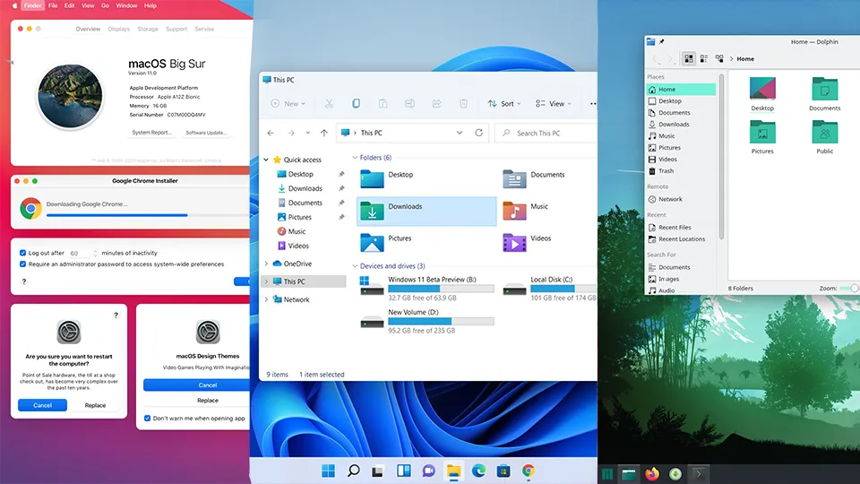

GUI Across Different Systems (macOS, Windows and GNU/Linux/KDE)

You are able to create a new file on you desktop or launch an application (VSCode, Firefox and file explorer) by just double-clicking.

Another way to do the same things shown above is by using the **Command Line Interface**. A CLI is one of the two ways to interact with a computer. It is a combination of a display and an input/output (keyboard) device. Users must ‘type out’ some commands in order to do interact with the computer.

So, instead of right-clicking and creating a new `.txt` file, you now have to type commands (for example: `touch`) to create that file. Here is a simple comparison between a GUI and a CLI.

```bash
# GUI (Graphical User Interface)  
New Folder: Right Click -> New Folder  
New File: Right Click -> New File -> Word Document File (.docx)  
Browse inside your USB Drive: Launch File Explorer -> Click 'E: My_USB (16GB)'  
Launch Google Chrome: Double Click Google Chrome  
Turn on/off Wi-Fi: Launch the settings app -> Find Wi-Fi -> Click toggle  
  
# CLI (Command Line Interface)  
New Folder: $ mkdir -p /home/tunacici/Desktop/Hello_There  
New File: $ touch /home/tunacici/Desktop/Final_Essay_2023_v2.docx  
Browse inside your USB Drive: $ sudo mount /dev/sdb /home/tunacici/Desktop/My_Drive  
                            : $ cd /home/tunacici/Desktop/My_Drive  
                            : $ ls -l .  
Launch Google Chrome: $ ./usr/local/bin/chromium # Not really, but trust me  
Turn on/off Wi-Fi: $ ip link set wlan0 down|up
```

You can see that the GUI is a more interactive way to ‘interact’ with the system via menus, buttons and mouse clicks. However, a CLI is more functional and complex. It requires you to type words and execute commands. They are two different approaches that does the same thing: **interaction with the computer.**

Terminal
========

When we ‘interact’ with our computer, we do it via the display, mouse, keyboard and other type of peripherals. It doesn’t matter which OS, software or a piece of software you have, you will always have to ‘interact’ with the hardware.

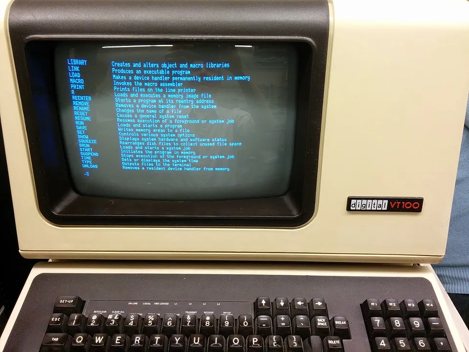

A Real Terminal With Display (Output) and a Keyboard (Input) — Model: DEC VT 100 — Source: wikipedia.com

The most important peripheral we have at our disposals is the display and the keyboard. To interact with the computer, we need at least one input device (keyboard) and an output device (display). The combination of these devices is called a _terminal_.

You can think the terminal as a ‘device’ that handles the input/output operations when we ‘interact’ with the computer.

> Quick note: Terminals provide us a command-line interface (CLI) to ‘intract’ with the system.

Terminal Emulator
-----------------

Now, as you can see ‘terminals’ are pretty cool. We can use them to ‘interact’ with the computer via just a display and a keyboard. But as you can see from the above picture, it is only presented to us via the CLI.

Most computers operating systems today comes with fancy GUIs (Windows, macOS, Ubuntu and etc). So, the question is: can we still continue using the CLI alongside the GUI? Yes, yes we can. _But not natively.._

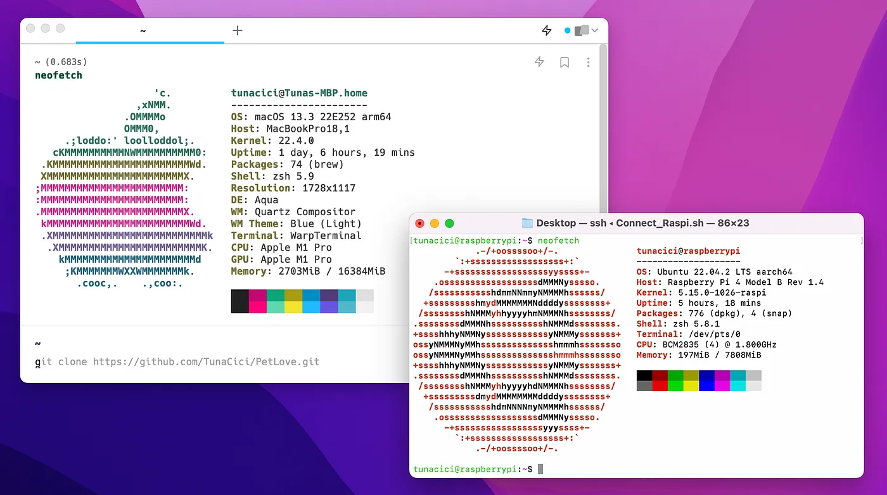

Warp vs. The Default macOS Terminal Emulator

Sometimes the GUI is not ‘sufficient’ or ‘fast’ enough for certain tasks. So, we might prefer to use the CLI to do increase functionality and have more control over the OS. In order to use the CLI (in a GUI environment), we need an application called a _Terminal Emulato_r.

Terminal emulators are _GUI applications_ that provide us a CLI to interact with the operating system. For example, the ‘Terminal’ app on macOS is a terminal emulator. They are not really a ‘terminal’ but an application that ‘emulates’ one.

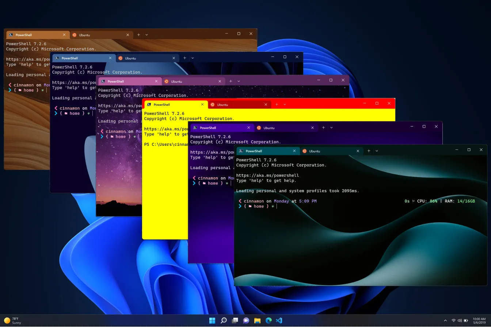

You Can Customize The Heck out of Them (For Ex. The Windows Terminal) — Source: devblogs.microsoft.com

There are MANY terminal emulator out there. So, it might be hard to choose a favorite one. In any case here are some popular terminal emulators just to name a few:

```textt
# Cross platform  
1. Putty (de facto)  
2. iTerm2   
3. Hyper (Electron based)  
  
# macOS  
1. Terminal (system default)  
2. Warp (Uses AI?!)  
3. Kitty (Cute name)  
  
# Windows  
1. Cmd.exe (system default)  
2. PowerShell v5 and v7 (powerful but kinda weird)  
3. Terminal (soon to be default) (also real pretty)  
  
# GNU/Linux  
1. GNOME Terminal (GNOME default)  
2. Konsole (default KDE)  
3. Terminator (Cool name)
```

Sorry, if I didn’t include your favorite one up there >.<

Shells
======

Alright. Now that we have seen what a CLI, terminal and a terminal emulator is, we are ready to start talking about the main topic of this article: **shells**.

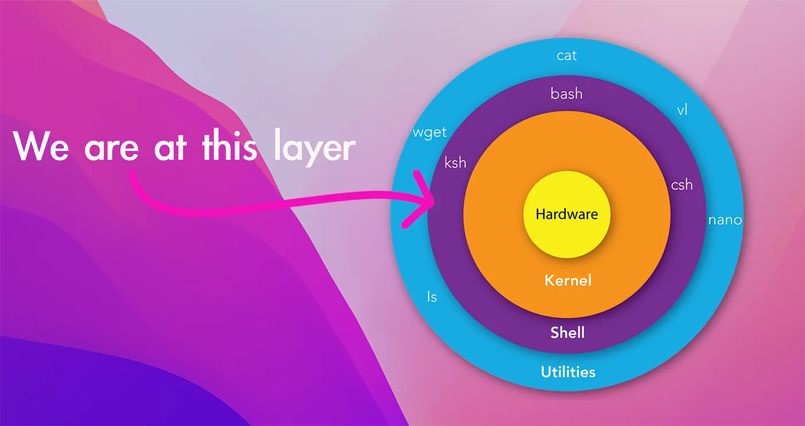

An Overly Simplified Layered View of a GNU/Linux System — Source (diagram): mindmajix.com

Layers
------

You can think of your whole computer as a layer abstractions. The innermost layer is the hardware (CPU, Memory and etc.) and the outermost layer is the ‘software applicatons’ that you run (Firefox, GCC, GTA 5 and etc.)

There are of course some layers between them, and perhaps the most important one is **the kernel**. The [Linux] kernel abstracts us from the real hardware so that the operating system can run and do whatever it wants (_display the GUI or run commands_). But the Linux kernel too needs an abstraction between itself and the operating system. And that layer is called the **Shell**! (_but more on that later…_)

System Calls
------------

We know that the computer hardware is precious, but the [Linux] kernel is equally precious. Just like how we can’t just access the CPU and the memory directly by sticking cables on to them, we **can’t access the Linux kernel** by running/inserting random binaries. There are rules that we must follow!

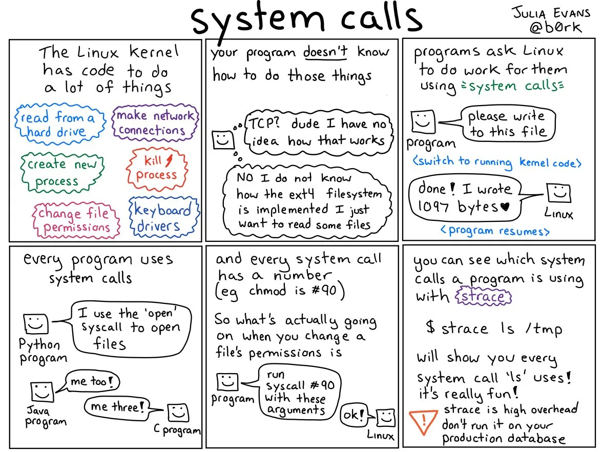

An AMAZING Explanation from **Julia Evans** on **About System Calls** - Source: twitter.com/b0rk

> We can use kernel modules to actually insert ‘random binaries’. But for the purpose of this article let’s just assume we can’t…

These rules are [basically] called ‘**system calls**’. System calls are very well-defined interfaces (APIs) that we can use to talk with the Linux kernel. For example, when we want to use the CPU by running an application, we ‘ask’ Linux to do it. Or if we want to create a file on disk, again, we ‘ask’ Linux. All of these are done via the ‘system calls’.

Altought there are MANY more system calls, here are some of the more commonly used system calls:

```c++
# File operations  
int open(...) # Opens a file and returns it descriptor  
int read(...) # Reads [X bytes] from the file and into a buffer  
int write(...) # Writes [X bytes] from a buffer into a file  
int close(...) # Closes an opened file  
  
# Process related  
pid_t fork(...) # Creates a [child] process [from the parent process]  
pid_t wait(...) # Waits for the [child] process to terminate/exit  
pid_t exit(...) # Terminates/exits the process  
  
# Memory related  
void *brk(...) # Increases the data segment to the specified address (think malloc())  
void *sbrk(...) # Increases/decrease the data segmant to the specified address (think free())  
void *mmap(...) # Maps a file/device into a memory (extremely useful when doing file/memory ops)
```

> Now, why did I told you all this? Aren’t we supposed to talk about **shells**? Well, we need to understand ‘why’ we need them in the first place. Then, we can talk about them in more detail. Savvy?

Shells (For Real This Time)
---------------------------

The Linux kernel [as you can see] is not something that we can use ‘directly’. We can’t talk to it unless we use the very specific and kinda-complex language called the _system calls._ Now, how about we add another layer into the system. So you know, we stay more abstract from the actual kernel and do even more crazy software things. And… boom! By adding another layer, we have created what is known as ‘**a shell**’.

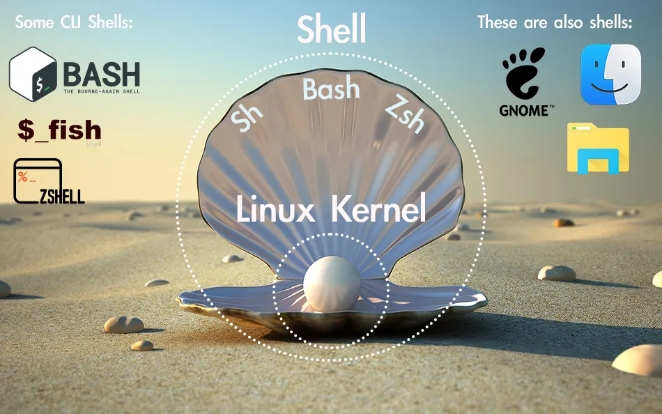

Another “Illustration” on What a Shell is

The **shell** is an abstraction layer made around the [Linux] kernel itself. It is the layer that we users can use to talk the the Linux kernel and by doing so also talk with the computer hardware. But wait, the shell is not just an abstract layer that we can’t touch or smell, it is a real **software application** that you are using at this exact moment without even noticing!

When you are using your computer, let it be via the _GUI_ or the _CLI_, you are actually using **the shell**. The file explorer you are using to browse your USB drive, the system settings app that you use to turn your Bluetooth on/off or even the app launcher that you are using to launch Sims 4 is **a shell!**

The Windows’s _explorer.exe_, macOS’s _Finder_ and Linux’s _GNOME_ desktop environment are all shells. So basically every GUI is a shell. And what about the CLI? Is it also a shell? Well, yes of course!

```bash
# Here are some examples of GUI shells  
1. GNOME Shell # Used on GNOME desktop env. (Also used on Ubuntu [duh])  
2. KDE Plasma # Used on KDE desktop env. (Clean AF)  
3. Windows Shell # Microsoft Windows' own desktop env. (explorer.exe and etc.)  
4. macOS Dock # Apple macOS' desktop env. (Finder, System Settings and etc.)  
5. Unity Shell # Used on Unity desktop env. ("ain't dead yet;)")
```

Every CLI out there is actually a shell (and thus a software application) that you can use to interact with your computer. And just like anything with the GNU/Linux systems, you have many options of shells to choose from. They all provide you a CLI, but in their [most] unique ways.

> From now on when I use the word ‘shell’ you can assume that I am talking about the shells that provide you with a CLI and not a GUI. Remember that there are two types of shells: one that provides you a CLI and one a GUI.

Here are some of the more commonly use shells that we can use in any GNU/Linux system. We will talk about each one of them in detail soon.

```bash
1. SH # The OG of the all shells out there: Bourne Shell  
2. Bash # GNU's own implementation of the SH, but harder, faster, stronger  
3. ZSH # Kinda like Bash but offers more customization and such  
4. Dash # Comes with [most] Debian distros. Small, fast and cute  
5. Fish # Kinda like ZSH but focused more on being user friendly and cute
```

To be more concise: A [Linux] **shell** is a ‘software application’ that exposes the GNU/Linux’s services to the user. It can be either thru a GUI or a CLI.

Common Features
===============

Although each shell is different, they all share some pretty common features. Let’s see what those are.

[Simple] Command Execution
----------------------------

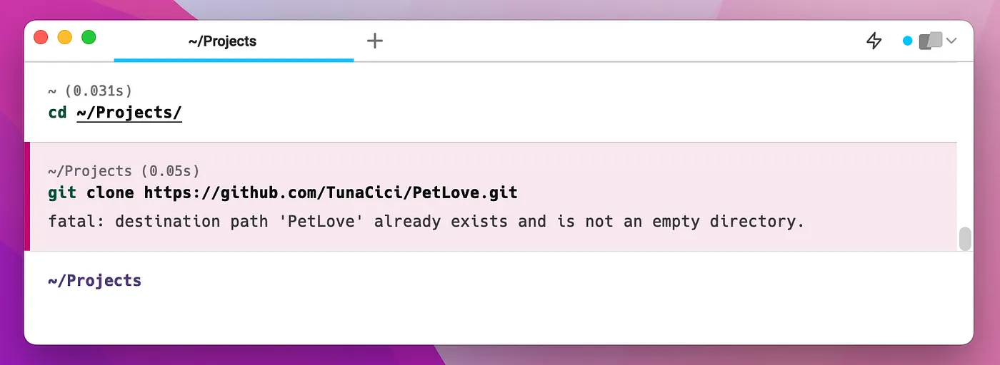

Executing the ‘**cd**’ and the ‘**git**’ Command (Warp Emulator with ‘**zsh**’)

Ah commands… Perhaps the main reason you are using a shell in the first place. Every shell allows you to execute some commands (A.K.A binaries). You can simply execute a command by typing out it’s name into the prompt and pressing `Enter` .

After you press `Enter` the shell goes thru some steps. Generally, it first ‘searches’ for your command. It does that by going over each directory specified in the `PATH` environment variable.

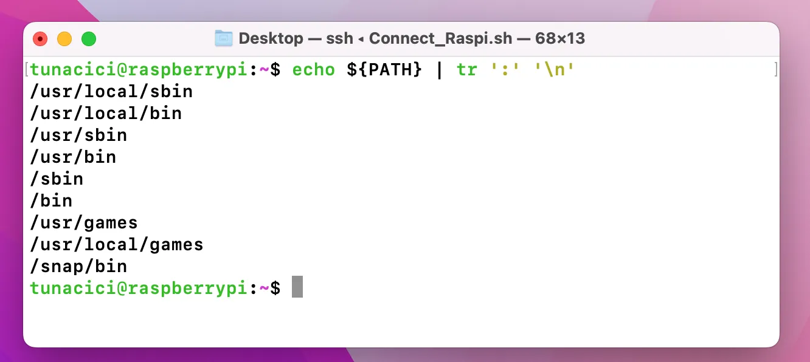

Printing the PATH Environment Variable

> In GNU/Linux systems there is an environment variable called PATH. It stores paths of some directories (For ex. /usr/local/bin).

The first binary that matches your command is then choosen to be executed. If it fails, then it gives out an error message to the **stderr** like:“_bash: command not found: bruh_”.

Shell then goes over to **execute the binary file** by calling the **fork()** system call. So, technically every command is actually a child process of the shell! And depending on your shell, it either waits for the command to **exit()** or continues its normal job and waits for the next command to be entered. (_Remember system calls?_)

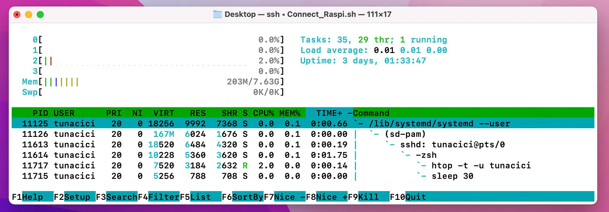

Check Out The ‘**htop**’ and ‘**sleep**’ Commands — They “Belong” to The Shell

> I should note that every command is technically a software application. We can also use the word ‘binary executable’ instead of the more common ‘command’.

Input/Output Redirection
------------------------

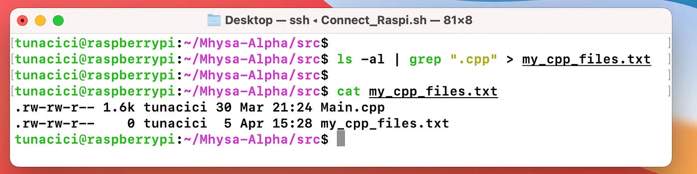

Using Some Basic I/O Redirections via ‘|’ and ‘>’

The start of something powerful… I/O operations via the shell. Like we previously mentioned, the terminal is basically an I/O device. It takes some input and outputs some data. Generally you will be using the default I/O devices: the keyboard `(stdin)` and the screen `(stdout/stderr)`. However, they might not always be enough!

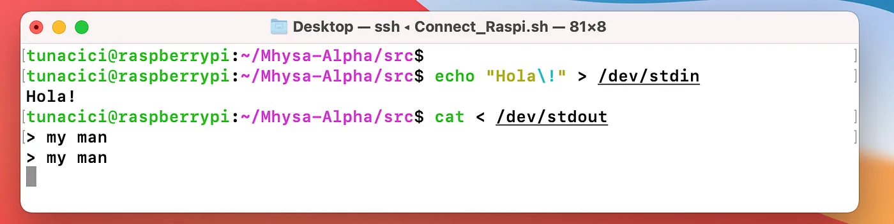

Terminal Emulators (by default) Connects to /dev/stdin and /dev/stdout

Shell applications allows you to ‘manipulate’ and ‘control’ how I/O operations handle. By default your terminal [emulator] uses the `stdin` as the input source and `stdout` as it’s output. But sometimes you might prefer to use different I/O for your command. You might want the output to be into a text file so that you can inspect it later. Or you want to combine multiple command together..!

You can do all sort of crazy things with I/O redirection and _manipulation_. All you need is to follow some pretty common syntax.

```bash
# I/O Redirection Syntax  
The '>' syntax # Changes output from 'stdout' to <FILE/DEVICE> (Overwrites)  
The '<' syntax # Changes input from 'stdin' to <FILE/DEVICE>  
The "2>" syntax # Changes err_output from 'stderr' to <FILE/DEVICE>  
The ">>" syntax # Changes output from 'stdout' to <FILE/DEVICE> (Appends)  
  
# Some examples  
$ echo "Hello World" > bro.txt # Writes Hello World to the bro.txt file  
$ cat < bro.txt # Reads from bro.txt and outputs it onto the terminal (stdout)  
$ ls -al ~/non_existent 2> oh_no.txt # Prints all the errors of 'ls' to the oh_no.txt  
$ echo "Hello Again" >> bro.txt # Appends Hello Again to the bro.txt file  
  
# You can combine them  
$ ./parse_data < my_data.csv 2> err.txt > parsed_data.csv
```

As you can see the I/O redirection done by the shell applications can be super useful! But it is not over yet. We have one more syntax and I have a feeling that you will like it.

Sometimes a command’s output can be too much for you to make a real use of it. Or the output only makes sense if it is used by another command. For example, the `curl` command will output EVERYTHING it can. You might, however, only be interested in certain parts. What do you do?

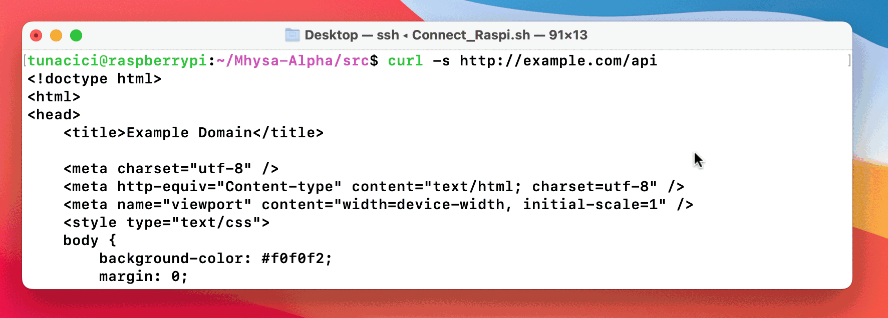

Filtering Out The ‘**curl**’ Command’s Output With The ‘**grep**’ command and **‘|’** Syntax

You can save the output into a text file with the **‘>’** syntax and later execute another command and give it the text file with the ‘<’ syntax. But… that is just inefficient doesn’t it? How about we use another syntax called a **pipe**.

```bash
# I/O Redirection Syntax (Pipes)  
The '|' syntax # Connects one command's output to another one's input  
  
# Some examples  
$ ls -al | grep ".cpp" # 'ls' all files and filter them with 'grep'  
$ cat bro.txt | sort | uniq # Output bro.txt 'sort' it and then list 'uniq' lines  
$ curl http://example.com/api | jq .results[0] # Retrieve the first JSON element
```

Basically, **pipes** allow you to redirect a command’s output to another command’s input. They are super useful especially when you want to further manipulate the output or parse some data. You will see many people use the **‘|’** pipe a lot in combination with commands like `grep`, `tail`, `head`, `sort`, and `uniq`.

The Prompt [Customization]
----------------------------

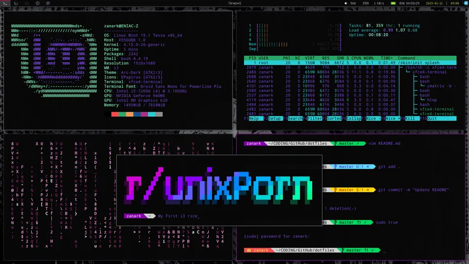

You Can Customize [The Hell Out] Your Shell Prompt — Source: reddit.com u/ZanarkTheAlucard

Like we said previously, shells are actually software applications. And just like any other software application, you need to launch them to actually use it. But you can’t just launch it like you would do with other applications (ex. Mozilla Firefox). It is your terminal emulator’s job to launch the shell.

When you launch your terminal emulator, it looks at your GNU/Linux user and determines which shell application to launch. Because there can be many shell applications available and it needs to know which one to launch. You can see the shell application tied to your user inside the file: `/etc/passwd`.

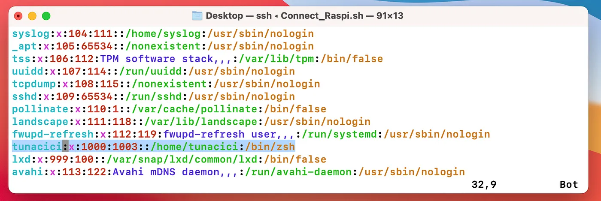

The User ‘tunacici’ Uses ‘/bin/zsh’ Shell

After your terminal emulator launches the shell, it provides you with what is known as a **prompt**. The prompt is the ‘actual’ CLI that you interact with. Thru the prompt that you are able to input some commands and see the output.

The prompt is generally displayed with a line that tells your user name, computer name, current working directory and a symbol. Let’s see an example prompt.

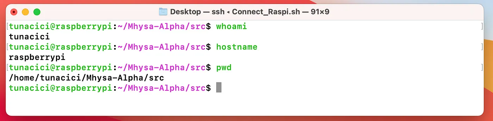

An Example **Prompt** With Some Additional Commands on The Screen

The `tunacici@raspberrypi:~/Mhysa-Alpha/src$` line is the prompt we are talking about. You can see from the above image that it actually displays my current user name, hostname and such. Then at the end we have symbol. This symbol symbolize your current user. Each shell can show a differnt symbol, but generally a `dollar [$]` sign means that the current user is a normal user and a `hash tag [#]` means the root user.

The good thing about prompts is that they can be customized.. by A LOT. Althought most prompts can look the same, some people chooses to customize it. Technically it does not change the overall functionality of the shell. But why not make it cooler, am I right?

Most shells uses an environment variable set called `PS1` to determine what kind of prompt to be displayed thru the terminal [emulator]. Youu can customize this variable in your dotfile (_ex. ~/.bashrc_). We will see what they are soon enough. But, here is an example `PS1` variable.

```bash
PS1="%F{green}%n%f%F{green}@%f%F{green}%m%f:%F{magenta}%~%f$ "
```

You can check out some of the above images to see what this prompt looks like.

Scripting
---------

It’s time to see the real power of shells. We have seen that we can use shells to execute commands thru a terminal. But shells can do much more than that. You can use them to do some very useful&complex stuff via **scripting**.

[Almost] every shell supports scripting. They all follow a similar syntax so you can write a script and use it with most shells. Scripting is general done via script files. These files have the `.sh` file extension. Let’s see an example one.

```bash
#!/bin/sh  
  
greet_user() {  
  echo "Wazzap, $1! Nice to meet you."  
}  
  
echo "Please enter your name: "  
read name  
  
if [ -z "$name" ]; then echo "You must enter a name >:(" && exit 1; fi  
  
echo "Welcome, $name!"  
  
i=1  
while [ $i -le 3 ]; do  
  echo "This is message $i."  
  i=$((i+1))  
done  
  
echo "----------------------------------"  
  
for fruit in apple banana cherry; do  
  echo "I like $fruit."  
done  
  
echo "----------------------------------"  
  
greet_user "$name"
```

The first thing you should now about sh scripts is that it starts with what is called a **shebang**. See the first line above (_#!/bin/sh_)? That is a shebang. They are used for specifying which shell (interpreter) to be used.

> Shebang’s are pretty cool! I highly encourage you to check them out yourself.

After a shebang, we can start writing our shell scripts. You can pretty much write a script file like you are entering them into a terminal. Most shells support name scripting features like:

*   Functions
*   If-else conditions
*   While and For loops

> I can talk about shell scripting for hours but it is best that we leave it here to keep things ELI5.

Alright now that we have seen some common shell feature, let’s see some shell application. There are many to choose from. Eventually, it is up to you to choose a favorite one.

Bourne SHell (sh)
=================

Let’s start with the original Unix shell — **sh (A.K.A Bourne shell)**. Its author is Stephen **Bourne** and it was developed in the 1970s. **Bourne SHell** is the OG of most modern shells. It is pretty simple and lightweight, but still very powerful.

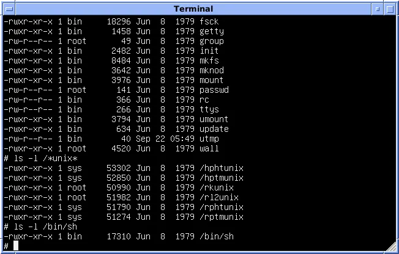

Bourne SHell is Very Simple [But Powerful] — Source: wikipedia.com

Most GNU/Linux distros comes with sh installed and you can find it under the `/bin/sh.` Nowadays it is mostly used when doing some shell scripts and not in terminals. It somewhat supports prompt customizations with `PS1` but it is nowhere near practical compared to other shells.

Here is a TL;DR of Bourne SHell:

*   The **OG** of modern shells.
*   Comes **default** with most GNU/Linux distros.
*   **Simple** and **lightweight** AF.
*   Customizable but **not practical.**

Bourne-Again SHell (Bash)
=========================

Next up we have **bash (A.K.A. Bourne-Again SHell)**. Created by Brian Fox for the **GNU** **Project** in 1989. Bash is a more modern and feature-rich shell that is designed to be compatible with **Bourne SHell** while also providing many additional features and improvements.

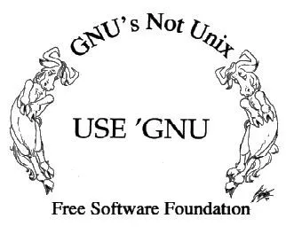

Bash is Part of the GNU Project — Source: gnu.org

Bash might be the most popular shell out there. It being a **FOSS** (GNU FTW) and also the de facto shell might just be the reason for its popularity. Most GNU/Linux systems chooses Bash as **the default shell**. Ubuntu, Kali, Arch, Fedora… you name it. Everyone uses Bash and it is for a good reason. It is damn good.


You Know His Name: Bash — Source: github.com/ChrisTollefson/jsonbash

You can customize it however you want thru the `PS1` and its dotfile. There are two ways that you can customize the Bash. Either via the .bash_profile or the .bashrc. The former one is used only for the user it belongs to and the later is for everyone in the system.

Here is an example .bashrc file.

```bash
# Example .bashrc file  wg
alias ll='ls -alF'  
alias h='history'  
export PATH=$PATH:/usr/local/bin  
export EDITOR=vim
```

You can create alias’s. They are basically short name abbreviations. Instead of writing long commands you can just create an alias to shortened it.

There are many wild things you can do with Bash and .dotfiles but I can’t explain them all here. Go wild and explore some communities like `r/unixporn` to see its potential.

Here is a TL;DR of Bourne-Again SHell:

*   The **de facto** choice amongst the shells.
*   The **default shell** in most GNU/Linux systems.
*   Greater customization compared to Bourne SHell. (via **dotfiles**)
*   Supports command history and has **powerful scripting capabilities**

Z SHell (Zsh)
=============

Let’s move on to a more advanced shell: **zsh** **(A.K.A Z SHell)**. It was created by Paul Falstad in 1990. zsh is designed to be a more powerful and user-friendly shell than **bash**, with many “advanced” features and capabilities.

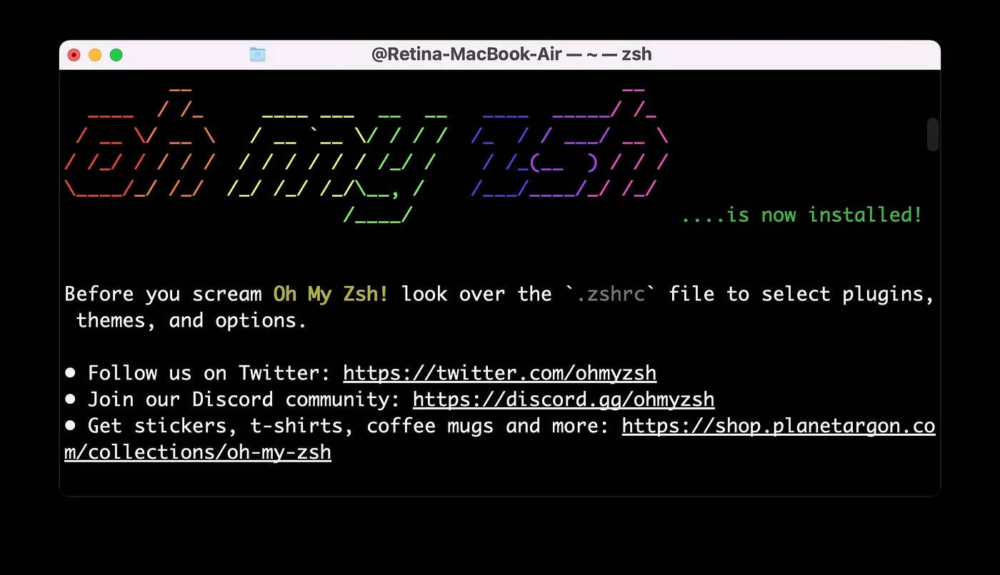

**Oh My Zsh** is The Most Popular ZSH Communtiy/Framework Out There — Source: osxdaily.com

If there is one thing that can be said about zsh it would be customization. Compared to Bash, zsh allows way more customiztion. Dare I say, it is the main reason many people uses it over Bash or sh.

Almost **none** of the GNU/Linux distros uses the zsh by default. In fact, macOS is the only OS I know that chooses zsh as its default shell (i knowit is not a GNU/Linux system but still…) Weird huh?

What makes zsh more customizable is in its ‘**plugin**’ support. You can use some pretty useful plugins/themes like:

*   PowerLevel10k (from GithHub)
*   zsh-powerleve9k-theme
*   zsh-syntax-highlithing
*   zsh-auto-completion

You can easily install them via common your package manager (apt, yum, pacman). This kind of easy installation, and “**plugin**” support makes zsh a more customizable shell compared to Bash and sh.

Here is a TL;DR of Z SHell:

*   Highly **customizable** via it’s **plugin** support. (in quotes)
*   The default shell in modern macOS systems.
*   Did I tell you it’s **highly** customizable?

Friendly Interactive SHell (fish)
=================================

Last but not least, we have **fish (A.K.A Friendly Friendly Interactive Shell)**. Created by Axel Liljencrantz in 2005. fish is designed to be a more **user-friendly** and intuitive shell than traditional Unix shells, with a focus on ease of use and discoverability.

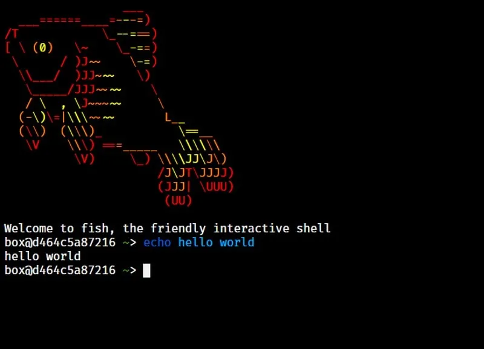

Fish is The Cutest (^^) — Source: itsfoss.com

Many of the shells we have seen so far are not very “user-friendly”. I mean most people can use them pretty well do not get me wrong. But for a more generic user (average Joe), they are not that easy to use. So we have fish!

Unlike zsh or bash, fish **comes default** with pretty good features. It supports _syntax-highlighting_, _auto-completion_, _listing-of-items_ and etc. Most of these features can be added to zsh but you need to install some themes/plugins and mess around with dotfiles. Wheres in fish, they are just there. Basically it just **works out-of-box**.

However where fish shines in customization, it lacks in being “functional”. Unfortunately it is **not POSIX complien**t. Meaning some scripting is different compared to what is done in bash or zsh. For example see the below code snippet:

```bash
# bash/zsh  
count=0  
  
double() {  
  echo $(( $1 * 2 ))  
}  
  
while [ $count -le 10 ]  
do  
  echo "Count is: $count"  
  count=$(double $count)  
done  
  
# --------------------------------  
  
# fish  
set count 0  
  
function double  
  echo (math $argv * 2)  
end  
  
while test $count -le 10  
  echo "Count is: $count"  
  set count (double $count)  
end
```

As you can see fish is very different with it’s syntax. This does not make it less useful or powerful but it is something you should consider when using.

Here is a TL;DR of Friendly Friendly Interactive Shell:

*   Focused more on being **user friendly** and **modern**.
*   Comes default with **syntax-highlighting, auto-completion** and **MORE**…
*   **Not POSIX compliant.**

Choosing the [Right] Shell
============================

So, with all of these different shells to choose from, how do you know which one to use? Well, the answer depends on your needs and personal preferences.

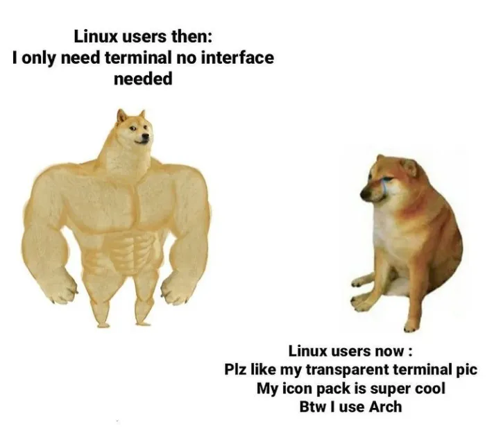

Terminal Rice is Real >.< — Source: knowyourmeme.com

If you’re looking for a simple and lightweight shell for basic tasks, then **Bourne SHell** might be a good choice. If you need more advanced scripting capabilities and compatibility with sh, **Bourne-Again SHell** is an excellent choice! If you’re looking for even more advanced features and customization options, then **Z SHell** is one of the best options out there. Lastly, if you want a more user-friendly and intuitive interface, **Fish** is your friend :)

> Of course, there are many other great shells available out there. You need to explore the wilderness (A.K.A. the Internet) to find the one that suits you the best.

Closing Words
=============

Hey… You are finally awake. Congratulations on making it to the end. Let’s summarize what we have seen so far. We started talking about the origins of shells via CLIs, terminals, emulators and layers of abstraction. Then we really dug into the shells and talked about their common features.

Lastly we have given some example popular shells: sh, bash, zsh and fish! I hope that this article helped you learn something new :) I know that it is longer than my usual articles, but I tried to keep everything as fun and colorful as possible to not bore you.

If you have spotted some errors and think that what I said was wrong please do tell me! It would mean a lot to me. And thanks again for reading my writings.

Take care ❤
