Hello and welcome to the final part of this ELI5 series. So far, we have learned the fundamentals of computer networking through questions like ‘_what is networking?’_, ‘_what is the TCP/IP model?_’ and ‘_what are ports?_’. We have covered most of the important networking terms, but there are still A LOT MORE things out there. However, let’s just leave them for future articles:)

In this final part we will **not** be explaining new networking terms, but instead we will use them to build something!

In front of use we have two simple practices: a game server (**Minecraft**) and a web server (**Flask**). Together, we will build, configure and run these servers using the networking fundamentals we have learned so far.


Both of The Servers Running

> Note that this is NOT a full-fledged tutorial on how to deploy a Minecraft or a web server on the cloud. Everything shown here is for learning purposes only.
> 
> It is recommended to follow a better/proper tutorial on how to ACTUALLY deploy them with production in mind.

If you want to go back to the previous parts, you can do so using the links below. And if you are felling ready, then let’s start having some fun!

[Navigate to Part 1 — Networks & Interfaces](https://medium.com/@tunacici7/linux-networking-eli5-part-1-networks-interfaces-b912826d699b)

[Navigate to Part 2 — IP, NAT & DHCP](https://medium.com/@tunacici7/linux-networking-eli5-part-2-ip-nat-dhcp-c1af98046654)

[Navigate to Part 3 — Ports, TCP/UDP & Firewalls](https://medium.com/@tunacici7/linux-networking-eli5-part-3-ports-tcp-ip-firewalls-73f17cb54ed8)

[Navigate to Part 4 — Minecraft & HTTP Server](https://medium.com/@tunacici7/linux-networking-eli5-part-4-minecraft-web-server-f0791b6318d0)

Before we begin, I would like to thank ‘Xiaodong Deng’ for kindly giving me the permission to use the ‘flask-example’ project.

The Setup
=========

I’m using basically the same setup from the previous parts. However, I have changed the diagram a bit to better suit this article.

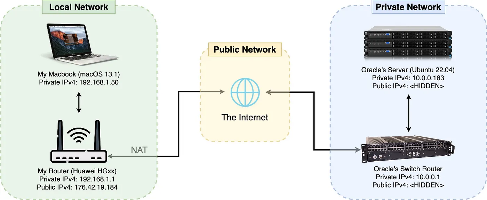

The Overall Network Used in This Article

I have two local devices: one is my Macbook and the other is my router. I am connected the Internet with the IP address 176.42.19.184.

At the other end, I have a cloud server (hosted on Oracle’s Server Farms). It is connected to a high-grade switch router.

> Most server farms uses a high-grade switch or a smart hub to route network packets into the servers (also to act as a firewall).

The server specs are:

```text
CPU: Ampere® Altra™ (2 OCPU) @ 3.0 GHz (virtio)  
RAM: 16GiB (virtio)  
OS: Ubuntu Server 22.04 LTS (aarch64)  
  
*No display avaliable. Only SSH connections.
```

You can get the same server using Oracle’s Always-Free resources. More information can be found on the official website below.

```text
# Oracle's Always-Free compute instance on cloud

https://www.oracle.com/cloud/free/
```

Minecraft
=========

When it comes to popular gaming, nothing can beat the good-old Minecraft! Everyone knows about it and probably have played it once in their lifetime. It’s a game about creativity where you can design, craft and build in an endless world full of adventures. Oh and it’s also the best selling game of all times, no biggies.

> It sold around 238 million copies around the world (beating the no.2 GTA V /w 170 million copies).

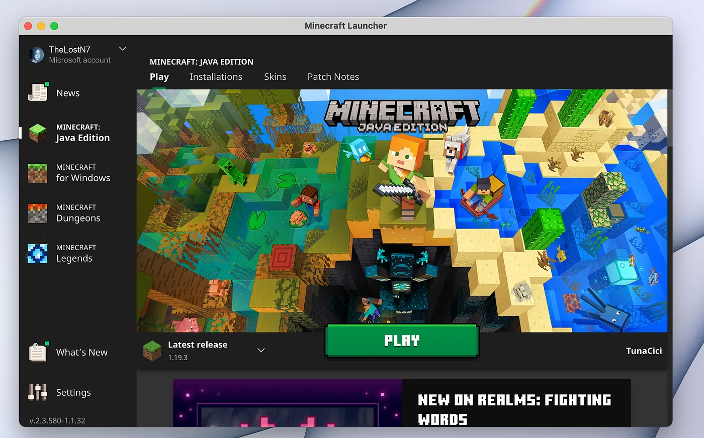

The Official Minecraft Launcher

Since, Minecraft is very popular and has one of the most active online communities out there, it is a pretty good and useful practice to build & host your own Minecraft server. Together with your buddies, you can play on the server you deployed. (thanks to your networking skillz!)

> Also, you can install custom mods, using tools like Forge, on your own server! (as long as you have enough RAM to spare)

Prerequisites (Allow Port Number 25565)
---------------------------------------

First things first, we should make some preparations on the server-side.

After you have created your Linux machine on the cloud (ex. Oracle, Azure, Google, AWS), you will need to configure some network settings. Or more specifically, the firewall settings, so that the Minecraft server can be accessible from the Internet.


Google Cloud (and other cloud services) Uses Firewalls to Increase Security — Source: cloud.google.com

In order for the server packets to ‘pass’ the firewall, we need to add a firewall/security ‘rule’. (remember Firewalls?). The rule (for Minecraft) is to allow **any incoming/outgoing packets (UDP&TCP)** that uses the **port number 25565**.

Below are the rules that you need to add to your firewall.

```text
Firewall/Security Rule 1. Allow UDP connections from 0.0.0.0/0 (anyone) to access port 25565  
Firewall/Security Rule 2. Allow TCP connections from 0.0.0.0/0 (anyone) to access port 25565
```

Depending on your cloud server (Oracle in our case) you need to configure two different firewalls.

1.  Network Security Group (from the web page)
2.  Linux Firewall (from the OS terminal)

Let’s learn how to do both.

Network Security Group
----------------------

Most cloud machines uses additional firewalls to increase their network security. You can see from the list below that each cloud service provider uses different terms and ways to configure their firewalls.

```text
Amazon Web Services: Security Groups -> [Inbound] Security Rule  
Azure: Network Security Group -> [Inbound] Security Rule  
Google Cloud: Virtual Private Network -> Firewall -> [Create] Firewall Rule  
Oracle Cloud: Virtual Cloud Network -> Security List -> [Add] Ingress Rule
```

> You can find more info about the firewall/security settings on your cloud service provide’s website.


Oracle Cloud’s Logo — Source: oracle.com

Here in this article I will be explaining only the Oracle’s firewall settings. However, most of the explanations here can also be applied to other cloud service providers.

First, open the ‘subnet’ configuration page that you are using with your Linux machine. (you can use the search panel)

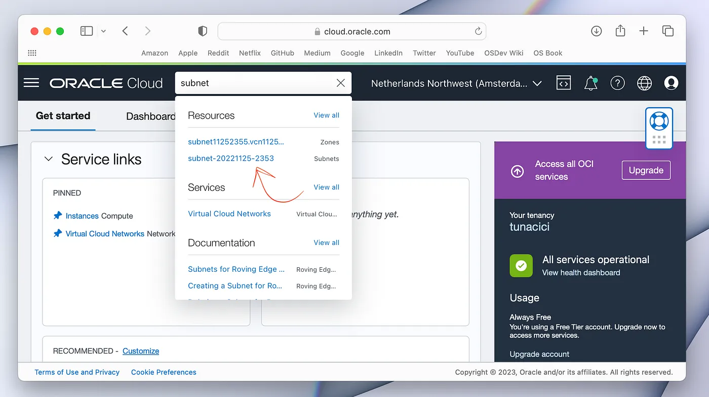

Quick Tip: You Can Use The Search Bar

Open the default security list (or create a new one, it does not matter).

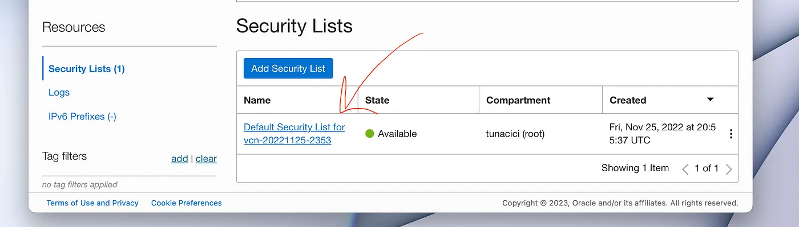

Open Your Security List That is Basically a Firewall Profile/Preset

Add **two** ingress rules (TCP & UDP) to allow port number **255565** (Minecraft) through the firewall. One rule is for the TCP and other is for UDP connections. You need to add the same rule for both of them.

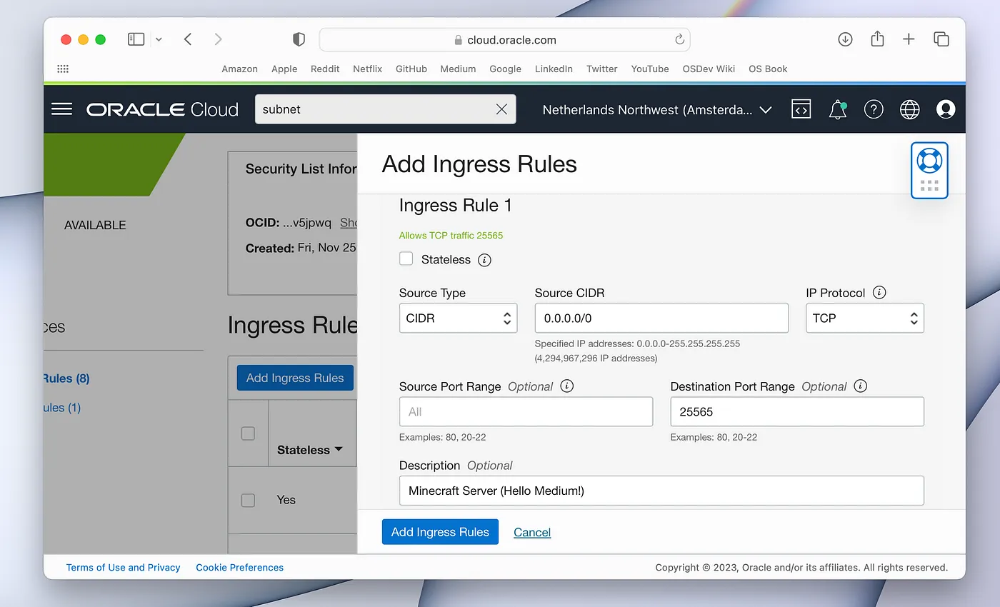

Add a Rule For Allowing TCP Requests For Port 25556

After these operations, your cloud firewall settings are finally set up!

Linux Firewall
--------------

As we have seen from the previous article, the Linux also has a firewall that we can use. Depending on your machine (and Linux distro), you might have it enabled or not.

We would be normally using the ‘ufw’ command tool to configure our firewall. However, Oracle Cloud does not like it very much. I tried to set it up, but failed miserably.

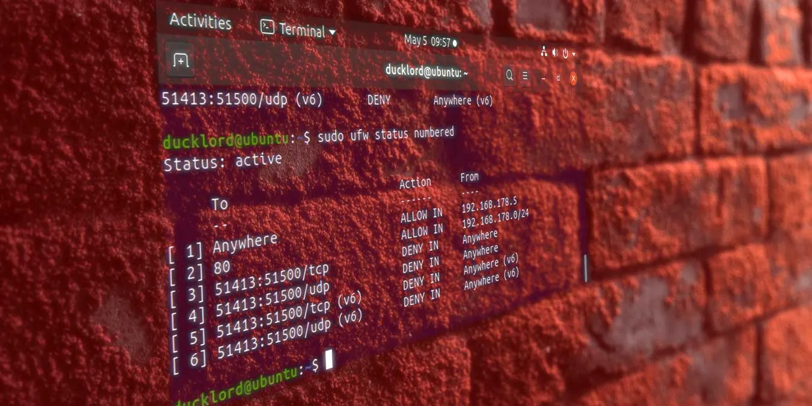

An Example ‘ufw’ Command Usage — Source: makeitcheasier.com

Instead of ‘ufw’ I have decided to use ‘firewalld’, which is an alternative way to configure Linux firewalls. And also, it works great with Oracle Cloud.

Run the below commands to allow port 25565 for both UDP & TCP connections.

```bash
# Install and enable 'firewalld' (so that it is open at OS launch)  
$ sudo apt install firewalld  
$ sudo systemctl enable firewalld  
  
# Allow port 25565 for both UDP & TCP  
$ sudo firewall-cmd --permanent --zone=public --add-port=25565/udp  
$ sudo firewall-cmd --permanent --zone=public --add-port=25565/tcp  
  
# Reload the firewall rules  
$ sudo firewall-cmd --reload
```

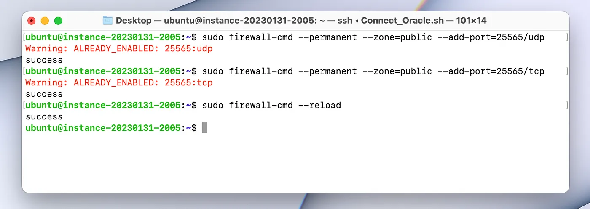

I have Already Added The Firewall Rules For Port Number 25565

Hurray! We have successfully onfigured our firewall settings to allow network packets for the port number 25565 (Minecraft Server).

nmap
----

Although, we have set the firewall setting to open port number 25565, we must make sure that it is working correctly. Of course we can check for it when we are actually running the server, but it is not a good practice. You should always test your settings.


‘nmap’ Logo — Source: nmap.org

For the testing, we will be using a tool we will be using a tool called Network Map (nmap). By using ‘nmap’ we can scan for open port(s) on a server/machine using it’s IP address.

You can use the below command to install and use ‘nmap’ to scan for a specific port.

```bash
# Install 'nmap'  
$ sudo apt install nmap  
  
# Scan for port 25565  
$ sudo nmap -p80,443 <SERVER_IP_ADDRESS>
```

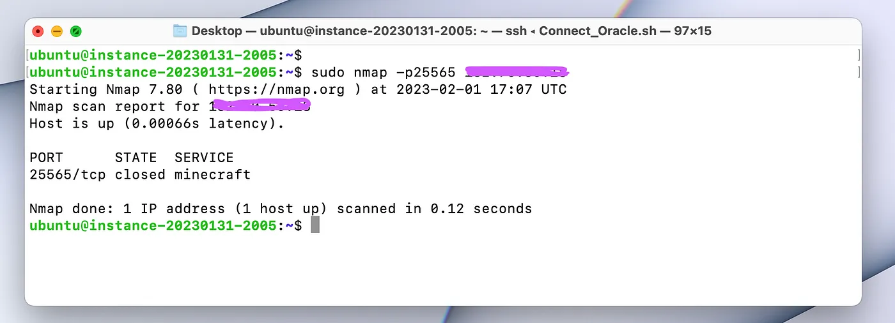

Here’s The ‘nmap’ Scan Result

We got the results and the port is ‘closed’? Now, look at the ‘state’ column. It is showing ‘closed’, because since there are no programs ‘listening’ on port 25565 (Minecraft server is not running yet), it shows the state as ‘closed’.

> If the port was really closed (meaning we can’t use it) then it will show up on the results as ‘filtered’. And that would mean that the firewall ‘filtered’ our packets for that port number.

In short the port number 25565 is open and we can use it however we want!

After all these firewall configurations, your cloud machine can now use the port 25565. YAY!!. For now, we are done with firewall settings. Let’s switch over to the Minecraft server itself.

Prerequisites (Install Java)
----------------------------

Minecraft & the server is written in Java and for that, we need to have Java installed on our machines.


Java Logo (Old vs.New) — Source: logos-world.net

In Linux you have two options to install Java. You can _a) Install the OpenJDK_ or _b) Install the Official Oracle JDK_. Here, in this article, we will be using the option **_a_**. (It does not matter which option you choose to use)

```bash
# Update the 'apt' sources list  
$ sudo apt update  
  
# Install OpenJDK 17 or newer (I choose 19)  
$ sudo apt install openjdk-19-jre-headless  
  
# Check if it is installed correctly  
$ java --version
```

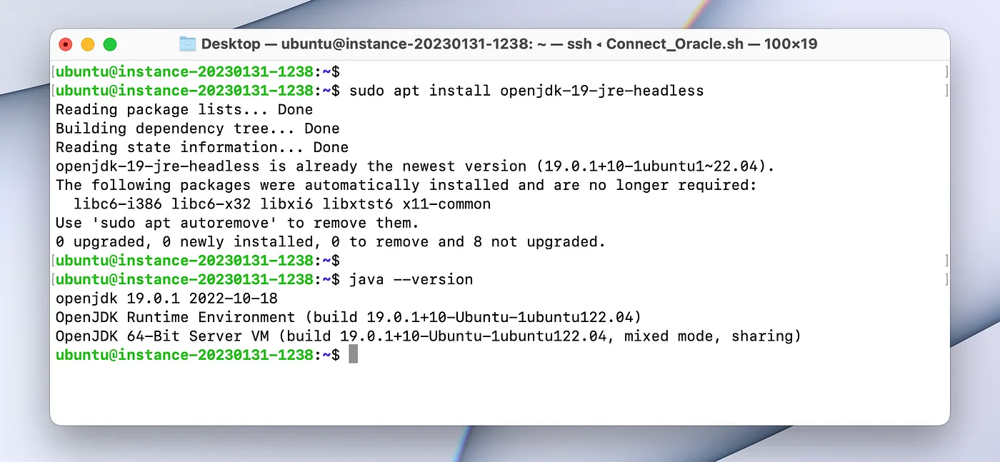

Java is Installed Correctly, YAY!

Server Setup
------------

We are now ready to install the server ! First, let’s choose a location to install your server and ‘change directory’ into it.

```bash
# I choose my 'home' directory  
$ mkdir ~/Minecraft_Server  
  
# Change directory into the Minecraft_Server  
$ cd ~/Minecraft_Server
```


Download the Minecraft Server file from Mojang’s offical website. You can choose whicever version you want. I will be using 1.19.3 since it is the latest version as of writing this article.

You can copy the download link by right clicking the highlighted green text ‘minecraft_server.1.19.3’.

```bash
# Copy the download link from the Mojang's website  
https://www.minecraft.net/en-us/download/server  
  
# Download the server  
$ wget https://piston-data.mojang.com/v1/objects/c9df48efed58511cdd0213c56b9013a7b5c9ac1f/server.jar
```

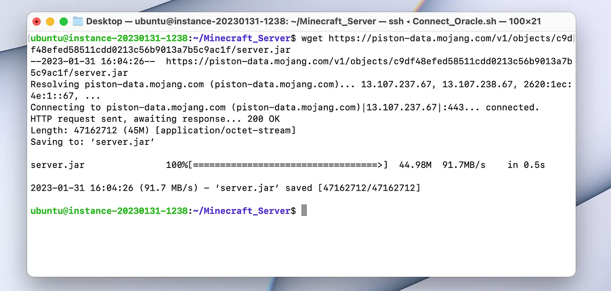

The Internet Speed is Incredible!

Now, you can directly start the server from the command line. However, I will be showing you a better way: start script.

Go to this beautiful website created **by bluely & aber**. Here, you can choose your machine settings and customize the server however you want. This way your Minecraft server will be properly optimized and hopefully work lag-free.

```bash
# You can use this website for a better server script  
https://startmc.sh
```

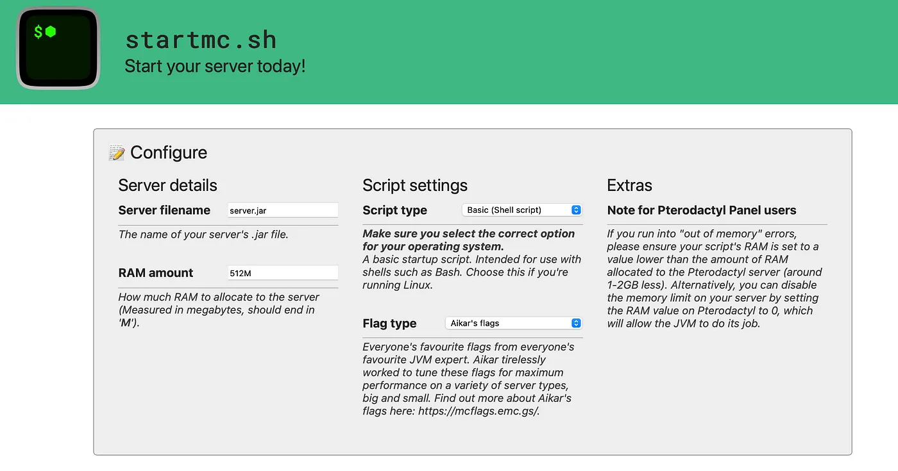

Here’s The UI That You Can Use to Create Your Customized Start Script

You can use the very simple UI to generate a start script. What you want to do is enter the server filename (in our case it’s _server.jar_), select the script type to be _‘Basic (Shell Script)’_, specify the RAM you want the server to have (in my case it’s _4096M_) and select from one of the flag types (_doesn’t matter_ _which one unless you have 12GB+ RAM_).

Here’s the start script that we will be using.

```bash
#!/bin/bash  
  
JAVA="java"  
JAR="server.jar"  
RAM="4096M"  
FLAGS="-XX:+UseG1GC -XX:+ParallelRefProcEnabled -XX:MaxGCPauseMillis=200 -XX:+UnlockExperimentalVMOptions -XX:+DisableExplicitGC -XX:+AlwaysPreTouch -XX:G1NewSizePercent=30 -XX:G1MaxNewSizePercent=40 -XX:G1HeapRegionSize=8M -XX:G1ReservePercent=20 -XX:G1HeapWastePercent=5 -XX:G1MixedGCCountTarget=4 -XX:InitiatingHeapOccupancyPercent=15 -XX:G1MixedGCLiveThresholdPercent=90 -XX:G1RSetUpdatingPauseTimePercent=5 -XX:SurvivorRatio=32 -XX:+PerfDisableSharedMem -XX:MaxTenuringThreshold=1 -Daikars.new.flags=true -Dusing.aikars.flags=https://mcflags.emc.gs"  
  
echo "Starting server..."  
${JAVA} -Xmx${RAM} -Xms${RAM} ${FLAGS} -jar ${JAR} --nogui
```

Now that we have our script, let’s use it to launch our server. First, create a file named _‘start.sh’._

```bash
# Create a new file  
$ touch start.sh
```

Copy the starting script into this file that we have generated before. Also, we need to give the ‘execution permission’ so that Linux can actually execute it.

```bash
# Open the file using 'nano' (you can also use vim)  
$ nano start.sh  
  
# Copy the script into the file  
  
# Hit CTRL+S to save and CTRL+X to exit  
  
# Give the 'execution' permission  
$ sudo chmod +x start.sh
```

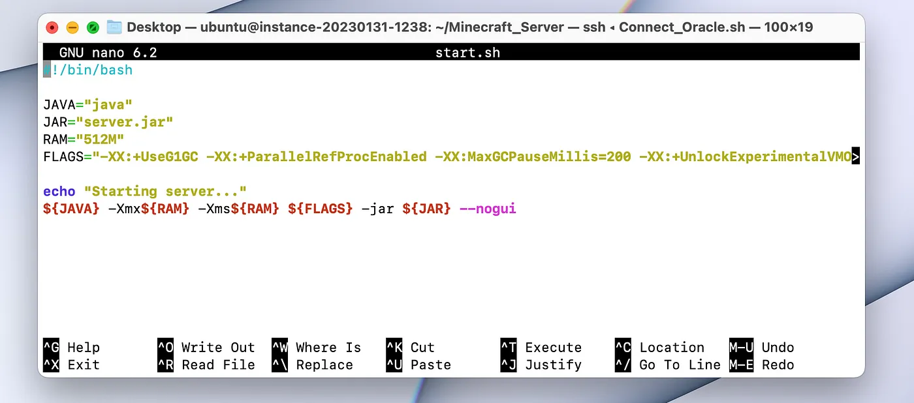

Here’s the ‘start.sh’ File

Everything is almost ready. Let’s execute the script and see what happens.

```bash
# Start the server  
$ ./start.sh
```

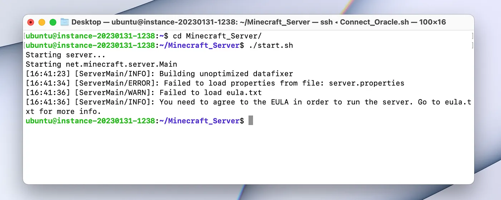

We Need to Accept Mojang’s EULA

Oh no… The server didn’t work. What happened? Well, if we take a closer look into the logs, we can see that we need to accept Mojang’s EULA in order to actually launch the server.

We can accept the EULA via opening the ‘eula.txt’ and changing a variable from ‘false’ to ‘true’. This way we will be accepting Mojang’s EULA.

```bash
# Open the 'eula.txt'  
$ nano eula.txt  
  
# Change the line 'eula=false' to 'eula=true'  
  
# Hit CTRL+S to save and CTRL+X to exit
```

Okay, let’s run the start script again.

```bash
# Start the server (for real this time)  
$ ./start.sh
```

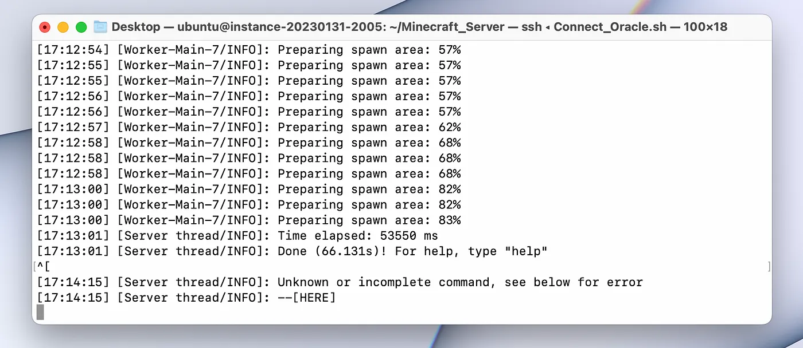

Server is Now Running

Everything is ready and we now should be able to join our new server! Let’s give it a shot.

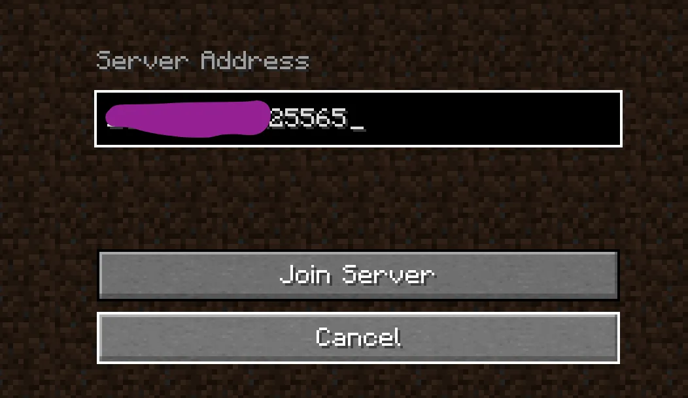

Connect to The Game Using Your Server’s Public IP Address (I Hide Mine For Security Reasons /sorry/)

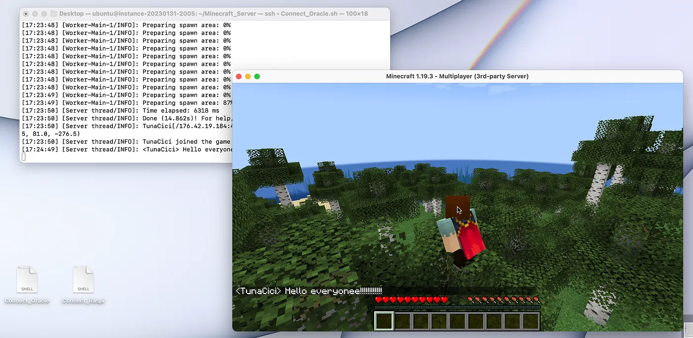

We Have Successfully Joined! It Works!! (/don’t mind the shell scripts on my desktop pls/)

Web Server (/w Flask)
=====================

Currently we have a game server running on our cloud machine and we are able to connect to it from virtually anywhere in the world. Now, let’s try to deploy an actual web server shall we?


Flask Logo — Source: wikimedia.org

Let’s admit it. The web application I have written in the previous article kinda sucks. It can only print ‘Hello’ to the server console and that’s it. Can we even call it a web ‘application’? We should try to deploy a more realistic web application.


Github Page of The ‘flask-example’

Fortunately, I was lucky enough to find a Git-Hub project called ‘flask-example’. Like it’s name suggests, it is a minimalistic web application written using the Flask framework. You can check it out for yourself from the link below

```text
flask-example: A minimal web app developed with Flask framework.  
  
https://github.com/XD-DENG/flask-example
```

The project’s README file explains this application as:

```text
A minimal web app developed with Flask framework.  
  
The main purpose is to introduce how to implement the essential elements in web application with Flask, including  
  
* URL Building  
* Authentication with Sessions  
* Template & Template Inheritance  
* Error Handling  
* Integrating with Bootstrap  
* Interaction with Database (SQLite)  
* Invoking static resources
```

As you can see it is objectively a better web application that we can use.

> Note that, we are doing this for learning purposes only. We are not actually deploying, but rather running a web server.

The project author ‘Xiaodong Deng’ was kind enough to let me use the project for this article. My biggest thanks and respects...

Okay, Let’s get to work!

Prerequisites (Allow Port Number 80)
------------------------------------

Just like we did with our Minecraft server, we need to add a firewall/security rule on our firewall so that the [HTTP] packets can ‘pass’ the firewall. The rule is to allow **any incoming/outgoing packets (TCP only)** that uses the **port number 80**.

> Remember that the HTTP protocol uses the port number 80 and the HTTPS uses 443.

Below are the rule that you need to add to your firewall.

```text
Firewall/Security Rule 1. Allow TCP connections from 0.0.0.0/0 (anyone) to access port 80
```

You can follow the same steps from the previous section ‘Prerequisites (Allow Port 25565)’. However you need to allow port 80, instead of 25565. Return to that section, and come back here after you have configured your firewall/security rules.

You have done it? Okay, let’s continue.

Just like we did before, we should test the port number 80 using ‘nmap’.

```bash
# Scan for port number 80 (HTTP)  
$ sudo nmap -p80 <SERVER_IP_ADDRESS>
```

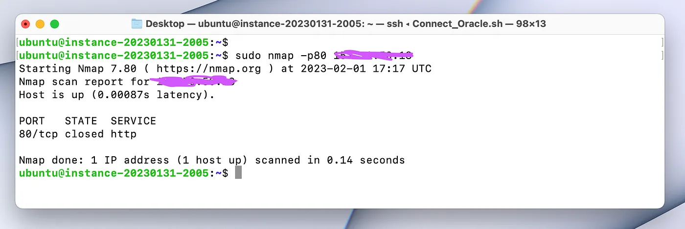

The Port 80 is Open!

After that, your cloud machine can now use the port number 80! We are done with firewall/security settings. Let’s move forward

Prerequisites (Python3)
-----------------------

Flask is a web framework written in Python. In order for it the work, we need to setup Python first. Luckily the Ubuntu Server 22.04 comes with Python (version 3.x) installed.

> Most other Linux distros also comes with Python (version 3) installed.

However you can still install the ‘python3’, if your distro does not have it.

```bash
# Install python3  
$ sudo apt install python3
```

Prerequisites (pip)
-------------------

Okay, we have python3 installed (thanks to Ubuntu). Now we need a special package manager called ‘pip’. We will use this package to actually install the ‘Flask’ framework very soon.

The below command installs the python3 package ‘pip’.

```bash
# Install 'pip'  
$ sudo apt install python3-pip  
  
# Check if 'pip' is installed correctly  
$ python3 -m pip --version
```
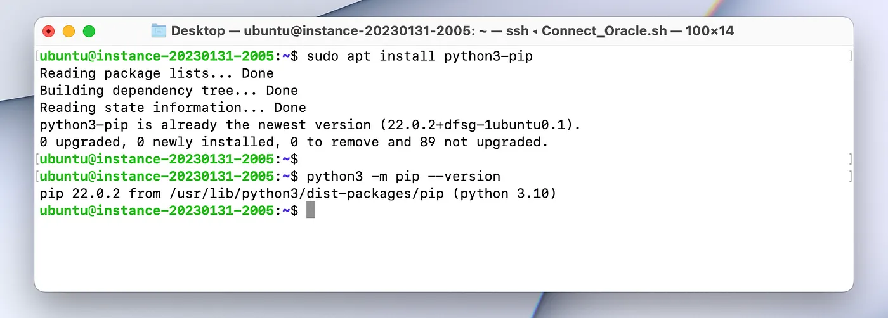

Pip is Installed Correctly

Installation
------------

The groundwork is now done. Let’s install our ‘flask-example’ application!

First, we need to download the project using the ‘git’ command.

```bash
# Clone the git repository  
$ git clone --depth 1 https://github.com/XD-DENG/flask-example.git
```

Second, we need change directory into ‘flask-example’ and install it’s python3 requirements. This will install the necessary python3 packages, including the long awaited **Flask framework**!

```bash
# Change directory into 'flask-example'  
$ cd flask-example  
  
# Install the required python3 packages  
$ sudo python3 -m pip install -r requirements.txt
```

> **Important side note:** as of writing this article (31.01.2023) the ‘requirements.txt’ file installs the Flask version 1.1.2. However, this will cause some problems when we are launching the application.
> 
> I will contact the project author about this. Luckily, the fix is rather easy.

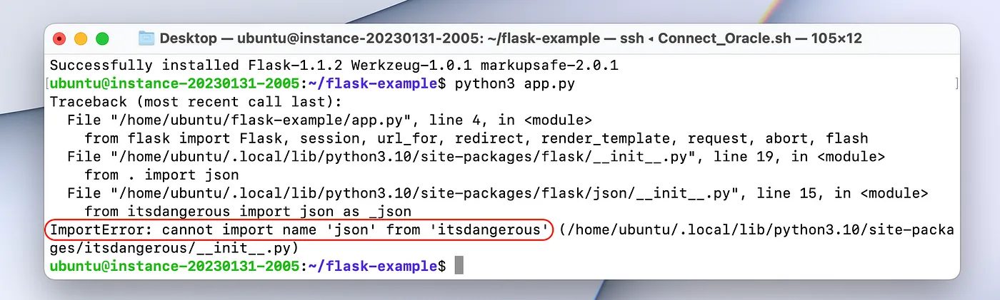

This is The Error We Will Get if We do Not Upgrade to Flask Version 2.x

We need to ‘upgrade’ the Flask version to 2.0 or newer. You can follow the command below.

```bash
# Upgrade the 'flask' package to the latest version  
$ sudo python3 -m pip install flask --upgrade
```

Testing
-------

Before we deploy the application itself, let’s test it and see if it works. Follow the below command to run the application.

```bash
# Run the web application in development mode  
$ python3 app.py
```

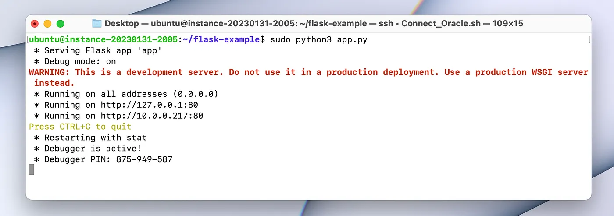

The Application is Running

Let’s use a web browser to acces it. Type your cloud machinec public IP into the browser.

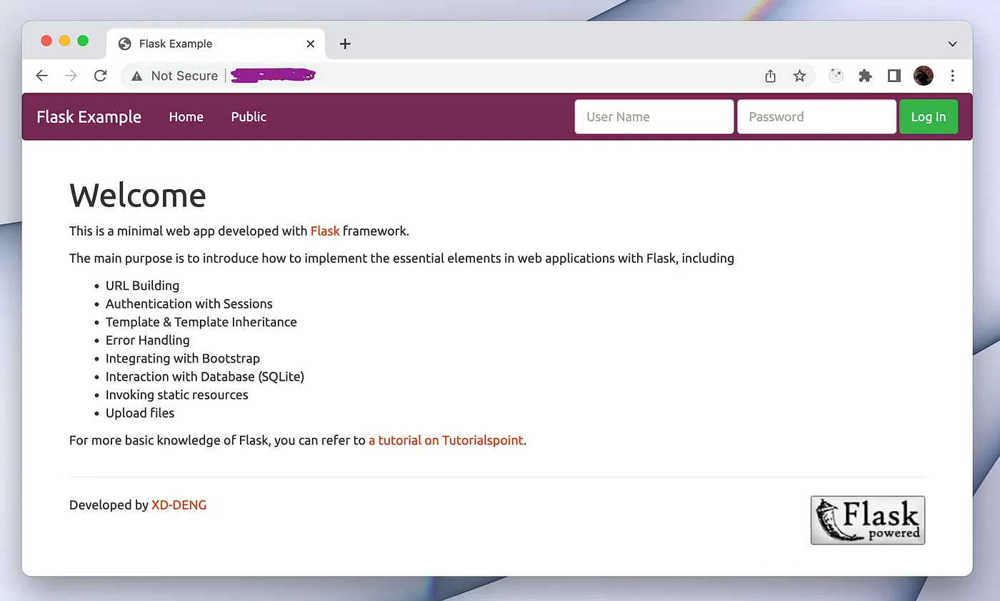

The Welcoming Page For The ‘flask-example’ Web App

You can try to login using one of the default users. Let’s try the username ‘admin’ with the password ‘admin’.

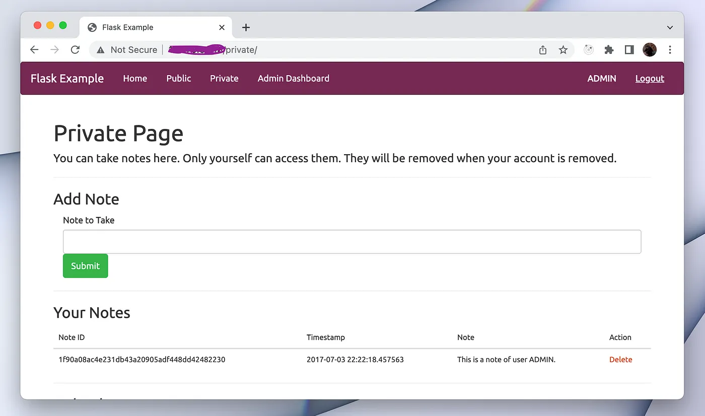

We Can Login to The System (Session’s Are Working)

Closing Words
-------------

Congrulations! Together we have built two servers using the network informations we have gained from this ELI5 series. With a little bit of work, you can actually deploy them for your own projects.

If you have any questions or just want to talk about this series, feel free to contact me however you see fit.

For now, this series is over and I would like to give my HUGE thanks anyone for reading my articles. If I made a typing mistake or just gave false information, please let me know so that I can fix it. Again, thanks for reading into this far. You were a true companion to me in this ELI5 journey!

Take care ❤
