Programming using high-level languages makes [a ton of stuff](https://en.wikipedia.org/wiki/Class_(computer_programming)) trivial. Your compiler/interpreter [abstracting lots stuff](https://en.wikipedia.org/wiki/Data_type) from you so that you can focus on what's important: getting shit done, efficiently. One of those abstractions is functions.

Calling a function is one of the first things you learn when starting programming. They are relatively trivial: you just type the function name, pass some parameters and then it does what it's meant to do ([or not](https://science.nasa.gov/mission/mariner-1/)). You don't need to think about whether the underlying CPU architecture is 64-bit or that it's by AMD, Intel or Apple. All you care is that the function gets called, does its thing and successfully returns. That is until you need to get real [close to the hardware](https://x.com/FFmpeg/status/1805687815294140542), [debug on register-level](https://ftp.gnu.org/old-gnu/Manuals/gdb/html_node/gdb_60.html) or d[esign system-level programs & languages](https://www.cse.unsw.edu.au/~cs9242/19/exam/paper1.pdf).

```c
int main(int argc, char **argv)
{
    /* Call to standard library */
    std::cout << "Hello, world!" << std::endl;
    
    /* Call to external library */
    std::string world = "world";
    fmt::print("Hello, {}!\n", world);
    
    /* Call to my own function */
    my_print_hello();

    /*
     * They are cool and all, but:
     *
     * How do they work under-the-hood?
     * How am I able to use external functions/APIs?
     * What happens at the machine code level?
     * How are parameters passed around?
     * What happens if I have too many parameters?
     * Is there a limit to amount of parameters I can define?
     * How does a pre-compiled library works on my machine?
     * Why does my CPU or its architecture matter?
     */
    
    return 0;
}
```

At that point it is good to know how the compiler, the standard library and the kernel/OS handles functions. For example, you might need to consider how stack is managed, how are functions called to & returned from, how parameters are passed (via registers or stack). They all depend on your specific platform (e.g., AMD64, AArch64) and the kernel/OS (e.g., Linux, macOS).

Here, I will try to [ELI5](https://www.urbandictionary.com/define.php?term=ELI5) those abstractions and concepts for the AArch64 platforms. Throughout this writing, I will assume that you are familiar with stuff like [compilers](https://en.wikipedia.org/wiki/Compiler), [linkers](https://en.wikipedia.org/wiki/Linker_(computing)), [ELF format](https://www.cs.cmu.edu/afs/cs/academic/class/15213-f00/docs/elf.pdf), [ISA](https://en.wikipedia.org/wiki/Instruction_set_architecture) and [basic assembly code](https://cs.lmu.edu/~ray/notes/gasexamples/). Feel free to stop reading at any point and gain more insight on those topics as they will help broaden your knowledge on system-level programming & computer hardware;)

I. Calling Conventions, API and ABI
===================================

Everyone writes programs in their own way. The compiler they choose to use can also be different; so does the hardware they worked on; or even the programming language itself. All these (and many other) factors can affect the final machine code of the program. 

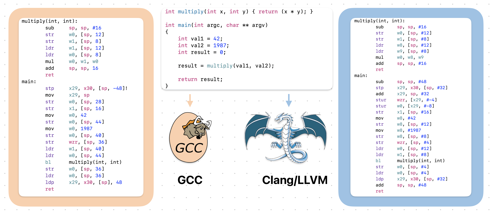

Same C++ Code Compile /w GCC and Clang/LLVM

Naturally, we expect our programs to behave the same with the same code; doesn't matter the compiler or the underlying hardware. If I wrote a static/dynamic library for others to use (e.g., [`libssl`](https://github.com/openssl/openssl), [`libcurl`](https://github.com/curl/curl)) I expect it to work for the platform I compiled it to, whether AMD64 or AArch64. The kernel/OS version, CPU generation (e.g. Apple [M1](https://www.apple.com/newsroom/2020/11/apple-unleashes-m1/) vs [M4](https://www.apple.com/newsroom/2024/05/apple-introduces-m4-chip/)) or the compiler version should NOT matter. How is this achieved?

I mean, really think about it: How does a program or library you download from the internet work on your machine? Even the CPU you have might not have been around when the program was first compiled!

Functions
=========

A function can be defined as a block of code with a well-defined interface and behavior that can be called multiple times. The program/code that calls the function is called `caller`, and the function itself is called `callee`. The interface of a function is particularly interesting.

API
===

On higher-level languages the interface of a function is also called an API (Application Programming Interface). Programmers must know this interface to make a function call. The order of the parameters, and their type matters for languages like C, Rust, Java. However, languages like Python and Ruby support [named parameters](https://en.wikipedia.org/wiki/Named_parameter), where the order doesn't "really matter".

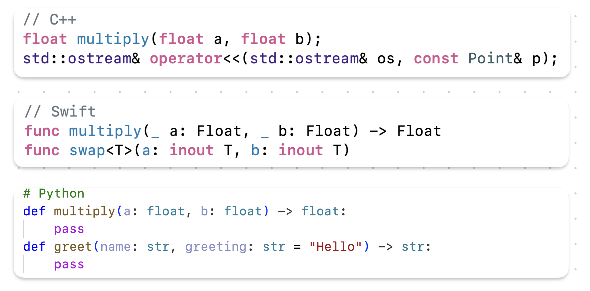
Some Basic Function Declarations in C++, Swift and Python

APIs are higher-level interfaces. They have language-specific parameters and types. So, they are generally intended to be used for the language they are written in. But in the end they are all compiled into machine code and programs talk with each other with machine code; not C or Swift.

We have seen from previous images that even if the code might be the same, the compiled machine code can be different. And if the machine code is different: how would the APIs work?

Below is an example function that's compiled using two different compilers /w different machine code. Yet, they work. How?

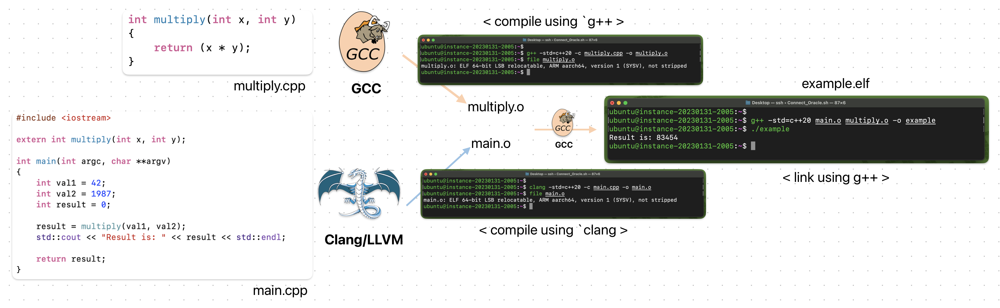
Compiling Two Different Source Codes With Two Different Compilers - Linking Still Works!

ABI
===

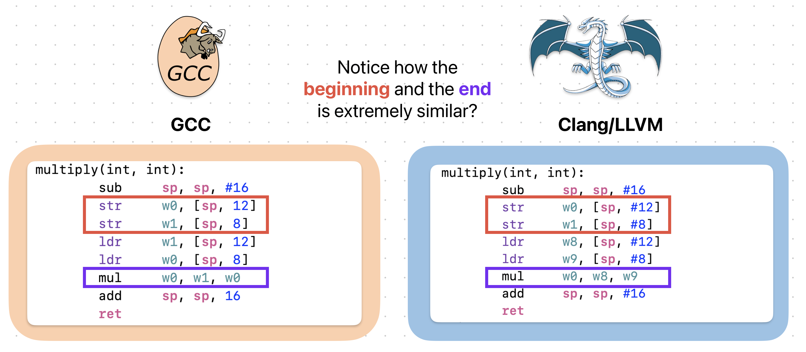


In the above image, notice how even if the machine code is generally different, some stuff is the same. Especially the begging and the end. And it's not just mere coincidence. The code you see there is called ABI (Application Binary Interface). They define how functions (or subroutines) should be called and returned from at the machine code level. You can compare them to APIs; the idea is the same, but the language and the level they work on is different.

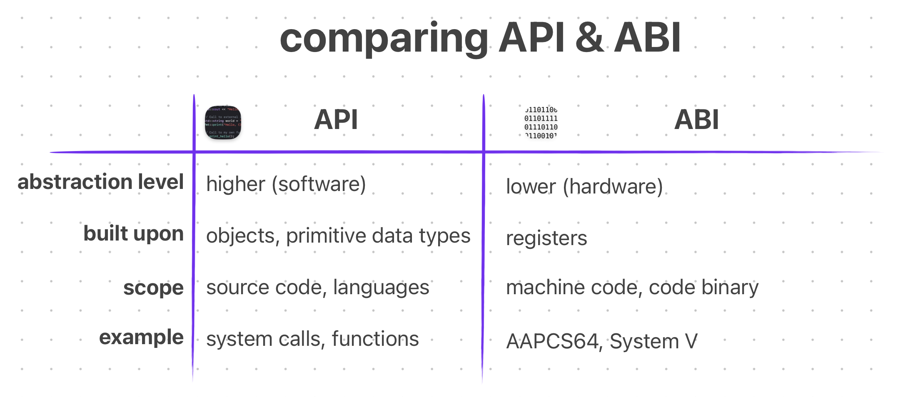
API vs. ABI -Just  Note That They Are Not Exactly Comparable; I Just Want to Give an Idea

Just like how the design of an API is unique to the author of the software, the design of an ABI is also unique to the it's platform. There are many design factors that defines an ABI (e.g., calling conventions, data type & alignment). The one we will be focus on is Procedure Call Standard (PCS) for AArch64 platforms. Also known as - calling convention for AArch64.

> I won't be explaining the data types & alignment as to keep this  writing on topic: calling conventions. They deserve their own writing, which I might do on another time;)

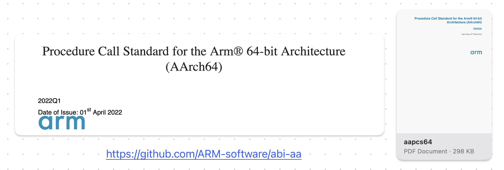
Reference AAPCS64 Document

Calling Conventions
===================

A Calling Convention is a scheme that defines how functions receive their parameters and return their results. They specify how a program should handle functions at the machine code level. Below are some of the schemes that they define (not limited to):

* How parameters are passed & returned
* Which registers the callee must preserve
* How the stack should be managed between the callee and caller

> From now on I will use the ABI and calling convention interchangeably to keep things on ELI5 level. But know that they are NOT the same time. Calling conventions are just a subset of ABI design.

Each platform has their own conventions, but the sane ones usually share a lot of similarities. Below are the preferred calling conventions for each widely used platforms.

* AMD64 (x86_64): [Sytem V ABI](https://refspecs.linuxbase.org/elf/x86_64-abi-0.99.pdf)
* AArch64 (ARM64): [Procedure Call Standard for AArch64](https://student.cs.uwaterloo.ca/~cs452/docs/rpi4b/aapcs64.pdf)
* RISC-V: [RISC-V Calling Convention](https://riscv.org/wp-content/uploads/2015/01/riscv-calling.pdf)
* PowerPC: [System V ABI for PowerPC](https://www.ibm.com/docs/en/aix/7.3?topic=overview-register-usage-conventions)

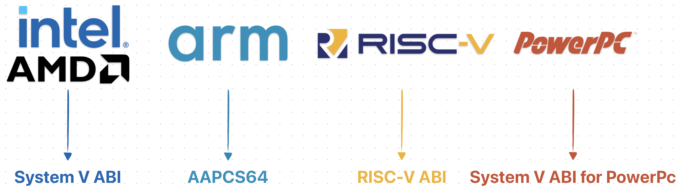
Platforms and The ABI They Use

The one we are focusing on is AArch64. But before we move on to that, let's talk about registers and stack as they are the foundation which a calling convention is build upon.

II. Machine Registers
=====================

There are many registers defined in AArch64 and the availability of them depends on the architecture version (e.g., [ARMv8](https://developer.arm.com/documentation/102378/0201/Armv8-x-and-Armv9-x-extensions-and-features), [ARMv9](https://developer.arm.com/documentation/ddi0608/latest/)) and the platform vendor. However, all of them are at least expected to implement the basic register banks: general-purpose and SIMD. We will focus on general-purpose registers and what their purposes.

General-Purpose Registers
=========================

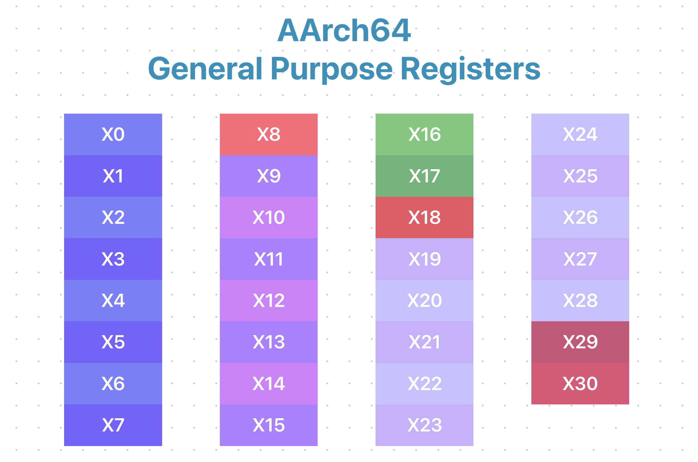
AArch64 General Purpose Registers

AArch64 provides 31 general-purpose registers, each 64 bits wide. They are named `X0 … X30`. Although the general-purpose registers are equal and interchangeable at the architecture level, in practice their purpose is defined by the AAPCS64 which most sane compilers/programmers adhere.

> The following sections are taken from [Maria Azeria Markstedter's ARM Assembly: Internals & Reverse Engineering](https://www.wiley.com/en-us/Blue+Fox%3A+Arm+Assembly+Internals+and+Reverse+Engineering-p-9781119745303) book. Shout out to her for the great book!

X0-X7
=====

These registers are used for argument registers to pass parameters and return a result. More on this later.

X8
===
[Pointer to where to write the return value if >128 bits, otherwise scratch register](https://github.com/Siguza/ios-resources/blob/master/bits/arm64.md). It can be used to pass the address location of an indirect result.

X9–15
=====

These are caller-saved temporary registers used to preserve values across a call to another function. The affected registers are saved in the stack frame of the caller function, allowing the callee function to modify these registers.

X16-X17
=======

These are intraprocedure-call temporary registers that can be used as temporary registers for immediate values between function calls. They can be used for ordinary computations within any given function. However, AAPCS64 gives them a different purpose.

For example, if a program calls a function defined in a shared library such as `malloc()`, this function call may be implemented via a call through the [procedure linkage table (PLT)](https://maskray.me/blog/2021-09-19-all-about-procedure-linkage-table) to call the `malloc()` implementation inside another module.

The PLT stub responsible for find and transferring execution to the `malloc()` function in the other library can use the X16 and X17 registers as intraprocedural call registers freely, without having to take care not to corrupt their values. LLVM, for example, will compile PLT stubs that make use of X16 and X17. 

> Also see [GCC's veneer](https://developer.arm.com/documentation/101754/0622/armlink-Reference/Image-Structure-and-Generation/Linker-generated-veneers) for more examples on X16 and X17 usage.

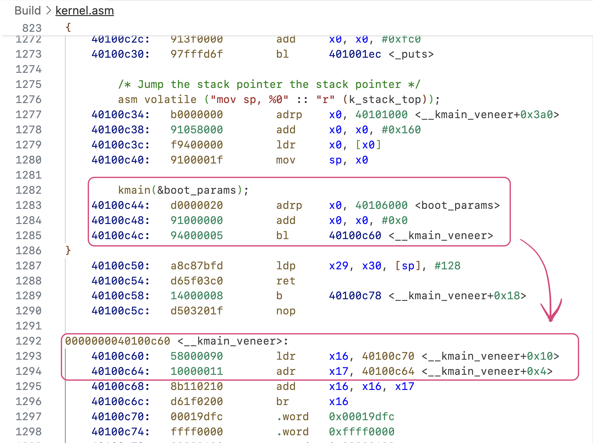
This Code Is From My [WesterOS Kernel](https://github.com/TunaCici/WesterOS)  -  Notice How `__kmain_veneer` Is Called Instead of `kmain()`

X18 (Platform Register)
=======================

The X18 platform is a general-purpose register like any. The AAPCS, however, reserves it to be the platform register, pointing to some platform-specific data. More on this later.

X19-X28
=======

These are callee-saved registers that are saved in the stack frame of the called function, allowing the function to modify these registers but also requiring it to restore them before returning to the caller.

X29 (FP)
========

It is used as a frame pointer (FP) to keep track of the stack frame. More on this later.

X30 (LR)
========

It is the link register (LR) holding the return address of the function. More on this later.

Overview
=======

Below image gives a basic overview on all the general purpose registers we have seen so far.

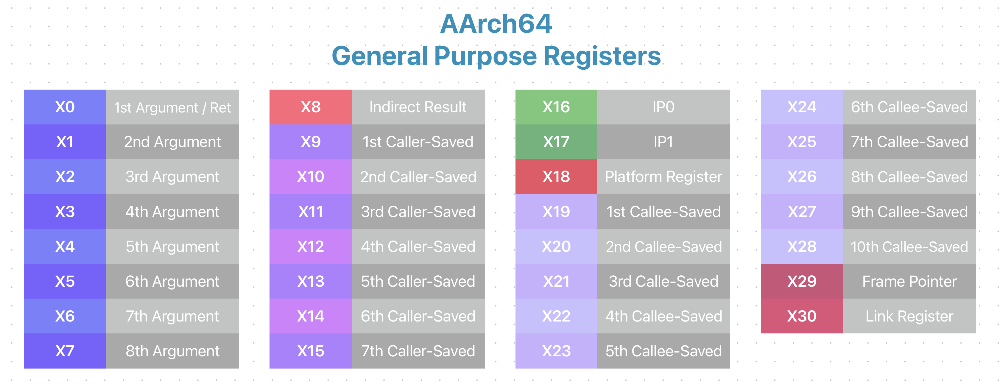
AArch64 General Purpose Register /w Purposes

SIMD and Floating-Point Registers
=================================

In addition to the 64-bit general-purpose registers, AArch64 also supplies a series of 32 x 128-bit vector registers for use in optimized single instruction multiple data (SIMD) operations for performing floating-point arithmetic. These registers are each 128-bits long and named `V0 … V31`.

Similar to general-purpose registers, the  first eight SIMD registers `V0 … V7` are used for argument registers to pass parameters and return a result. The rest is either used as scratch registers. However, there are some calling convention details. More on this later.

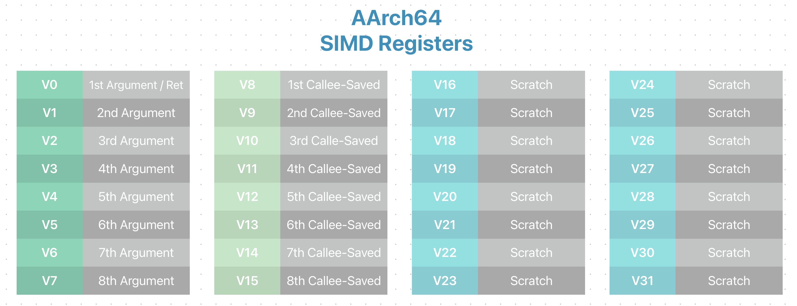
AArch64 SIMD Register /w Purposes

III. AAPCS64
============

Most platform's author/owner describes their calling conventions for public use. After all that's what they are meant for: for everyone to use and adapt. We are currently only interested in Arm's.

Arm® Architecture describes their calling conventions [on their GitHub page](https://github.com/ARM-software/abi-aa) named **Procedure Call Standard for the Arm® 64-bit Architecture (AArch64)**. We will shortly call it: **AAPCS64**. 

> There are other documents on that Arm's GitHub page that further describes their ABI. Check them out if you are curious!

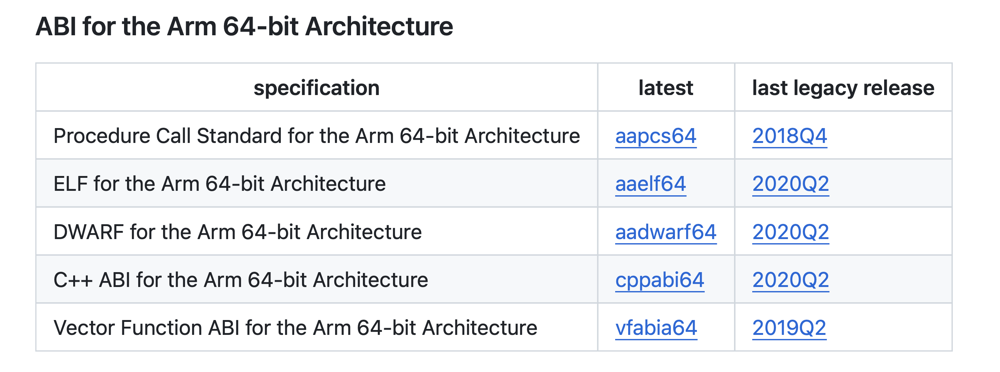
ABI Documents  -  Check Out: https://github.com/ARM-software/abi-aa

Inside the AAPCS64 there are multiple sections and each deserve their own writings. We are only going to talk about calling conventions, but for the curious: here's other sections that's described in it:

* [Data Type and Alignment](https://github.com/ARM-software/abi-aa/blob/main/aapcs64/aapcs64.rst#data-types-and-alignment)
* [The Base Procedure Call Standard](https://github.com/ARM-software/abi-aa/blob/main/aapcs64/aapcs64.rst#the-base-procedure-call-standard)
* [Standard Variations](https://github.com/ARM-software/abi-aa/blob/main/aapcs64/aapcs64.rst#the-standard-variants)
* [C and C++ Language Mappings](https://github.com/ARM-software/abi-aa/blob/main/aapcs64/aapcs64.rst#arm-c-and-c-language-mappings)

AAPCS64 is kind of a long and it would be pointless to explain everything in it. I will only talk about the parts that I consider to be the most useful when doing casual programming for AArch64 platforms.

Parameter Passing
=================

Naturally, [on any language] when doing a function call, the caller and the callee must agree on how to pass parameters at the machine code level. AAPCS64 defines this in section [6. The Base Procedure Call Standard.](https://github.com/ARM-software/abi-aa#id48) It describes that:

* `X0 … X7`: Should be used for the first eight (8) parameters
* `Stack`: Should be used for any additional parameters

I think it is pretty straightforward. We can even see this in action. Let's look at an [example C function](https://godbolt.org/z/KrMMWo7fc) with 4, 8 and 12 parameters.

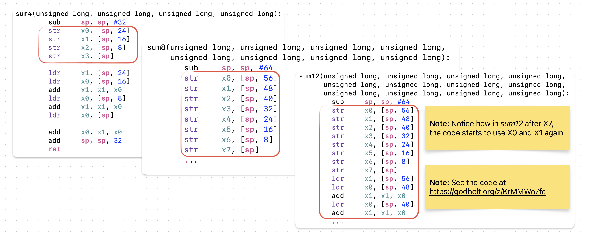
Assembly Code of sum4(), sum8() and sum12()  -  Notice How Arguments Are Stored in X0 … X7 and/or The Stack

As you can see the first (1st) parameter is stored in `X0`, second (2nd) in `X1`, third (3rd) in `X2` and so on… After the eight (8th) the additional parameters are stored in thread stack. This is where things get interesting.

Stating the obvious: [CPU registers are fast and stack memory is slow](https://www.mikeash.com/pyblog/friday-qa-2013-10-11-why-registers-are-fast-and-ram-is-slow.html). We want to stay away from accessing the memory as much as possible. Generally, compilers are pretty good at optimizing on this and you won't have to worry about the amount of parameter a function takes.

Sometimes, however, you might need those extra nano/microseconds (e.g., low-latency systems).

Result Return
=============

This one, again, is pretty straightforward and clear. AAPCS64 states that the function return value should be stored in:

* `X0` 

You can see from the below C function that the uint64_t return value is stored in `X0` before the call to [`RET`](https://developer.arm.com/documentation/dui0802/b/A64-General-Instructions/RET) (function return).

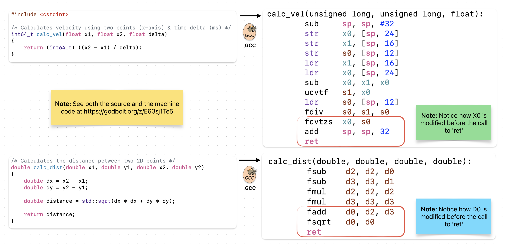
Notice The Modified X0 Before The Call to Ret (Function Return)  -  Just FYI: D0 is Basically X0 But for Floating

> Personal note: I always wondered why C/C++ functions always returned only one value. What if I want to return two values like 2D coordinates of {x, y}? Well, now I know: the ABI just doesn't support it. Probably for good reasons.

> Later, however, I learned about objects/structs and then used them to "return more than one value". But still, at the machine code level, a function still returns one value: reference/pointer to an object.

The Stack
=========

Almost all modern languages use the concept of stack. They are used for various reasons. I would like to give examples but am no language designer;( One thing I know is that they are used when calling functions.

> The next parts assume that any language is designed to make use of the stack. There are, however, languages that DON'T have stack. See [Parrot](https://web.archive.org/web/20100706035639/http://www.linux-mag.com/cache/7373/1.html) or [other functional languages](https://www.defmacro.org/2006/06/19/fp.html).

Each thread in a program has its own stack. [According to AAPCS64](https://github.com/ARM-software/abi-aa/blob/main/aapcs64/aapcs64.rst#the-stack), a stack is a continuous memory region that the thread can use for storage of local variables and for passing additional arguments [if the first eight (8) register are insufficient].

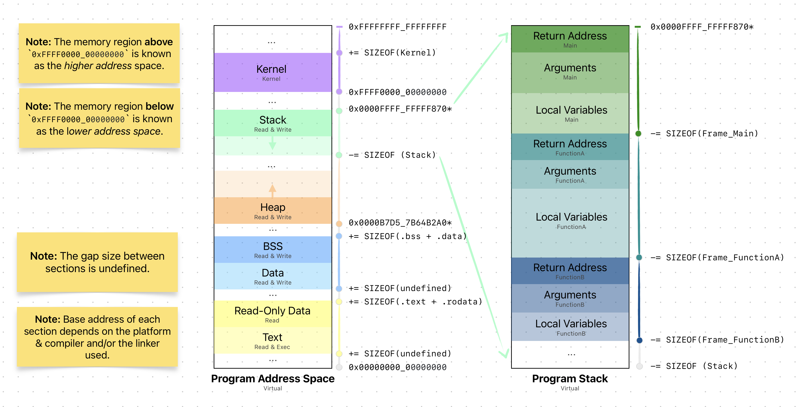
Overview of a Program's Address Space & Its [Imaginary] Stack

The concept of stack is a pretty big topic and [again] deserves it's own writing. From now on I will assume that you have some familiarity with the [thread stack in C](https://docs.oracle.com/cd/E19455-01/806-5257/attrib-33670/index.html).

In AAPCS64, a stack is defined to have the following three (3) values:

* Base: base of the stack (e.g., `0x800`)
* Limit: limit of the stack (e.g., `0x400`)
* Current Extent: current tack pointer (SP) (e.g., `0x600`)

The SP is basically a pointer that moves from base to limit as the stack grows. And from limit to base as the stack shrinks. Below is a visualization on this concept.

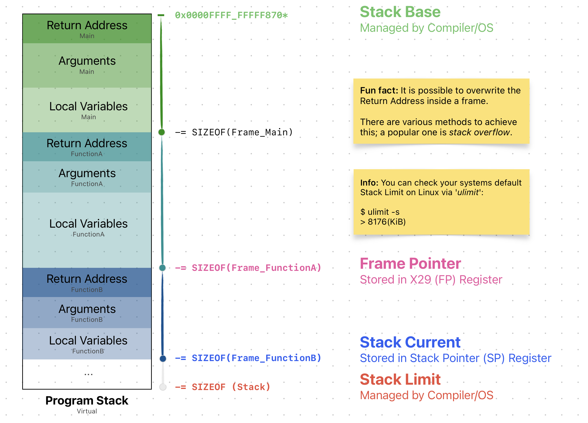
An Example Program's Stack And AAPCS64-Related Definitions

AAPCS64 further defines the stack to be full-descending. Now, there are four (4) different stack organizations. I am not going to explain them here as there is a [great note about them by John Winans](https://faculty.cs.niu.edu/~winans/CS463/notes/stack.pdf). I highly recommend you to read at is it's very informative and pretty short. It shouldn't take more than 15 minutes to understand it.

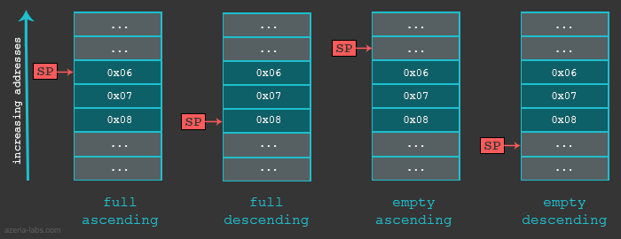
Different Kinds of Stack Implementations  -  Source: https://azeria-labs.com/functions-and-the-stack-part-7/

Last, but not least, the AAPCS64 uses the stack to passing parameters. If there are more than eight (8) parameters, that is the `X0 … X7` is already used, then the rest is put in stack. Below is an [example C function](https://godbolt.org/z/cea5j9GMd) and it's machine code that shows how stack is used to pass parameters.

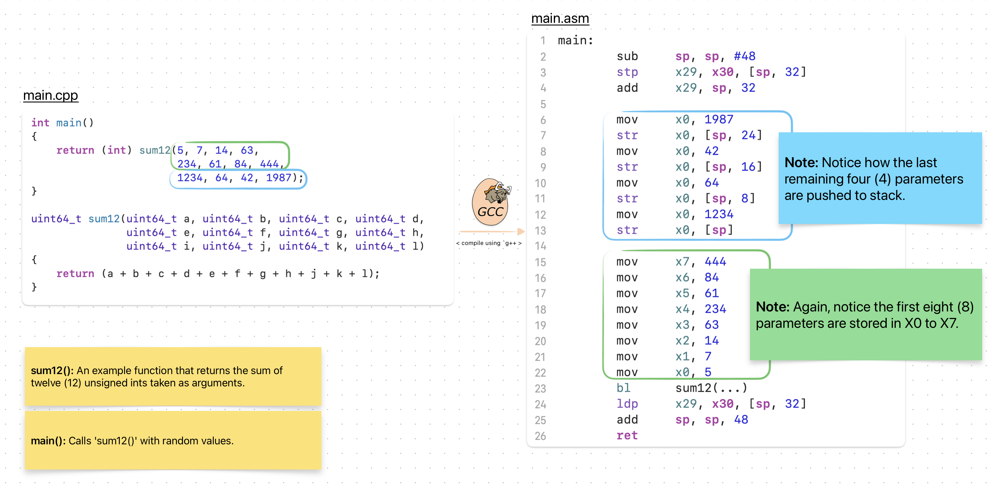
Notice How The First Eight (8) and The Last Remaining Four (4) Parameters Are Passed

Machine Registers
=================

Like we have seen before, Arm 64-bit architecture defines two mandatory register banks: general-purpose and SIMD. Technically, you can use them however you want, but in practice each have their own purposes defines by AAPCS64.

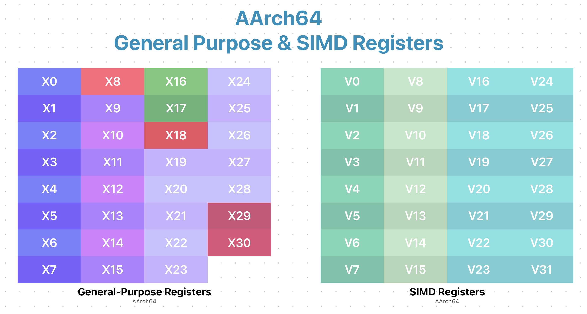
AArch64 General-Purpose & SIMD Registers

Let's talk about each of those registers.

`X0 … X7`: These register are used to store the first eight (8) parameters of a function. The caller fills these register and then the callee function can use them however it sees fit. 

Before the function returns, the X0 must be updated by the callee to store the function return value. However, if the return type is void or not used, compilers can optimize this away.

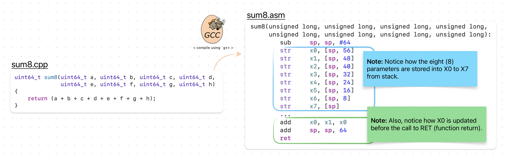
The Function 'sum8(…)' And It's Machine Code Generated By g++  - [ See Both On Godbolt](https://godbolt.org/z/9G17ocG9n)

`X8`: Also known as indirect result register. Frankly, I don't think the usage of this is well defined. AAPCS64 states that "This is used to pass the address location of an indirect result, for example, where a function returns a large structure." [From what I gather around the internet](https://learn.microsoft.com/en-us/cpp/build/arm64-windows-abi-conventions?view=msvc-170&viewFallbackFrom=vs-2019), each OS (e.g., Windows) and language (e.g., C++) uses it a bit differently.

Basically, if an object is too big to fit into a 64-bit register (or divided into multiple ones) the caller reserves a memory region (via stack or heap). It then passes a pointer/reference of that object inside the X8 register. After that, the callee is able to access that [big] object. Below is a basic example on this.

Unfortunately, I couldn't succeed in creating an example C++ code which GCC generates a machine code utilizing the X8. However, [when I tried Clang and MSVC](https://godbolt.org/z/hxGedET6Y), they both utilized it as an indirect result and a scratch register.

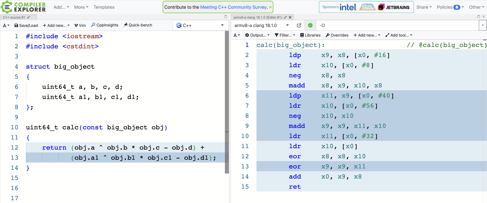
Clang Compiler Utilizing The 'X8' Register

`X9 … X15`: These are just scratch registers. Meaning a function can use them freely as temporary storages for intermediate calculations or data. AAPCS64, however, gives them a purpose and a name: caller-saved registers.

These register should be used by a function for values that are NOT needed after the next function call (if exists). And if it's needed (and you must use them after) then the caller is the one responsible of saving them before the call. Now, when I first saw this, it all seemed so vague and confusing. Like, okay… How do I know which values are needed and which are not? Why can't I just use them normally?

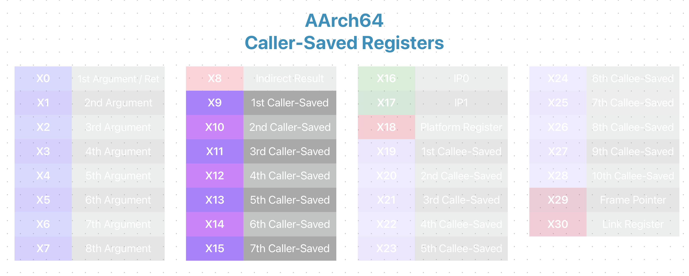
AArch64 Caller-Saved Registers: X9 … X15

For that I needed an example. I couldn't find a good one. But I did find [one explanation](https://stackoverflow.com/questions/9268586/what-are-callee-and-caller-saved-registers/56178078#56178078) that made it all make sense. You can read it If you want, but if you can wait a little bit, I prepared an example after this section that will help you understand on why they exists and why you shouldn't just use them normally.

`X16 - X17`: Ah the twin registers, also known as IP0 and IP1. They are the intra-procedure-call temporary registers. Like others, they can be as scratch registers, but AAPCS64 marks them as "corruptible by function". Meaning, after ANY function call, the caller assumes them to be corrupt and act accordingly.

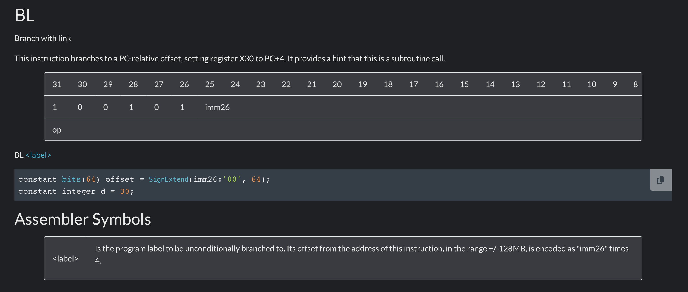
[ARM 'BL' Instruction](https://developer.arm.com/documentation/ddi0602/2024-06/Base-Instructions/BL--Branch-with-link-)  -  Notice the +/- 128MB Range Under 'Assembler Symbols'

In practice, however, they are used by [veneers](https://stackoverflow.com/questions/64893770/what-is-veneer-that-arm-linker-uses-in-function-call) and other similar pieces of code. In [Arm A64 ISA](https://developer.arm.com/documentation/ddi0596/latest/), the [`BL`](https://developer.arm.com/documentation/dui0802/b/A64-General-Instructions/BL) branch line instruction can only in the range of PC +/-128MiB. Most of the time your code won't have to jump around that much, but sometimes it happens (e.g., dynamic libraries OR switching from lower-address to higher-address range in kernel syscalls).

To overcome this range limitation, compilers (like GCC) uses a small piece of code called veneers. I don't really looked at how they work, but know that they used to jump between codes that are FURTHER away from each other in [virtual] memory. Hence the IP0 and IP1 are called the intra-procedure-call registers.

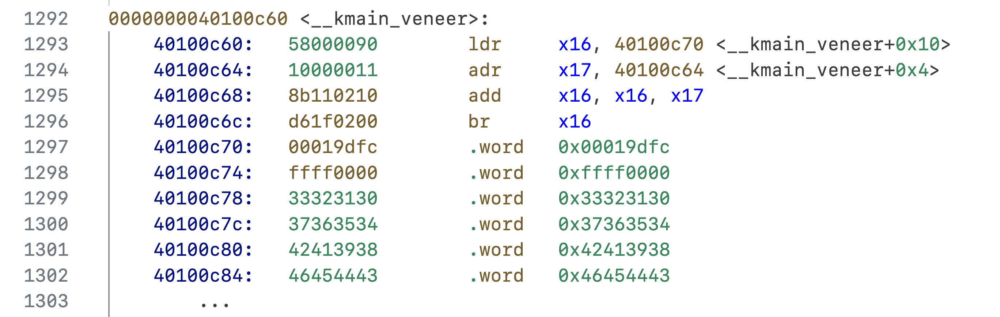
Veneer Code Generated by GCC For The 'kmain()' Function Located at 0xFFFF00004011AA60

`X18`: It's called the platform register. Like the name suggests, each platform (e.g., Linux, Windows, macOS) can define whatever use for it they want. The exact usage of it can also change from platform version to version.

* [Apple](https://developer.apple.com/documentation/xcode/test-coverage) (macOS, iOS, iPadOS…): [Reserved](https://opensource.apple.com/source/xnu/xnu-7195.141.2/tests/x18.c.auto.html)
* [Linux](https://patchwork.kernel.org/project/linux-hardening/patch/20170712144424.19528-8-ard.biesheuvel@linaro.org/): [Task Structure](https://github.com/torvalds/linux/blob/master/include/linux/sched/task.h) pointer in kernel mode; (?) in user mode
* [Windows](https://learn.microsoft.com/en-us/cpp/build/arm64-windows-abi-conventions?view=msvc-170): [Thread Environment Block](https://en.wikipedia.org/wiki/Win32_Thread_Information_Block) pointer in user mode; reserved in kernel mode

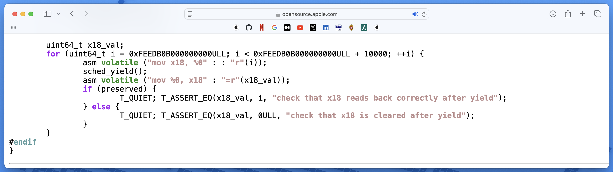
Apple's XNU Code That Checks For X18's Preservation

As you can see, it isn't much used or have a well-defined usage on some common platforms. It's recommended (at least for now) just avoid using it.

`X19 .. X28`: Just like the previous scratch registers (caller-saved ones), these registers are also scratch registers. Similarly, AAPCS64 gives them their own purpose and name: callee-saved registers.

These register should be by the function if they ARE needed to be preserved after the call. The callee is the one responsible of saving AND restoring them.

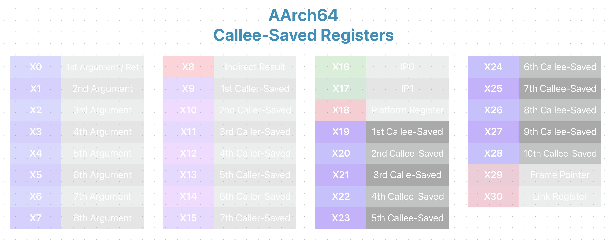
AArch64 Calle-Saved Registers: X19 … X28

Just like the caller-saved registers, the explanation by Arm and AAPCS64 seems confusing. In the coming section I will give a concrete example that will help you understand what it's meant by callee & caller saved registers.

`X29`: This is the register that holds the frame pointer as describe by AAPCS64. A frame pointer is.. well a pointer that is used to keep track of the [stack frame](https://en.wikipedia.org/wiki/Call_stack#Stack_and_frame_pointers). When a new stack frame is created (after a function call) the base address of it is stored inside this register.

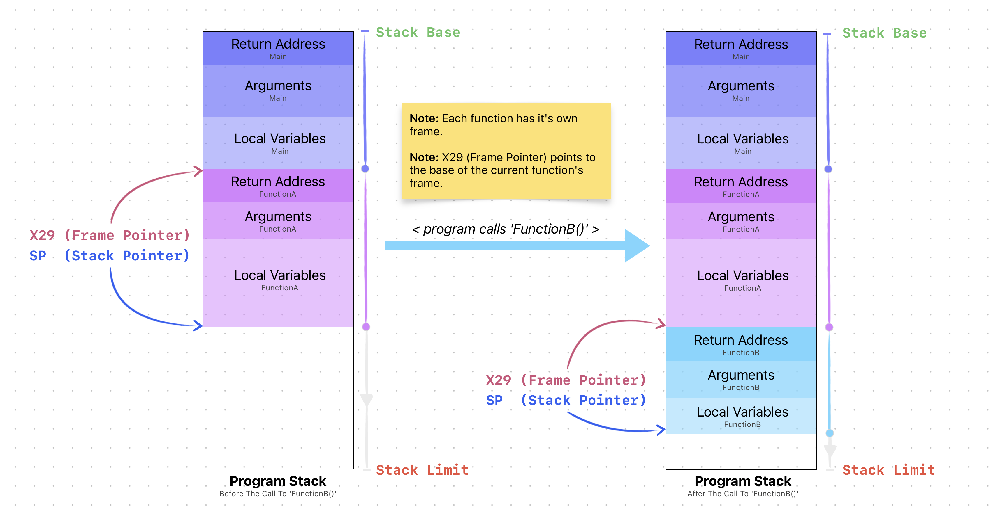
X29 (Frame Pointer) Before And After The Call To 'FunctionB()'

In practice, compilers can generate machine code that makes use of this register to store the frame pointer and then use it to locate certain variables/object that resides within the stack. They can technically just use the `SP` stack pointer, but that pointer is dynamic! It moves during the runtime so it's harder (maybe impossible?) to use it to access local variables. Frame pointers, however, are static and do not change during a function's lifetime. So, they can be easily used to calculate variable locations.

`X30`: Last, but not least, the link register! Have you ever wondered when a function is called how does it know where to return after? Well, the link register is how.

Before a thread executes the `BL` branch with link instruction (basically calling a function) the link register is set to the current `PC` program counter so that when the function returns with `RET` this register would be pointing to the caller function. The exact value hold in it is the address of the NEXT instruction right after `BL`.

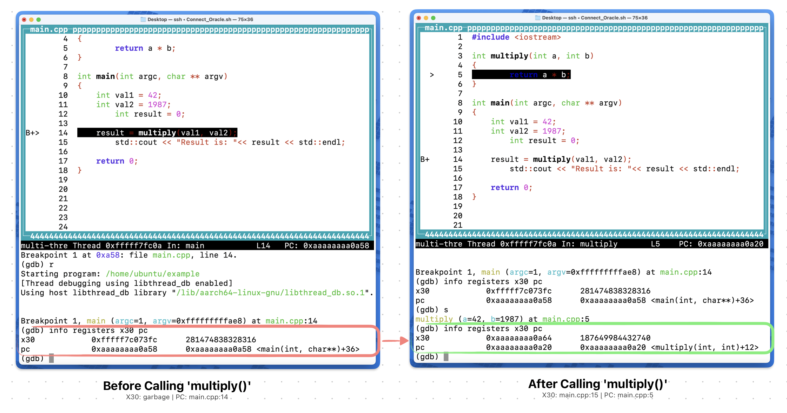
X30 Updated To The Next Instruction (PC + 12) That is Right After main.cpp:14

As you can see from the image X30 was updated to hold the next instruction (machine code, not source line) right after the call to multiply(). The value is of course pre-calculated (before BL) via the PC register. So, in the example above, the X30 becomes PC + 12. The number here, 12, can be calculated by looking at the machine code. I didn't give that code to keep things simple. But, you can easily check it out yourself by creating the example above.

Now we have one more thing to talk about. Notice that the link register only holds the previous function's address. But, what if we call multiple functions? Where would their return addresses be stored? Again, thee answer is: by using the stack.

[AAPCS64 further details](https://github.com/ARM-software/abi-aa/blob/main/aapcs64/aapcs64.rst#subroutine-calls) that before calling a function and modifying the link register, its current value should be pushed to the stack. And then, when the called function returns, the value is popped and written back to the link register. Therefore, preserving the order of function calls!

> One last thing I want to talk shortly about is SIMD registers. [AAPCS64 also talks about them](https://github.com/ARM-software/abi-aa/blob/main/aapcs64/aapcs64.rst#simd-and-floating-point-registers), but not in great detail compared to general-purpose ones as their purpose is pretty straightforward.
> \
> \
>  SIMD registers are named `V0 … V31`. The first eight (8) register `V0 … V7` are used to pass parameters and to return the result value from a function. Registers `V8 … V17` are callee-preserved registers that have seen before. The rest can be used as a scratch register like normal.

IV. Caller-Saved & Callee-Saved
===============================

When I first saw these terms, I was confused. Why would someone categorize the scratch registers into caller & callee saved? Why shouldn't I just use them however I want? Technically, yes, you can use them freely. But, there are two things  you need to be aware of: optimization and modularity.

Remember the following:

* `X0 … X7`: Used to pass the first eight (8) parameters
* `X9 … X15`: Caller-saved registers
* `X19 … X28`: Callee-saved registers

Let's talk about an example C++ code. Don't worry about the naming and such; I created it just to show how registers are used within GCC.

```c
uint64_t loop(uint64_t a, uint64_t b, uint64_t c, uint64_t d, uint64_t e, uint64_t f, uint64_t g, uint64_t h) {
    uint64_t result = 0;

    for (int i = 0; i < 16; ++i) {
        // Random calculations on the function parameters
        a += b + c * d;
        b ^= e >> 2;
        c *= f + g;
        d -= h * a;
        e += f ^ g;
        f = (g << 3) - d;
        g += h * e;
        h = a | b | c;

        // Call another function
        result += calc(a, b, c, d, e, f, g, h);
    }

    return result;
}
```

All it does is just do some calculations on eight (8) different variables, with each being taken as a parameter. After that, they are all passed to another function that does even more calculation. Let's see it.

```c
uint64_t calc(uint64_t a, uint64_t b, uint64_t c, uint64_t d, uint64_t e, uint64_t f, uint64_t g, uint64_t h) {
    // Local variables
    uint64_t a1 = a + 42, b1 = b + 42, c1 = c + 42, d1 = d + 42;
    uint64_t e1 =  e+ 42, f1 = f + 42, g1 = g + 42, h1 = h + 42;

    // More local variables
    uint64_t i = a + 10, j = b + 20, k = c + 30, l = d + 40;
    uint64_t m = e + 50, n = f + 60, o = g + 70, p = h + 80;

    // Random calculations on the local variables
    a1 += b1 - c1 * d1;
    b1 ^= e1 << 1;
    c1 *= f1 - g1;
    d1 += h1 / a1;
    e1 += f1 ^ g1;
    f1 = (g1 >> 2) + d1;
    g1 -= h1 * e1;
    h1 = a1 & b1 & c1;

    i += j * k - l;
    j ^= m >> 3;
    k *= n + o;
    l -= p * i;
    m += n ^ o;
    n = (o << 2) - l;
    o += p * m;
    p = i | j | k;

    // Return the result [X0]
    uint64_t result = a1 + b1 + c1 + d1 + e1 + f1 + g1 + h1 + i + j + k + l + m + n + o + p;

    return result;
}
```

Basically `calc(...)` is just more calculation. But this time the amount of variables incresed. It now has sixteen (16) local variables with each being used to calculate the final result (`X0`).

Our problem is this: *Generate a good & efficient machine code that utilizes register usage instead of accessing the memory using the AAPCS64.*

**Option 1) Use stack to save those registers:**

This is the naive way of doing this. The code becomes simpler, yes. But you would be accessing the memory way more often. All those sweet scratch registers are sitting empty;( Meaning, you are missing out on optimization!

Here's the `ARM64 gcc 13.2.0` compiler with no optimization. Also, see the full code on godbolt.org: https://godbolt.org/z/T9GKG96Tz

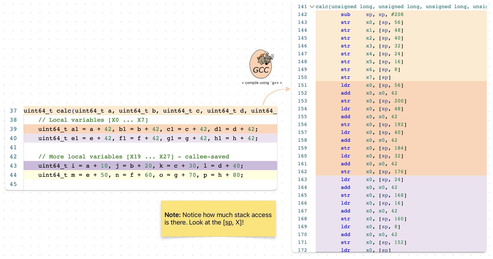
There Are MANY Stack (Memory) Accesses Within 'calc()'  -  It Works, But Not Efficiently

**Option 2) Use the scratch registers:**

Now the fun begins by thinking smart. We have the following 25 register at our disposal: `X0 … X7`, `X9 … X15` and `X19 … X28`. We could just save each variable to an empty register. But what if someone were using that (e.g., previous function)? We can't just assume they are free to use, otherwise we risk corrupting the whole program.

What we can do is push ALL the registers onto the stack and freely use the registers. After we are done, we could just pop them out. Alright… we are getting somewhere. However, still we are accessing the stack, still we are accessing the memory! There must be a smarter way of doing this.

It seems we need a way to tell which registers are free to use. So that can avoid pushing ALL register to stack vs. SOME registers. And guess what? AAPCS64 explicitly talks about this!

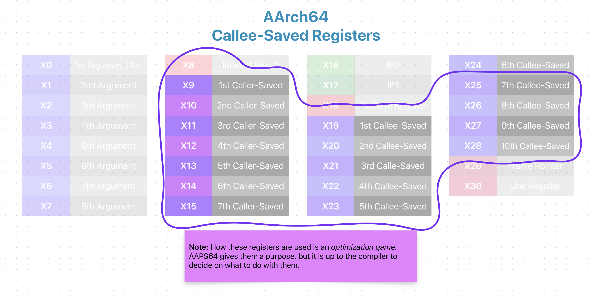
Although AAPCS64 Gives Them A Purpose ([Like Marika](https://eldenring.wiki.fextralife.com/Melina#:~:text=My%20children%20beloved.%20Make%20of%20thyselves%20that%20which%20ye%20desire.)) It Is The Decision of The Compiler To Make Use

Here, we are introduced to caller-saved and callee-saved registers. I'm not going to repeat what's written in AAPCS64. Instead, I will give you the intuition. 

Caller-saved registers (`X9 … X15`)
===================================

If you DO NOT care about what happens to a temporary value after a function call, then use these registers. They are also called volatile registers for this exact reason. The values MIGHT be changed by the function, so DO NOT use them to store values you want to keep after a function call.

* From the caller's perspective: Assume registers are to be destroyed 
* From the callee's perspective: Freely use the registers

> You might wonder, then why they are named caller-saved? Frankly, idk. The caller COULD save them to stack if it wants, but does NOT have to. So, I ([and many others](https://stackoverflow.com/questions/9268586/what-are-callee-and-caller-saved-registers/56178078#56178078)) think the name is misleading.

Callee-saved registers (`X19 … X28`)
====================================

If you DO care about the retaining a temporary value after a function call, then use these registers. They are also called non-volatile registers for this exact reason. Assume that the values are to be RETAINED and you must save them to the stack before doing anything to them. Interesting thing her is it is NOT the caller, but the callee that should save them. As to why? I don't know.

* From the caller's perspective: Do nothing. They won't be changed
* From the callee's perspective: Save them to stack & then restore after

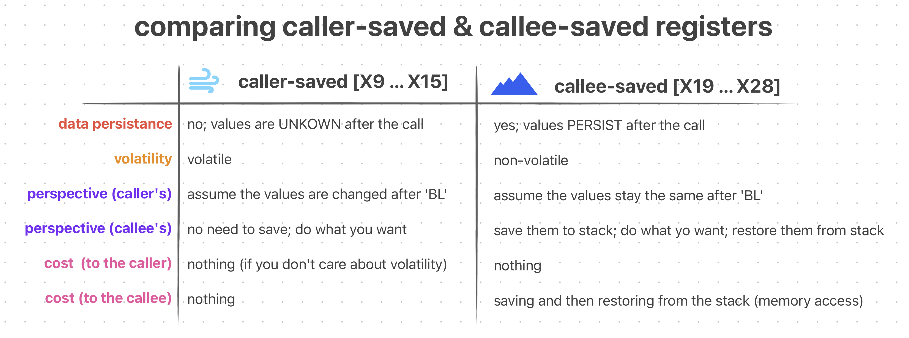
Comparing Caller & Callee - Saved Registers

Now, we have enough information on our hand about the scratch registers. We can use this to optimize our code. As to how? I don't really know. This is an area where compiler engineers work to optimize. Each different compiler and their version will use these registers differently.

Let's look at the code generated by `ARM64 gcc 13.2.0` with the `-O1` optimization flag. Also, see the full code on godbolt.org: https://godbolt.org/z/ETc81YadG

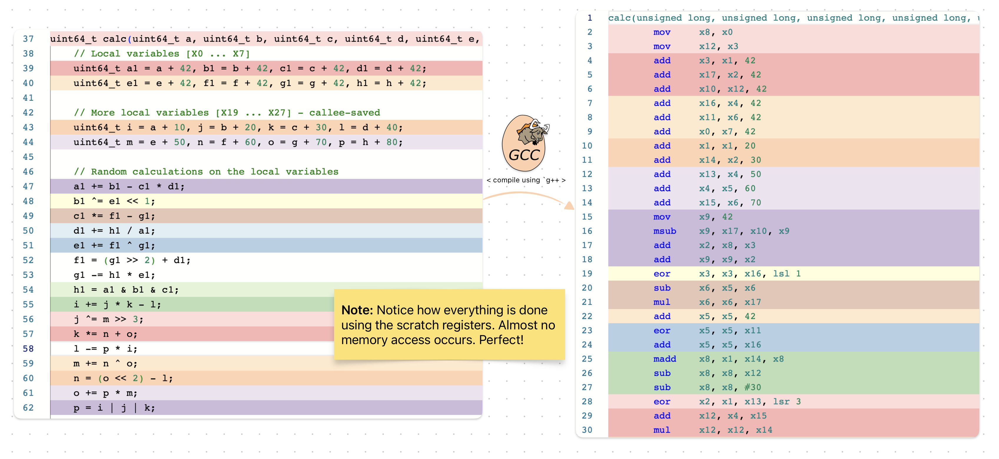
Most (if not all) Calculations Are Done Using The Scratch Registers - Efficient!

Notice how BOTH the caller-saved and callee-saved registers are used. Again, how compilers decide on which to use depends on its design & goals.

Closing Words
=============

And with all that, we know have a little bit more information about AAPCS64 and how calling conventions work. There is a lot to unpack here. Don't feel bad if you don't understand each and everything. Just keep reading, practicing and learning. I highly encourage you to come to this writing again after a couple of weeks. After some time, your brain would be done processing everything. By reading this again, everything then would make a lot more sense. And who knows, maybe you would learn A NEW thing you missed during the first time.

I want to point out that lot's of details were left out to keep things simple & straightforward. AAPCS64 is a long document with many technical details. For the purpose of this writing I didn't talk about them. Keeping everything on ELI5 level was my goal.

By cutting and compressing everything from the AAPCS64, I might've made some mistakes. If you think there is one, feel free to contact me. I wouldn't want to give wrong information.

And lastly, thanks for reading.

Enjoy Life ❤
